# AI系列——01、用cursor接入mcp协议并体验Magic生成AI网站

效果实现：

场景一：
场景二：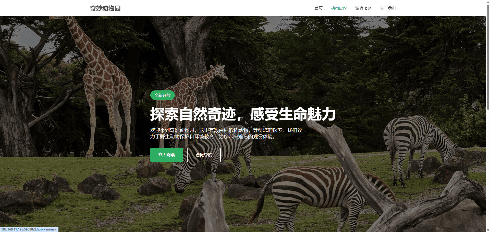
场景三：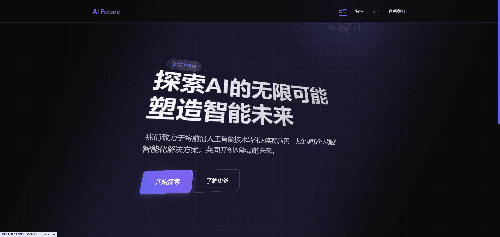

视频演示：
<video style="width:100%;height:300px" controls="controls" autoplay="autoplay" loop="loop" preload="auto" src="./assets/AI系列——01、用cursor接入mcp协议并体验Magic生成AI网站.md/1.mp4"></video>
## 什么是mcp协议
在开始使用之前，我们要稍微理解一下什么是 `mcp协议`。
英文全称：`Model Context Protocol` （模型上下文协议）
MCP 是一种开放式协议，它规范了应用程序向 LLM 提供上下文的方式。 **把 MCP 想象成人工智能应用的 USB-C 接口** 。

### 1.标准化接口

 - 就像 USB-C 让各种设备（笔记本、手机、游戏机）都能用同一接口充电、传输数据，MCP 让 各种 AI 应用都能用同一协议接入
   LLM（大语言模型）。
 - 无需为每个 AI 应用定制 API，大幅降低了集成成本。就像 USB-C
   让各种设备（笔记本、手机、游戏机）都能用同一接口充电、传输数据，MCP 让 各种 AI 应用都能用同一协议接入 LLM（大语言模型）。
 - 无需为每个 AI 应用定制 API，大幅降低了集成成本。

### 2.模块化 & 兼容性

 - USB-C 可以适配不同的协议（Thunderbolt、DisplayPort、PD 充电），MCP 也允许 AI 接入
   不同的数据源、插件、工具，比如数据库、API、实时传感器数据等。
 - 这样，LLM 不再只是一个“孤岛”，而是能无缝接入企业应用、个人助手、自动化工作流等场景。 
### 3.双向通信 & 扩展能力
 - USB-C 不仅能充电，还能传输音视频、数据，MCP 也支持 AI
   读取外部数据，同时提供增强响应的能力（如利用搜索引擎、计算工具、企业知识库等）。
image.png
这意味着 AI 不仅仅是回答问题，还能基于外部信息 动态推理、执行任务、提供个性化内容。
### 4.统一生态

 - USB-C 让不同品牌的设备能用同一充电器，MCP 让不同 LLM（如
   OpenAI、Anthropic、Mistral）可以遵循同样的协议，方便开发者适配不同 AI
   平台，而不需要针对每个模型写不同的集成代码。

## 如何使用
首先得话版本需要下载到>=4.6 或<= 4.7,因为4.7的话不会弹出 `Add new MCP server`而是直接使用 `Add new global MCP server`

然后我们需要用到一个网址
[Smithery](https://smithery.ai/)
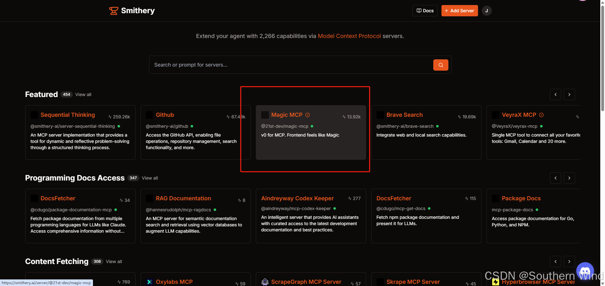
我们可以选择使用一下magic MCP作为测试案例
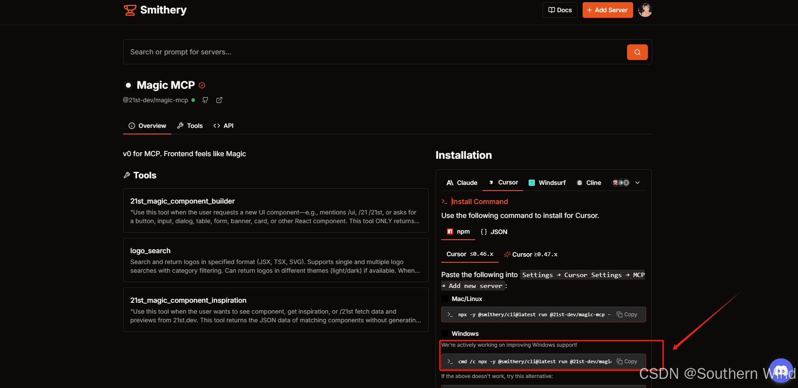
**注意：** 如果第一次进入需要去他提到的网站中去注册一下key，这里可以顺带了解一下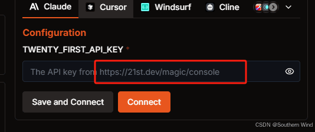
[https://21st.dev/magic/console](https://21st.dev/magic/console)
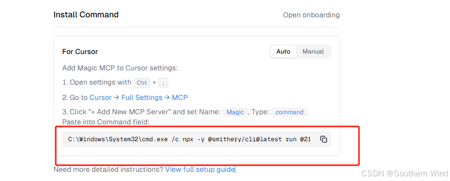
上面是key值找到key赋值给输入框中即可生成链接

之后在cursor中找到`设置`=>`MCP` => `Add new MCP server`
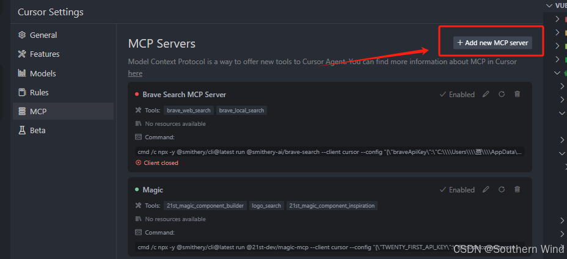
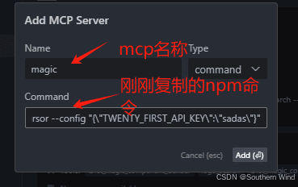
点击add进行添加，当等待结束后会出现成功的提示，这样就可以直接用了。
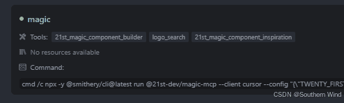

在这里插入图片描述
#### 启动失败解决方法
如果说参数填写错误：可以直接进入github开源项目中去寻找最新的安装命令进行替换即可
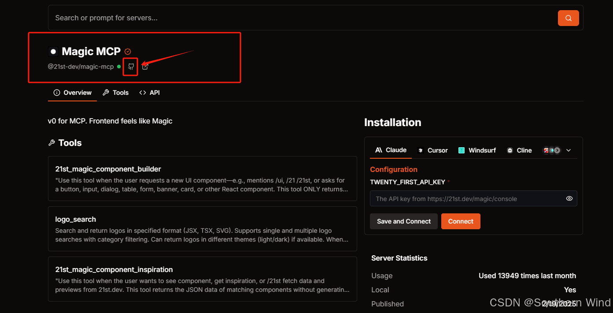
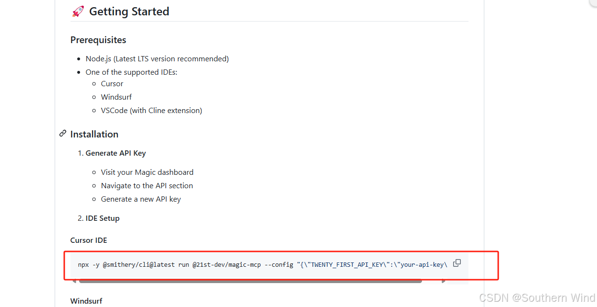
## 输入关键词测试：
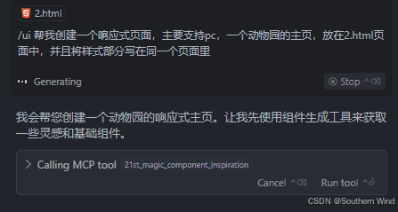
出现下方的21st就说明已经成功啦！
整体来说效果蛮好的
