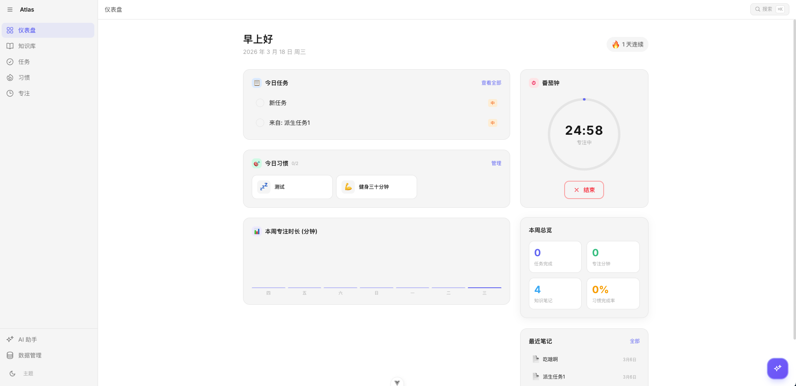
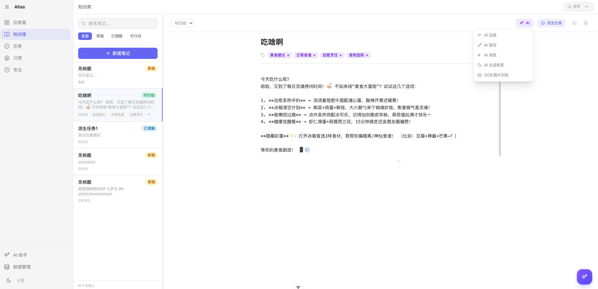
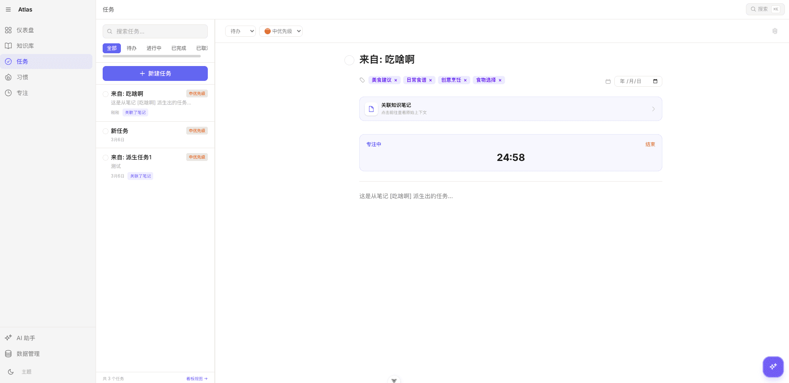
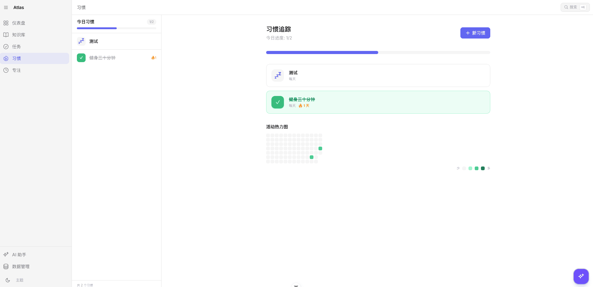
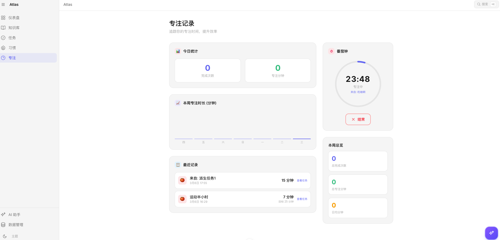
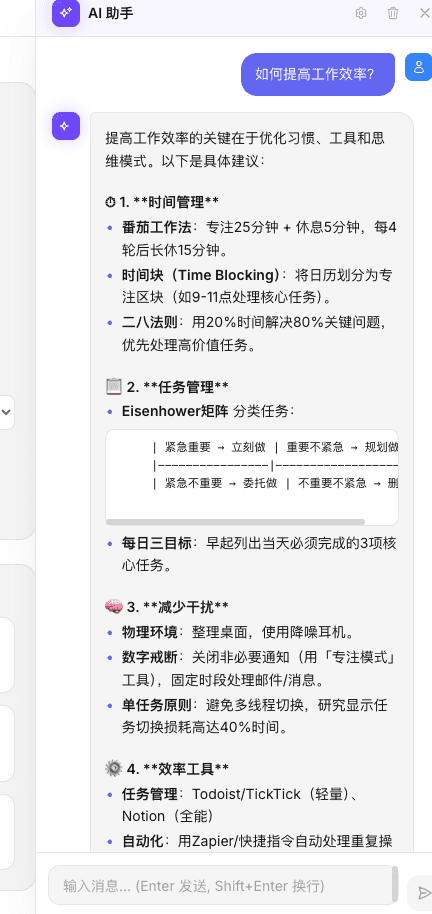

# Atlas —— 从零搭建一个 AI 增强的个人知识与生产力系统

> 最后更新：2026-03-06
>
> 这篇博客会跟着项目一起更新，每次有大的改动我都会在这里补上。

---
首页

自定义知识库

任务栏

习惯

专注记录

AI 助手


## 写在前面

这篇文章是记录我从零开始搭建 **Atlas** 这个项目的全过程。Atlas 是一个纯前端的个人效率工具，集成了知识笔记、任务管理、习惯追踪、番茄钟、还有 AI 助手。

说白了就是——**我想要一个「什么都有」的个人工作台，而且数据全在本地，不用担心隐私问题**。

技术栈选的是 Vue 3 + TypeScript + Pinia + IndexedDB + Tailwind CSS，后面还接入了 AI（通过硅基流动 SiliconFlow 调用 DeepSeek、Qwen 等模型）。

---

## 目录

1. [项目整体架构——为什么这么设计](#1-项目整体架构为什么这么设计)
2. [技术选型——为什么选这些](#2-技术选型为什么选这些)
3. [项目启动与基础搭建](#3-项目启动与基础搭建)
4. [领域驱动设计——分层架构详解](#4-领域驱动设计分层架构详解)
5. [知识库模块——笔记系统](#5-知识库模块笔记系统)
6. [任务管理模块](#6-任务管理模块)
7. [习惯追踪模块](#7-习惯追踪模块)
8. [专注计时（番茄钟）模块](#8-专注计时番茄钟模块)
9. [仪表盘——数据汇总展示](#9-仪表盘数据汇总展示)
10. [共享 UI 组件库](#10-共享-ui-组件库)
11. [主题系统（明暗模式）](#11-主题系统明暗模式)
12. [AI 接入——从零到可用](#12-ai-接入从零到可用)
13. [DeepSeek-OCR 图片识别](#13-deepseek-ocr-图片识别)
14. [动画与交互效果](#14-动画与交互效果)
15. [踩坑记录与经验总结](#15-踩坑记录与经验总结)
16. [后续计划](#16-后续计划)
17. [更新日志](#17-更新日志)

---

## 1. 项目整体架构——为什么这么设计

先看一眼项目的文件结构：

```
src/
├── main.ts                        # 入口文件
├── App.vue                        # 根组件
├── app/
│   ├── bootstrap.ts               # 应用初始化（Pinia、Router 等）
│   └── router.ts                  # 路由配置
├── domains/                       # 业务领域（核心）
│   ├── knowledge/                 # 知识库
│   │   ├── model.ts               # 数据模型定义
│   │   ├── repository.ts          # 数据库操作（IndexedDB）
│   │   ├── service.ts             # 业务逻辑
│   │   ├── store.ts               # 状态管理（Pinia）
│   │   └── views/                 # 页面组件
│   │       ├── KnowledgeList.vue
│   │       └── KnowledgeEditor.vue
│   ├── tasks/                     # 任务管理（同样的分层）
│   ├── habits/                    # 习惯追踪
│   ├── focus/                     # 专注计时
│   ├── dashboard/                 # 仪表盘
│   └── ai/                        # AI 模块
│       ├── model.ts
│       ├── service.ts
│       ├── store.ts
│       └── views/
│           └── AIChatPanel.vue
├── shared/
│   └── ui/                        # 共享 UI 组件
│       ├── AppSidebar.vue
│       ├── AppHeader.vue
│       ├── SearchModal.vue
│       ├── PomodoroTimer.vue
│       ├── CalendarHeatmap.vue
│       ├── WeeklyChart.vue
│       ├── StreakBadge.vue
│       ├── ThemeToggle.vue
│       ├── TagInput.vue
│       ├── ConfirmModal.vue
│       ├── AISettingsModal.vue
│       └── ...
└── styles/
    └── tailwind.css                # 全局样式 + 主题变量
```

### 核心设计思路

我采用的是**领域驱动设计（DDD）** 的思路，但不是那种企业级的重量级 DDD，而是适合前端的轻量版本。简单说就是：

**每个业务模块（知识、任务、习惯、专注）都是一个独立的「领域」，每个领域内部都有自己完整的分层：**

```
model.ts      →  定义数据长什么样（TypeScript 类型）
repository.ts →  和数据库打交道（IndexedDB 读写）
service.ts    →  业务逻辑（创建、更新、删除的规则）
store.ts      →  状态管理（Pinia，给 Vue 组件用的）
views/        →  页面组件（用户看到的界面）
```

为什么要分这么多层？说白了就是**关注点分离**。如果以后我要把 IndexedDB 换成别的存储（比如接一个后端 API），我只需要改 `repository.ts`，其他层完全不用动。如果我要换 UI 框架，只需要改 `views/` 里的文件，业务逻辑不受影响。

---

## 2. 技术选型——为什么选这些

### Vue 3 + Composition API

选 Vue 3 主要是因为用着顺手，Composition API 写起来逻辑复用特别方便。`<script setup>` 语法糖让代码量少了很多。

### TypeScript

必须用 TS。这个项目有好几个模块，数据结构之间有关联（比如任务可以关联笔记），不用 TS 后面一定会出各种类型错误。而且写代码的时候有自动补全和类型检查，效率高很多。

### Pinia

Vue 3 官方推荐的状态管理。比 Vuex 好用太多了，没有那些 mutation 的概念，直接写函数就行。而且 TypeScript 支持是一流的。

### IndexedDB（通过 idb 库）

这是这个项目最核心的决策之一——**Local-first（本地优先）**。

为什么不用后端？因为：
1. 不想部署服务器，纯前端就能用
2. 数据隐私——所有数据都在用户自己的浏览器里
3. 离线也能用
4. 速度快——不需要网络请求

`idb` 是一个很薄的 IndexedDB 封装库，让 IndexedDB 用起来像 Promise 一样简单，不用写那些恶心的回调。

### Tailwind CSS 4

用 Tailwind 写样式效率真的很高，不用来回切换文件写 CSS。而且通过 CSS 变量实现主题切换非常优雅。

### SiliconFlow（硅基流动）

AI 接口选的硅基流动，原因很简单：
1. 有免费模型可以用（Qwen3-8B、DeepSeek-V3 等）
2. API 格式兼容 OpenAI，不用写特殊的适配代码
3. 有 DeepSeek-OCR 可以做图片文字识别

---

## 3. 项目启动与基础搭建

### 入口文件

项目从 `main.ts` 开始：

```typescript
// src/main.ts
import { bootstrap } from './app/bootstrap'
bootstrap()
```

很简洁，具体的初始化逻辑放在 `bootstrap.ts` 里：

```typescript
// src/app/bootstrap.ts
import { createApp } from 'vue'
import { createPinia } from 'pinia'
import App from '../App.vue'
import { router } from './router'
import '../styles/tailwind.css'

export function bootstrap() {
    const app = createApp(App)
    app.use(createPinia())
    app.use(router)
    app.mount('#app')
}
```

为什么把初始化逻辑抽出来？因为以后如果要加插件（比如 i18n 国际化）、或者写测试的时候需要自定义初始化，这样更方便。

### 路由配置

```typescript
// src/app/router.ts
import { createRouter, createWebHistory } from 'vue-router'

export const router = createRouter({
    history: createWebHistory(),
    routes: [
        { path: '/', redirect: '/dashboard' },
        { path: '/dashboard', component: () => import('@/domains/dashboard/views/DashboardView.vue') },
        { path: '/knowledge', component: () => import('@/domains/knowledge/views/KnowledgeEditor.vue') },
        { path: '/knowledge/:id', component: () => import('@/domains/knowledge/views/KnowledgeEditor.vue') },
        { path: '/tasks', component: () => import('@/domains/tasks/views/TaskEditor.vue') },
        { path: '/tasks/:id', component: () => import('@/domains/tasks/views/TaskEditor.vue') },
        { path: '/habits', component: () => import('@/domains/habits/views/HabitTracker.vue') },
        { path: '/:pathMatch(.*)*', redirect: '/dashboard' },
    ],
})
```

所有路由组件都用了**懒加载**（`() => import(...)`），这样首屏只加载仪表盘的代码，其他模块用到的时候才加载，提升首屏速度。

### 根组件 App.vue

根组件的布局是一个经典的「侧边栏 + 主内容区」：

```
┌──────────┬──────────────────────────┐
│          │        AppHeader         │
│ Sidebar  ├────────┬─────────────────┤
│          │  List  │     Content     │
│          │ Panel  │   (RouterView)  │
│          │        │                 │
│          ├────────┴─────────────────┤
│          │     AI Chat Panel →      │
└──────────┴──────────────────────────┘
                            [AI FAB 🤖]
```

- **左侧侧边栏**：导航菜单，可以折叠
- **顶部头栏**：显示当前页面名称和搜索按钮
- **中间列表面板**：在知识库、任务、习惯页面时显示左侧列表
- **右侧内容区**：`RouterView`，展示具体页面
- **AI 聊天面板**：从右侧滑出
- **右下角 AI 按钮**：浮动按钮，点击打开 AI 面板

还有全局搜索弹窗（⌘K 快捷键触发）和 AI 设置弹窗。

---

## 4. 领域驱动设计——分层架构详解

这是整个项目最重要的设计模式，我来详细讲一下每一层到底干什么。

### Model 层——数据长什么样

以知识笔记为例：

```typescript
// src/domains/knowledge/model.ts

export type KnowledgeStatus = 'draft' | 'understood' | 'actionable'

export interface KnowledgeNote {
    id: string
    title: string
    content: string
    tags: string[]
    status: KnowledgeStatus
    createdAt: number
    updatedAt: number
}
```

这层很简单，就是用 TypeScript 定义数据结构。但这很重要，因为整个模块的其他层都围绕这个类型来工作。

我给笔记设计了三个状态：
- `draft`（草稿）：刚记下来，还没整理
- `understood`（已理解）：整理过了，理解了
- `actionable`（可行动）：可以转化为具体行动

这其实是费曼学习法的思路——**学了东西不能只是记下来，要理解，最好能转化为行动**。

### Repository 层——和数据库打交道

```typescript
// src/domains/knowledge/repository.ts
import { openDB } from 'idb'

const DB_NAME = 'atlas-db'
const STORE_NAME = 'knowledge'

function getDB() {
    return openDB(DB_NAME, 2, {
        upgrade(db, oldVersion) {
            if (oldVersion < 1) {
                const store = db.createObjectStore(STORE_NAME, { keyPath: 'id' })
                store.createIndex('updatedAt', 'updatedAt')
            }
            if (oldVersion < 2) {
                const store = db.transaction(STORE_NAME).objectStore(STORE_NAME)
                store.createIndex('status', 'status')
            }
        },
    })
}
```

这里用了 `idb` 库来操作 IndexedDB。核心概念：

- **ObjectStore**：相当于数据库的表，比如 `knowledge` 就是存笔记的表
- **keyPath**：主键，用 `id` 字段
- **Index**：索引，加了 `updatedAt` 和 `status` 的索引，方便按更新时间排序和按状态筛选
- **upgrade**：数据库版本升级时执行，用来创建表和索引

每个领域都有自己独立的 IndexedDB 数据库，互不干扰。任务用 `atlas-db-tasks`，习惯用 `atlas-db-habits`，专注用 `atlas-db-focus`。

### Service 层——业务逻辑

```typescript
// src/domains/knowledge/service.ts
import * as repo from './repository'
import type { KnowledgeNote } from './model'

export async function createNote(): Promise<KnowledgeNote> {
    const note: KnowledgeNote = {
        id: crypto.randomUUID(),
        title: '',
        content: '',
        tags: [],
        status: 'draft',
        createdAt: Date.now(),
        updatedAt: Date.now(),
    }
    await repo.saveNote(note)
    return note
}

export async function updateNote(
    id: string,
    patch: Partial<Pick<KnowledgeNote, 'title' | 'content' | 'tags' | 'status'>>
): Promise<KnowledgeNote | undefined> {
    const note = await repo.getNote(id)
    if (!note) return undefined
    Object.assign(note, patch, { updatedAt: Date.now() })
    await repo.saveNote(note)
    return note
}
```

Service 层不关心数据怎么存的，也不关心 UI 怎么展示的，它只管**业务规则**。比如：

- 创建笔记时自动设置为 `draft` 状态
- 更新笔记时自动更新 `updatedAt` 时间戳
- 生成 ID 用 `crypto.randomUUID()`

### Store 层——状态管理

```typescript
// src/domains/knowledge/store.ts
import { defineStore } from 'pinia'
import { ref, computed } from 'vue'
import * as service from './service'

export const useKnowledgeStore = defineStore('knowledge', () => {
    const notes = ref<KnowledgeNote[]>([])
    const current = ref<KnowledgeNote | null>(null)
    const searchQuery = ref('')
    const filterStatus = ref<KnowledgeStatus | 'all'>('all')

    const filteredNotes = computed(() => {
        let list = notes.value
        if (filterStatus.value !== 'all') {
            list = list.filter(n => n.status === filterStatus.value)
        }
        const q = searchQuery.value.trim().toLowerCase()
        if (q) {
            list = list.filter(n =>
                n.title.toLowerCase().includes(q) ||
                n.content.toLowerCase().includes(q) ||
                n.tags.some(t => t.toLowerCase().includes(q))
            )
        }
        return list
    })

    async function loadList() { ... }
    async function open(id: string) { ... }
    async function create() { ... }
    async function save(note: KnowledgeNote) { ... }
    async function remove(id: string) { ... }

    return { notes, current, filteredNotes, loadList, open, create, save, remove, ... }
})
```

Store 层是 Vue 组件和业务逻辑之间的桥梁。它做两件事：

1. **持有状态**：当前笔记列表、当前打开的笔记、搜索关键词、筛选条件
2. **封装操作**：加载列表、打开笔记、创建笔记、保存、删除

Vue 组件只需要调用 Store 的方法就行了，不需要关心底层的 service 和 repository。

### Views 层——用户界面

这一层就是 Vue 组件了，负责渲染 UI 和处理用户交互。组件里直接使用 Store：

```html
<script setup>
const store = useKnowledgeStore()
// 调用 store 的方法和数据
</script>
```

---

## 5. 知识库模块——笔记系统

知识库是整个项目最核心的模块。我的设计思路是做一个**轻量级的 Markdown 笔记系统**。

### 数据模型

每条笔记有：标题、正文内容（Markdown）、标签数组、状态（草稿/已理解/可行动）、创建和更新时间。

### 编辑器

`KnowledgeEditor.vue` 是知识编辑器，功能包括：

1. **标题输入**：无边框的大标题输入框
2. **标签管理**：用 `TagInput` 组件添加/删除标签
3. **Markdown 编辑**：纯文本编辑，等宽字体
4. **Markdown 预览**：点击预览按钮可以看渲染后的效果
5. **自动保存**：输入后 800ms 自动保存（防抖），不需要手动保存
6. **状态切换**：顶部下拉选择草稿/已理解/可行动
7. **派生任务**：一键从笔记创建关联任务
8. **AI 功能**：总结、续写、润色、生成标签、OCR 识别
9. **双向链接**：在笔记中写 `[[关键词]]` 可以创建可点击的链接

自动保存的实现很简单，就是一个防抖函数：

```typescript
let saveTimer: ReturnType<typeof setTimeout> | null = null

function scheduleSave(patch) {
    saveStatus.value = 'saving'
    if (saveTimer) clearTimeout(saveTimer)
    saveTimer = setTimeout(async () => {
        await store.updateCurrent(patch)
        saveStatus.value = 'saved'
        setTimeout(() => { saveStatus.value = null }, 1500)
    }, 800)
}
```

用户输入的时候显示「保存中...」，保存完了显示「已保存」，1.5 秒后隐藏。这个交互体验参考了 Notion。

### Markdown 渲染

没有引入第三方 Markdown 库（比如 marked），自己写了一个简单的渲染器，用正则表达式处理：

- 标题（`# ## ###`）
- 粗体 / 斜体（`**bold** *italic*`）
- 行内代码（`` `code` ``）
- 列表（`- item`）
- 链接（`[text](url)`）
- 双向链接（`[[keyword]]`）

为什么不用 marked？因为这个项目目前不需要完整的 Markdown 支持，自己写的够用了，而且少了一个依赖，包体积更小。

---

## 6. 任务管理模块

### 数据模型

```typescript
export interface Task {
    id: string
    title: string
    description: string
    status: TaskStatus          // 'todo' | 'in-progress' | 'done' | 'cancelled'
    priority: TaskPriority      // 'low' | 'medium' | 'high'
    tags: string[]
    relatedNoteId?: string      // 可以关联知识笔记
    projectId?: string          // 预留项目分组字段
    dueDate?: number            // 截止日期
    createdAt: number
    updatedAt: number
}
```

任务有几个重要的设计决策：

1. **四种状态**：待办 → 进行中 → 完成 / 取消。这比简单的「完成/未完成」更实用
2. **三级优先级**：高/中/低，显示时用红色/橙色/蓝色区分
3. **关联笔记**：可以把任务和知识笔记关联起来，形成「学习 → 行动」的闭环
4. **截止日期**：可选的，显示时会计算逾期天数

### 任务列表

`TaskList.vue` 展示在左侧面板中，功能有：

- 搜索和筛选（按状态）
- 显示优先级标签（颜色区分）
- 显示截止日期（逾期的标红）
- 点击勾选完成/取消完成
- 新建任务按钮

### 任务编辑器

`TaskEditor.vue` 的功能：

- 编辑标题、描述
- 设置状态、优先级
- 选择截止日期
- 管理标签
- 查看关联笔记（如果有的话，可以跳转过去）
- 集成番茄钟——可以针对某个任务开始专注
- 删除任务（带确认弹窗）

---

## 7. 习惯追踪模块

### 设计思路

习惯追踪的核心理念是「连续打卡」。人的行为养成靠的是重复，所以这个模块的重点是**让用户看到自己的连续天数和完成率**。

### 数据模型

```typescript
export interface Habit {
    id: string
    title: string
    icon: string                    // 预设的 emoji 图标
    frequency: HabitFrequency       // 'daily' | 'weekdays' | 'weekends'
    createdAt: number
    updatedAt: number
}

export interface HabitLog {
    id: string
    habitId: string
    date: string                    // '2026-03-06' 格式
    completedAt: number
}
```

注意这里用了两个 ObjectStore：
- `habits`：存习惯定义
- `habit-logs`：存每日打卡记录

为什么分开存？因为一个习惯可能有几百条打卡记录，如果全部嵌套在 habit 对象里，每次更新都要读写整个大对象，性能会很差。

### 频率设置

习惯有三种频率：
- 每天
- 工作日（周一到周五）
- 周末

Service 层会根据频率判断今天需不需要追踪这个习惯：

```typescript
export function shouldTrackToday(frequency: HabitFrequency): boolean {
    const day = new Date().getDay()  // 0=周日, 6=周六
    if (frequency === 'daily') return true
    if (frequency === 'weekdays') return day >= 1 && day <= 5
    if (frequency === 'weekends') return day === 0 || day === 6
    return true
}
```

### 连续天数计算

这是一个有趣的算法问题。从今天/昨天开始往前数，看连续有多少天有打卡记录：

```typescript
export function calculateStreak(logs: HabitLog[]): number {
    // 先找出所有不重复的日期，排序
    // 从最近的日期开始，连续往前数
    // 如果某天断了，返回当前计数
}
```

### 日历热力图

`CalendarHeatmap.vue` 组件展示过去 365 天的打卡热力图（类似 GitHub 的 contribution graph）。用不同深浅的绿色表示完成程度。

### 习惯追踪主页

`HabitTracker.vue` 包含：

- 今日进度条
- 习惯卡片列表（点击打勾/取消）
- 日历热力图
- 新建/编辑/删除习惯的弹窗

---

## 8. 专注计时（番茄钟）模块

### 设计思路

番茄工作法：25 分钟专注工作，然后休息 5 分钟。这个模块就是一个番茄钟。

### 数据模型

```typescript
export interface FocusSession {
    id: string
    taskId?: string         // 可以关联到某个任务
    taskTitle?: string
    duration: number         // 设定时长（分钟）
    actualMinutes: number    // 实际完成的分钟数
    completedAt: number
    date: string
}
```

### Store 的实现

专注 Store 是这个项目里最复杂的 Store，因为它要管理定时器：

```typescript
export const useFocusStore = defineStore('focus', () => {
    const isRunning = ref(false)
    const mode = ref<'work' | 'break'>('work')
    const remainingSeconds = ref(25 * 60)
    const currentTaskId = ref<string | undefined>()
    let timer: ReturnType<typeof setInterval> | null = null

    function start(taskId?: string, taskTitle?: string) {
        isRunning.value = true
        currentTaskId.value = taskId
        timer = setInterval(() => {
            remainingSeconds.value--
            if (remainingSeconds.value <= 0) {
                complete()
            }
        }, 1000)
    }

    function complete() {
        clearInterval(timer!)
        isRunning.value = false
        // 记录这次专注会话
        service.recordSession({ ... })
        // 播放提示音
        playNotificationSound()
        // 切换到休息模式
        mode.value = 'break'
        remainingSeconds.value = 5 * 60
    }

    // ...
})
```

### PomodoroTimer 组件

`PomodoroTimer.vue` 展示一个圆形的倒计时器，用 SVG 画的进度环：

- 工作模式：红色主题
- 休息模式：绿色主题
- 显示剩余分秒
- 开始/暂停/重置按钮
- 完成时播放声音提醒

### 和任务的联动

任务编辑器里集成了番茄钟，可以针对某个任务开始专注。专注完成后，这次的会话记录会关联到那个任务上，方便统计每个任务花了多少时间。

---

## 9. 仪表盘——数据汇总展示

`DashboardView.vue` 是应用的首页，进来就能看到今天的概览。

### 布局

用了一个 3 列的网格布局：

- **左边两列**（大区域）：
  - 今日任务列表（最多显示 5 条，按优先级排序）
  - 今日习惯打卡
  - 本周专注时长柱状图
- **右边一列**（小区域）：
  - 番茄钟
  - 本周统计（任务完成数、专注分钟数、笔记数、习惯完成率）
  - 最近笔记

### 问候语

页面顶部有一个根据时间段变化的问候语：

```typescript
const greeting = computed(() => {
    const hour = new Date().getHours()
    if (hour < 6) return '夜深了'
    if (hour < 12) return '早上好'
    if (hour < 14) return '中午好'
    if (hour < 18) return '下午好'
    return '晚上好'
})
```

### 连续活跃天数

侧边显示一个「连续活跃 X 天」的徽章。原理是每次打开仪表盘，都会把今天的日期记到 `localStorage` 里，然后从最近一天开始往前数连续天数。

---

## 10. 共享 UI 组件库

`shared/ui/` 下面有很多可复用的组件，这里挑几个重要的说。

### AppSidebar —— 侧边栏

可折叠的导航侧边栏，包含：
- 折叠/展开按钮
- 导航链接（仪表盘、知识库、任务、习惯）
- AI 助手入口
- 主题切换

折叠时只显示图标，展开时显示图标+文字。用 CSS transition 做的宽度动画。

### SearchModal —— 全局搜索

`⌘K`（Mac）或 `Ctrl+K`（Windows）打开的全局搜索弹窗。会同时搜索笔记和任务，支持键盘上下导航和回车打开。

### TagInput —— 标签输入

自定义的标签输入组件：
- 输入关键词后按回车添加标签
- 点击标签上的 × 删除
- 支持 v-model 双向绑定

### ConfirmModal —— 确认弹窗

通用的确认弹窗组件，删除操作的时候弹出来让用户再确认一下。用 `<Teleport to="body">` 挂载到 body 上，避免被父元素的 `overflow: hidden` 裁剪。

### WeeklyChart —— 周图表

用纯 CSS 画的柱状图，展示本周每天的专注时长。没有引入 Chart.js，因为这个图表太简单了，几个 div 就能搞定。

### CalendarHeatmap —— 日历热力图

类似 GitHub contribution graph 的热力图，展示过去一年的习惯打卡情况。

---

## 11. 主题系统（明暗模式）

主题系统全部通过 CSS 变量实现，核心在 `tailwind.css` 里：

```css
@theme {
    --color-surface: #ffffff;
    --color-surface-alt: #f5f5f5;
    --color-surface-hover: #eeeeee;
    --color-border: #e5e5e5;
    --color-text-primary: #171717;
    --color-text-secondary: #737373;
    --color-text-muted: #a3a3a3;
    --color-accent: #6366f1;
}

.dark {
    --color-surface: #0a0a0a;
    --color-surface-alt: #171717;
    --color-surface-hover: #262626;
    --color-border: #262626;
    --color-text-primary: #fafafa;
    --color-text-secondary: #a3a3a3;
    --color-text-muted: #525252;
    --color-accent: #818cf8;
}
```

`ThemeToggle.vue` 组件负责切换暗色模式，实际就是给 `<html>` 元素添加/移除 `dark` 类名，然后把偏好存到 `localStorage` 里。

用 CSS 变量的好处是：所有颜色都通过变量引用，切换主题只需要改变量值，不需要写两套样式。

---

## 12. AI 接入——从零到可用

这是整个项目最有意思的部分。我来详细讲一下怎么在一个纯前端项目里接入 AI。

### 整体思路

```
用户操作 → AI Store → AI Service → SiliconFlow API → 流式响应 → 实时渲染
```

### API 服务商选择

选的是**硅基流动（SiliconFlow）**，主要原因：

1. **免费模型**：Qwen3-8B、DeepSeek-V3 等都可以免费用
2. **OpenAI 兼容格式**：API 接口和 OpenAI 一模一样，学过 OpenAI 的直接能用
3. **流式输出**：支持 SSE（Server-Sent Events），可以一个字一个字地显示
4. **视觉模型**：有 DeepSeek-OCR 可以识别图片文字

### AI 模块的分层

AI 模块也遵循同样的分层思路：

```
model.ts   →  定义类型（AIConfig、ChatMessage、服务商配置）
service.ts →  封装 API 调用（聊天、快捷操作、OCR）
store.ts   →  管理状态（消息列表、流式状态、面板开关）
```

### model.ts —— 服务商配置

```typescript
export const PROVIDER_CONFIG = {
    siliconflow: {
        label: '硅基流动',
        defaultModel: 'Qwen/Qwen3-8B',
        baseUrl: 'https://api.siliconflow.cn',
        ocrModel: 'deepseek-ai/DeepSeek-OCR',
        models: [
            { id: 'Qwen/Qwen3-8B', label: 'Qwen3-8B', tag: 'free' },
            { id: 'deepseek-ai/DeepSeek-V3', label: 'DeepSeek-V3', tag: 'free' },
            { id: 'deepseek-ai/DeepSeek-R1', label: 'DeepSeek-R1', tag: 'reasoning' },
            // ... 更多模型
        ],
    },
    deepseek: { ... },
    qwen: { ... },
}
```

预设了三个服务商，用户可以在设置里切换。API Key 存在 `localStorage` 里，只在浏览器本地，不会上传到任何服务器。

### service.ts —— 核心：流式 API 调用

这是最关键的文件。调用 AI API 用的是 `fetch` + `ReadableStream`，实现流式接收响应：

```typescript
export async function chatStream(config, messages, callbacks, signal, options) {
    const url = `${config.baseUrl}/v1/chat/completions`

    const res = await fetch(url, {
        method: 'POST',
        headers: {
            'Content-Type': 'application/json',
            'Authorization': `Bearer ${config.apiKey}`,
        },
        body: JSON.stringify({
            model: options?.model || config.model,
            messages,
            stream: true,           // 关键：开启流式
            temperature: 0.7,
            max_tokens: 4096,
        }),
        signal,                      // 用于取消请求
    })

    // 读取 SSE 流
    const reader = res.body.getReader()
    const decoder = new TextDecoder()
    let buffer = ''

    while (true) {
        const { done, value } = await reader.read()
        if (done) break

        buffer += decoder.decode(value, { stream: true })
        const lines = buffer.split('\n')
        buffer = lines.pop() || ''

        for (const line of lines) {
            if (!line.startsWith('data: ')) continue
            const data = line.slice(6)
            if (data === '[DONE]') { callbacks.onDone(); return }

            const json = JSON.parse(data)
            const delta = json.choices?.[0]?.delta?.content
            if (delta) callbacks.onChunk(delta)    // 每收到一块文字就回调
        }
    }
}
```

流式输出的原理是 **SSE（Server-Sent Events）**。服务器不是等 AI 想完了才一次性返回，而是 AI 每想出一个字就发一个字过来。前端通过 `ReadableStream` 不断读取这些数据，每收到一块就通过 `onChunk` 回调更新界面。这样用户就能看到 AI 一个字一个字地打出来，体验好很多。

### store.ts —— AI 状态管理

Store 管理了：

- `config`：当前的 AI 配置（服务商、API Key、模型）
- `messages`：聊天消息列表
- `isStreaming`：是否正在流式输出
- `panelOpen`：AI 面板是否打开
- `settingsOpen`：设置弹窗是否打开
- `abortController`：用于取消正在进行的 AI 请求

几个关键方法：

**sendMessage** —— 发送聊天消息：

```typescript
async function sendMessage(content: string) {
    // 1. 添加用户消息到列表
    messages.value.push({ role: 'user', content, ... })

    // 2. 添加一个空的 AI 回复（loading 状态）
    const assistantMsg = { role: 'assistant', content: '', loading: true, ... }
    messages.value.push(assistantMsg)

    // 3. 调用 API，每收到一块就追加到 AI 消息内容里
    await chatStream(config.value, [...history], {
        onChunk(text) {
            assistantMsg.content += text   // 实时更新
        },
        onDone() {
            assistantMsg.loading = false
        },
        onError(error) {
            assistantMsg.content = `⚠️ ${error}`
        },
    })
}
```

**runQuickAction** —— 执行快捷 AI 操作（总结、续写等）：

```typescript
async function runQuickAction(systemPrompt, userContent, onChunk) {
    // 单次调用，不走聊天历史
    await quickPrompt(config.value, systemPrompt, userContent, {
        onChunk(text) { onChunk(text) },
        // ...
    })
}
```

**runOCR** —— 图片文字识别：

```typescript
async function runOCR(imageData, onChunk) {
    await ocrImage(config.value, imageData, {
        onChunk(text) { onChunk(text) },
        // ...
    })
}
```

### AIChatPanel.vue —— 聊天面板

这是 AI 最主要的交互界面。从右侧滑出的面板，包含：

1. **头部**：显示标题、状态（思考中...）、设置/清空/关闭按钮
2. **消息区域**：消息气泡列表
   - 用户消息：靠右，蓝色背景
   - AI 消息：靠左，灰色背景，支持 Markdown 渲染
   - loading 时显示三个跳动的点
   - 流式输出时末尾有闪烁的光标
3. **空状态**：没有消息时显示引导和快捷建议按钮
4. **输入区域**：多行输入框，Enter 发送，Shift+Enter 换行，停止生成按钮

### AISettingsModal.vue —— 设置弹窗

让用户配置 AI 服务：

- 选择服务商（硅基流动 / DeepSeek / 通义千问）
- 输入 API Key（密码模式，可以切换显示/隐藏）
- 选择模型（每个服务商有不同的模型列表，标注了免费/推理等标签）
- 显示就绪状态

### 知识编辑器里的 AI 功能

在知识编辑器的顶部有一个 AI 按钮，点击弹出菜单：

| 功能 | 说明 |
|------|------|
| AI 总结 | 自动提取笔记关键点，追加到文末 |
| AI 续写 | 基于当前内容继续写（流式，实时追加） |
| AI 润色 | 优化文笔和逻辑，替换原内容 |
| AI 生成标签 | 分析内容生成标签关键词，合并到现有标签 |
| OCR 图片识别 | 选择图片，提取其中的文字 |

每个功能的实现思路都差不多：构造一个 system prompt，把当前笔记内容作为 user content，调用 AI，然后处理返回结果。

比如 AI 总结：

```typescript
if (key === 'summarize') {
    let summary = ''
    await aiStore.runQuickAction(
        '请用简洁的中文总结以下内容，提取关键要点，用 Markdown 列表格式输出：',
        content,
        (chunk) => { summary += chunk }
    )
    // 追加到笔记末尾
    store.current.content += '\n\n---\n\n## AI 总结\n\n' + summary
    scheduleSave({ content: store.current.content })
}
```

---

## 13. DeepSeek-OCR 图片识别

这个是一个比较特别的功能，利用了 SiliconFlow 平台上的 `deepseek-ai/DeepSeek-OCR` 模型。

### 什么是 VLM

DeepSeek-OCR 是一个 **VLM（Vision Language Model，视觉语言模型）**。普通的聊天模型只能处理文字，VLM 还能「看」图片。

### API 调用格式

VLM 的消息格式和普通聊天不一样。普通聊天的 content 是字符串，VLM 的 content 是一个数组，包含文字和图片：

```typescript
const messages = [
    {
        role: 'user',
        content: [
            {
                type: 'image_url',
                image_url: { url: 'data:image/png;base64,...' }
            },
            {
                type: 'text',
                text: '请识别这张图片中的文字'
            }
        ]
    }
]
```

图片支持两种格式：
- URL（在线图片）
- Base64 data URI（本地图片转码后）

### 在编辑器中使用

用户点击 AI 菜单里的「OCR 图片识别」→ 选择图片 → 图片被读取为 base64 → 发送给 DeepSeek-OCR → 识别结果追加到笔记里。

```typescript
async function handleOCRFile(e: Event) {
    const file = input.files?.[0]
    const reader = new FileReader()
    reader.onload = async () => {
        const base64 = reader.result as string
        let ocrText = ''
        await aiStore.runOCR(base64, (chunk) => { ocrText += chunk })
        // 追加到笔记
        store.current.content += '\n\n---\n\n## OCR 识别结果\n\n' + ocrText
    }
    reader.readAsDataURL(file)
}
```

---

## 14. 动画与交互效果

为了让界面更有「质感」，我加了不少动画效果：

### AI 浮动按钮

右下角的 AI 按钮有三个效果：
1. **入场动画**：从底部弹出，带缩放效果
2. **发光边框**：一直在缓慢呼吸的渐变光晕
3. **悬浮效果**：hover 时微微上浮，阴影增强

```css
.ai-fab {
    animation: ai-fab-in 0.5s cubic-bezier(0.34, 1.56, 0.64, 1) both;
}

.ai-fab::before {
    /* 渐变光晕伪元素 */
    background: linear-gradient(135deg, #8b5cf6, #6366f1, #8b5cf6);
    background-size: 200% 200%;
    animation: ai-border-glow 3s ease-in-out infinite;
}
```

### AI 面板滑入动画

```css
.ai-panel-enter-active,
.ai-panel-leave-active {
    transition: transform 0.3s cubic-bezier(0.16, 1, 0.3, 1), opacity 0.3s ease;
}
.ai-panel-enter-from,
.ai-panel-leave-to {
    transform: translateX(100%);
    opacity: 0;
}
```

用了 `cubic-bezier(0.16, 1, 0.3, 1)` 这个缓动曲线，效果是快速滑入然后轻微回弹，比线性动画感觉好很多。

### 消息气泡入场

每条消息出现时从下方淡入：

```css
@keyframes msg-in {
    from { opacity: 0; transform: translateY(8px); }
    to { opacity: 1; transform: translateY(0); }
}
```

### 流式打字光标

AI 输出文字时末尾有一个闪烁的光标：

```css
@keyframes blink {
    0%, 100% { opacity: 1; }
    50% { opacity: 0; }
}
```

### 卡片悬浮效果

仪表盘上的卡片 hover 时微微上浮：

```css
section[class*="rounded-2xl"]:hover {
    transform: translateY(-1px);
    box-shadow: 0 4px 20px rgba(0, 0, 0, 0.06);
}
```

### 全局过渡

所有元素的背景色、文字色、边框色变化都有 0.2s 的过渡，切换主题时不会突兀：

```css
* {
    transition: background-color 0.2s ease, color 0.2s ease, border-color 0.2s ease;
}
```

---

## 15. 踩坑记录与经验总结

### 1. IndexedDB 的版本升级

IndexedDB 有个坑：创建索引只能在 `upgrade` 回调里做。如果你已经创建了数据库，后面想加索引，必须升级版本号。

```typescript
function getDB() {
    return openDB('atlas-db', 2, {    // 版本号从 1 升到 2
        upgrade(db, oldVersion) {
            if (oldVersion < 1) {
                // 第一版：创建表
            }
            if (oldVersion < 2) {
                // 第二版：补充索引
            }
        },
    })
}
```

### 2. Pinia Store 的响应式陷阱

在 Store 里直接修改 ref 的嵌套属性是可以响应式更新的，但如果你把 ref 的值 reassign 了，需要用 `.value`。

### 3. SSE 流式解析的 buffer 处理

SSE 数据可能在任意位置被截断（一个 JSON 可能分两次到达），所以必须维护一个 buffer：

```typescript
buffer += decoder.decode(value, { stream: true })
const lines = buffer.split('\n')
buffer = lines.pop() || ''  // 最后一个可能是不完整的行，留到下次
```

### 4. AI 请求的取消

用 `AbortController` 来取消进行中的 AI 请求。这很重要，因为 AI 请求可能持续几十秒，用户需要能随时停止。

### 5. 自动保存的防抖

不能每输入一个字就保存一次，那太频繁了。用防抖（800ms 无输入后才保存）是最佳实践。

---

## 16. 后续计划

接下来打算做的事情：

- [ ] **数据导出/导入**：把数据导出为 JSON，方便备份和迁移
- [ ] **PWA 支持**：做成可以安装的网页应用，支持离线访问
- [ ] **AI 多轮上下文优化**：让 AI 聊天时能记住更多上下文
- [ ] **AI 对话历史持久化**：目前 AI 聊天记录刷新就没了，后面存到 IndexedDB
- [ ] **更丰富的 Markdown 支持**：引入 markdown-it 或 unified
- [ ] **拖拽排序**：任务和习惯支持拖拽调整顺序
- [ ] **数据同步**：探索 WebRTC 或 CRDTs 实现多端同步
- [ ] **更多 AI 模型**：接入更多 SiliconFlow 上的模型，包括多模态

---

## 17. 更新日志

### 2026-03-06 —— AI 模块上线

**新增功能：**

- 接入 SiliconFlow（硅基流动）AI 平台
- 支持 DeepSeek、Qwen、GLM 等多种模型
- AI 聊天面板（流式对话、打字效果、Markdown 渲染）
- AI 设置弹窗（服务商切换、API Key 管理、模型选择）
- 知识编辑器 AI 工具（总结、续写、润色、标签生成）
- DeepSeek-OCR 图片文字识别
- 右下角 AI 浮动按钮（带发光动画）
- 侧边栏 AI 助手入口

**UI/交互增强：**

- AI 面板滑入/滑出动画
- 消息气泡入场动画
- AI 流式打字光标效果
- 卡片悬浮微抬升效果
- 全局过渡动画优化

**默认 AI 配置：**

- 服务商：硅基流动
- API Key：已预填
- 默认模型：Qwen/Qwen3-8B（免费）
- OCR 模型：deepseek-ai/DeepSeek-OCR（免费）

**可用免费模型列表：**

| 模型 | 用途 |
|------|------|
| Qwen/Qwen3-8B | 通用对话（默认） |
| Qwen/Qwen3-30B-A3B | 通用对话（更强） |
| deepseek-ai/DeepSeek-V3 | 通用对话 |
| THUDM/glm-4-9b-chat | 通用对话 |
| Qwen/Qwen2.5-7B-Instruct | 通用对话 |
| deepseek-ai/DeepSeek-R1 | 深度推理 |
| deepseek-ai/DeepSeek-OCR | 图片文字识别 |

---

### 2026-03-06 —— 项目初始版本

**核心功能：**

- 知识库笔记系统（Markdown、标签、状态流转、双向链接）
- 任务管理（四种状态、三级优先级、截止日期、关联笔记）
- 习惯追踪（每日打卡、连续天数、日历热力图）
- 番茄钟计时器（25 分钟工作、5 分钟休息）
- 仪表盘（数据汇总、今日任务、习惯进度、专注统计）
- 全局搜索（⌘K）
- 明暗主题切换
- 数据全部存储在浏览器本地（IndexedDB）

---

*这篇博客会持续更新，记录项目的每一次迭代。如果你有任何问题或建议，欢迎交流！*
