# 谷记账：一个 Vue 3 批次记账 App 的完整拆解

体验地址：[https://notelyai.pages.dev/](https://notelyai.pages.dev/)

新建批次
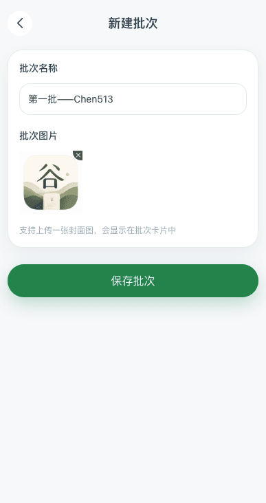

记一笔：
进货支出以及卖入收入
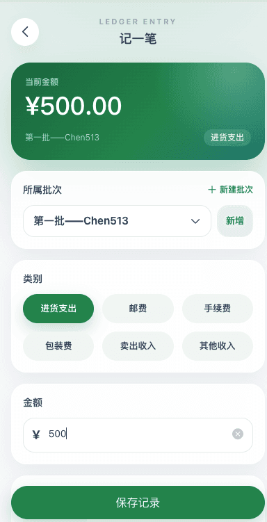
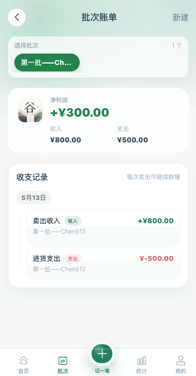
较前一日对比效果：（右侧滑动可对其编辑删除）
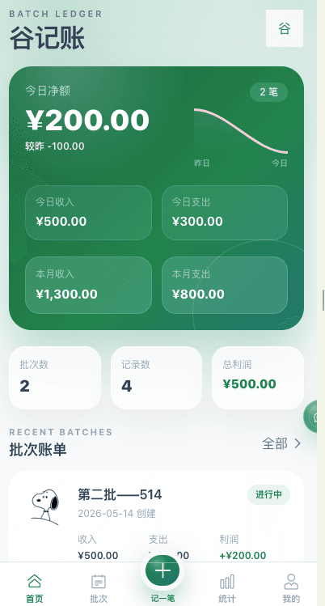
一个偏移动端体验的批次记账 App，适合记录转卖、代购、小批量进货这类“按批次核算利润”的场景。用户可以围绕某个批次持续追加收入和支出，系统会自动汇总收入、支出、净利润，并提供统计分析、数据导入导出和 AI 自然语言记账能力。
统计分析：
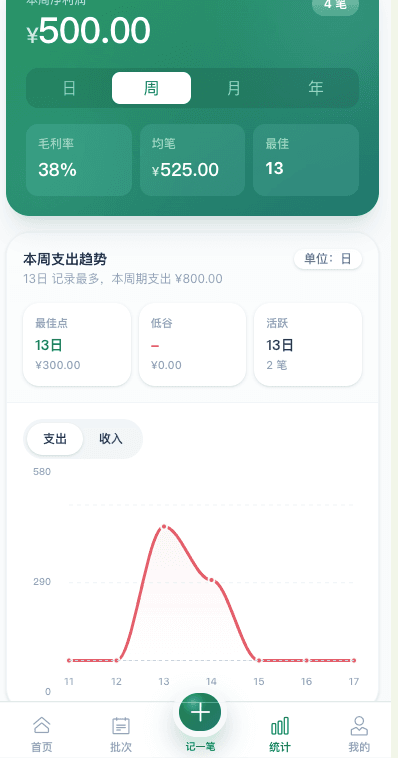
导入导出本地数据：
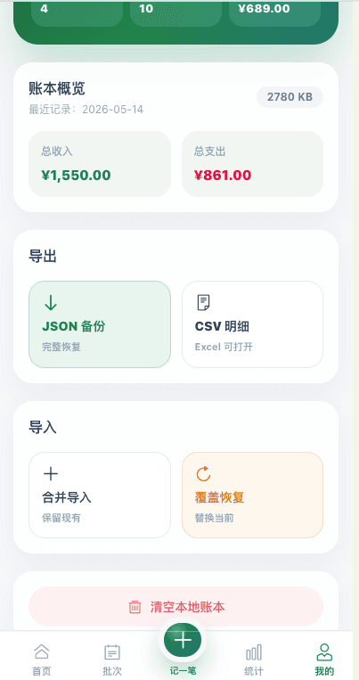

智能AI记账 （采用deepseek v4模型）
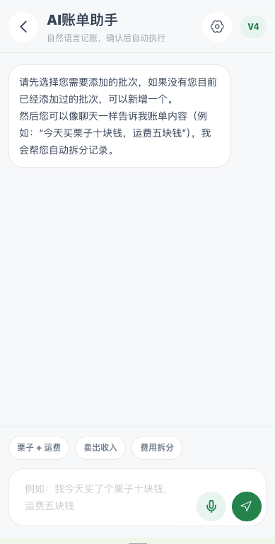

本地执行的任务清单：
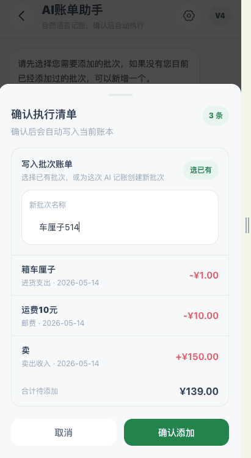


接入ai后执行的任务清单：
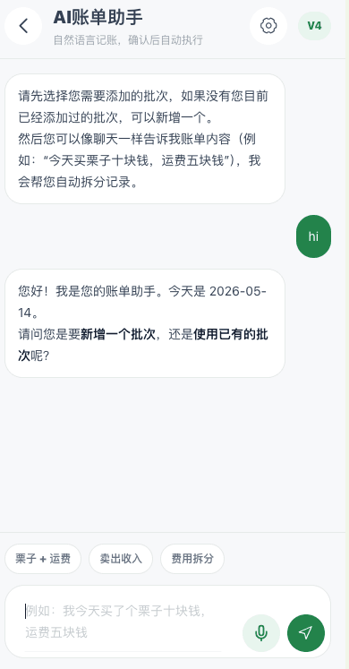

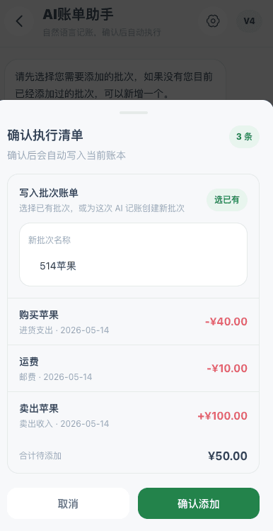

完成记录：

创建的批次账单：
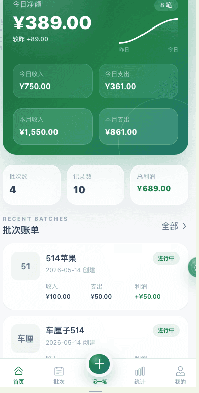

## 前言

很多前端项目在一开始都会带着一点“概念先行”的味道。先搭一个 UI，先放一个 AI 按钮，先做一些看起来很聪明的交互，再慢慢去找真正的使用场景。这个项目最初也有点类似。它最早叫 **Notely AI**，从名字就能看出来，原本是偏“智能笔记”方向的一个尝试。

但在实际推进过程中，方向很快就变得明确起来：相比做一个抽象的“AI 记事本”，不如把它收敛成一个更具体、更能解决现实问题的工具。于是项目从“内容记录”转向了“批次记账”，也就是现在的 **谷记账**。

这个转向看起来像是换了个名字，实际上等于把整个产品的核心逻辑、页面结构、状态管理方式、图表展示、AI 交互、数据持久化思路都重新定义了一遍。它不再是一个“我可以记点什么”的产品，而是一个“我需要围绕某个批次持续核算利润”的工具。

这篇文章会完整拆解这个项目，尽量不只是讲“做了什么”，而是讲清楚：

- 为什么要从通用记事转成批次记账。
- 为什么这类项目更适合用 `Batch + Record` 模型，而不是把所有数据揉成一张表。
- 为什么 AI 不应该直接写数据，而是要先走确认流程。
- 为什么前端本地记账项目看起来简单，实际上最难的是约束数据一致性。
- 为什么一个移动端账本页面，最后需要同时处理布局、统计、图表、持久化、语音输入和交互容错。

如果你正在做一个本地工具类应用，或者你也在考虑怎么把 AI 接进一个真实的前端业务流里，这个项目里的不少取舍应该都能提供一些参考。

## 一、问题不是“怎么记”，而是“按什么维度算”

大部分普通记账 App 的思路都是围绕“单笔交易”展开的。今天花了多少钱、昨天赚了多少钱、这个月餐饮占比多少，这些都是以时间和分类为核心视角的记账方式。

但如果场景变成转卖、代购、小批量进货、潮玩、数码、鞋服倒卖，事情就不一样了。

这时候用户在意的不是“今天花了多少钱”，而是：

- 这个批次一共进货花了多少。
- 这个批次卖出了几次。
- 运费、手续费、包装费分别吃掉了多少利润。
- 这个批次现在到底赚了还是亏了。
- 上个月那个批次的每一笔卖出记录还在不在。

也就是说，**用户需要的不是时间账本，而是批次账本**。

这会直接影响整个数据模型设计。我们不能只存一堆散落的收支记录，然后指望前端再临时按条件筛选。因为从业务语义上讲，“记录”本身必须依附在“批次”下面，而“批次”又必须成为利润汇总的天然边界。

所以项目转型后的第一个核心决定，就是把业务模型收敛成两层：

1. `Batch`：批次，代表一个核算单元。
2. `AccountRecord`：收支记录，代表批次下的一次记账动作。

看起来这很普通，但其实这一步就已经把项目从“泛记事”拉回到了“垂直业务工具”的轨道上。

## 二、从 Notely AI 到谷记账：项目收敛的过程

项目从 Notely AI 转成谷记账，并不是简单地换了几个页面标题。真正发生变化的是“产品中心”从内容转向了数据。

在 Notely AI 的设想里，AI 是主角，页面更多是 AI 的容器；而在谷记账里，AI 只是工具层，真正的主角变成了：

- 批次
- 收支记录
- 利润统计
- 数据可恢复性

这个变化带来了几个非常具体的后果。

### 1. 页面组织方式变了

原来如果是笔记类产品，通常会有：

- 列表页
- 编辑页
- AI 助手页
- 内容详情页

但批次记账不需要复杂的内容编辑器，它更像一个轻量级业务系统，所以最后的页面被整理成了：

- 首页：看总览
- 批次页：看某个批次的详情和流水
- 统计页：看周期分析
- 我的：做导入导出和数据管理
- 批次表单页 / 记录表单页：做具体编辑
- AI 助手页：把自然语言转换成待确认动作

### 2. 状态设计从“展示数据”变成“驱动业务”

笔记类项目里，状态往往只是内容渲染的来源。而在这个项目里，Pinia store 不只是“存东西”，而是整个业务规则的承载点：

- 某个分类到底是收入还是支出，不由视图判断，而由 store 统一定义。
- 某个批次的利润怎么得出，不由组件拼接，而由 store 统一汇总。
- 导入进来的数据是否有效，不由页面决定，而由 store 负责规范化。

这意味着 store 已经不再只是“共享状态”，而是开始接近一个本地领域模型。

### 3. AI 的位置发生了本质变化

很多 AI 功能做着做着会有一个问题：它看起来很酷，但其实脱离业务闭环。用户说一句话，模型返回一大段解释，最后还得手动自己填表。

在谷记账里，AI 被重新定义成一个“输入解释器”：

- 用户说自然语言。
- AI 拆成结构化记录。
- 用户确认。
- 系统执行。

AI 不再负责“制造内容”，而是负责“降低输入成本”。这是它在真实业务里更稳妥的位置。

## 三、为什么用 Vue 3、Pinia、Vant 和 ApexCharts

这个项目的技术栈看起来很主流，但里面其实有明确的取舍逻辑，而不是“因为大家都这么用”。

### 1. Vue 3 的优势在这里不是“框架先进”，而是表达力刚好够

这个项目有几个比较典型的前端难点：

- 有明显的表单流。
- 有多个页面共享同一批本地数据。
- 有不少派生统计值。
- 有轻量但真实存在的交互复杂度。

Vue 3 对这种“本地状态 + 页面编排 + 组件拆分”的项目非常合适。`computed` 用来做统计推导，`ref` 和 `reactive` 用来维护表单和 UI 状态，`watch` 用来做持久化和页面联动，组合起来足够干净。

如果这个项目再大一倍，甚至引入服务端同步，Vue 3 这套写法依然能扩展；但如果项目再小一半，只是一个纯静态展示页，那它又会显得稍微偏重。所以从规模上讲，这个选择刚好。

### 2. Pinia 很适合这种“本地领域状态”项目

Pinia 在这里最关键的价值不是“共享状态”，而是：

- 它让批次和记录成为单一可信数据源。
- 它让派生统计逻辑可以收拢到一个中心位置。
- 它让页面不必各自维护自己的利润算法。

你可以把这个项目看成一个没有后端数据库的轻业务系统，而 `bookkeeping.ts` 就像它的本地模型层。

### 3. Vant 不是“方便”，而是“少踩移动端细节坑”

表单、Popup、Picker、SwipeCell、Tabbar、Toast、Dropdown，这些在移动端里是非常高频的 UI 基础设施。自己从零写不是不行，但你很快就会遇到：

- 点击态和滚动态冲突
- 弹层圆角、遮罩和 safe-area 处理麻烦
- 选择器交互不稳
- 滑动删除的触摸反馈不好调

Vant 在这类移动端场景里足够成熟，能把注意力释放出来，让你把时间更多花在业务模型和数据流上。

### 4. ApexCharts 在中小项目里非常高效

统计页如果只是展示一张柱状图或者折线图，纯 CSS 或 Canvas 自画也不是不行。但一旦你需要：

- area 趋势图
- donut 占比图
- tooltip
- marker
- annotations
- 动态切换 series

自己造轮子的投入就会迅速变高。ApexCharts 在这个项目里最大的价值，是以较低的接入成本提供了一整套足够体面的统计呈现能力。

## 四、目录结构看起来不复杂，但它已经隐含了一套业务边界

项目的目录结构大致分成下面几层：

```text
src/
├── assets/
├── components/bookkeeping/
├── layouts/
├── router/
├── stores/
├── utils/
└── views/
```

这套结构背后的含义不是“按功能分类”，而是“按职责分层”。

### 1. `views/` 负责页面入口

页面路由对应的顶层界面都放在 `views/`。它们通常负责：

- 读取路由参数
- 决定当前页面要展示什么
- 把业务动作派发给 store
- 组合页面级组件

例如：

- `DashboardView.vue` 负责首页
- `BatchesView.vue` 负责批次详情与流水
- `StatisticsView.vue` 负责统计分析
- `ProfileView.vue` 负责导入导出与本地管理

### 2. `components/bookkeeping/` 负责业务组件和复杂页面组件

这个目录下既有复用组件，也有像 `AIAssistantPage.vue`、`RecordFormPage.vue` 这种页面主体组件。严格来讲，它们已经接近“feature component”，并不只是纯粹意义上的小组件。

这是一种比较实用主义的组织方式。它不追求概念上绝对纯粹的原子组件拆分，而是优先保证：

- 账本相关代码放在一起
- 复杂页面逻辑有明确归属
- 可以在页面和 store 之间多一层缓冲

### 3. `stores/` 是数据与规则的中心

`bookkeeping.ts` 是整个项目真正的心脏。页面可以换皮、图表可以替换、AI 接入可以重写，但只要批次与记录的状态模型不变，这个项目的骨架就还在。

### 4. `utils/` 是语义一致性的保障

像金额格式化、日期显示、财务颜色语义，这些看起来像“小工具”，但它们的价值在于统一。一个账本系统如果每个组件都自己判断利润颜色、自己拼金额符号，最后一定会出现风格和逻辑分裂。

## 五、路由设计：把主导航流和功能编辑流拆开

路由文件 `src/router/index.ts` 很短，但它体现了很重要的一个设计思路：**主导航页和功能页不要混在一起**。

项目把 `/` 下面的几个主页面放进了 `BookkeepingLayout` 里：

- 首页
- 批次
- 统计
- 我的

而把下面这些页面做成独立路由：

- 新建批次
- 编辑批次
- 新建记录
- 编辑记录
- AI 助手

这样拆的好处很直接。

### 1. 主页面有稳定的 App 壳

底部导航、页面切换动画、整体滚动区域，全都由 `BookkeepingLayout` 统一接管。这样首页、批次页、统计页、我的页在结构上就保持高度一致。

### 2. 表单页不被导航干扰

记录表单和批次表单都属于“专注输入”页面。它们不需要底部导航一直在那儿提醒用户“你还可以去别的地方看看”。相反，它们需要的是沉浸式的单任务输入流程。

### 3. AI 页面不被塞进 Tabbar 流里

AI 助手的使用频率和主导航的常规页面不一样。它更像一个工具入口，而不是一个必须长期停留的一级页面。所以它适合从首页悬浮入口进入，再独立承载自己的聊天和确认逻辑。

这就是为什么项目最终选择了“悬浮球 + 独立路由”而不是“Tabbar 里塞一个 AI tab”。

## 六、核心数据模型：为什么 `category` 比 `type` 更重要

在很多记账项目里，用户会先选“收入”还是“支出”，再选具体类别。但在这个项目里，事情反过来了。

它定义了六个核心分类：

- 进货支出
- 邮费
- 手续费
- 包装费
- 卖出收入
- 其他收入

真正的 `income` / `expense` 是由分类自动推导出来的：

```ts
const categoryTypeMap = {
  进货支出: "expense",
  邮费: "expense",
  手续费: "expense",
  包装费: "expense",
  卖出收入: "income",
  其他收入: "income",
};
```

为什么这很重要？

### 1. 用户填写时更自然

用户在真实场景里通常不会先想“这是不是一笔支出”，而是会先想“这是运费”“这是手续费”“这是卖出收入”。让分类直接承载业务语义，输入门槛会更低。

### 2. AI 更容易稳定输出

如果让模型同时判断：

- 这是收入还是支出
- 这是什么分类

它就有两层决策要做。现在把 `type` 从用户和 AI 层都隐藏起来，模型只要输出合法分类，系统就能自动推导收支方向，复杂度会小很多。

### 3. 统计更不容易出错

如果 `type` 和 `category` 都允许手动填，就会存在“卖出收入被标成支出”的可能性。一旦出现这种脏数据，整套利润统计都会偏掉。

因此，这里的关键不是多做了一个映射表，而是通过这个映射把“数据合法性”提前固化到了模型层。

## 七、Pinia store：这个项目真正的业务中枢

如果只允许我指出这个项目里最重要的一个文件，那一定是 `src/stores/bookkeeping.ts`。

它的重要性体现在几个方面。

### 1. 它维护了最小但足够的原始数据

store 只存两份基础数据：

- `batches`
- `records`

除此之外，像：

- 总收入
- 总支出
- 总利润
- 本月收入
- 本月支出
- 本月利润
- 某个批次的利润
- 最近记录

这些都不是额外落库的，而是运行时推导出来的。

这是一个非常健康的信号。因为一旦你开始把“统计结果”也写回状态里，项目很快就会进入“改一处，漏三处”的维护地狱。

### 2. 它统一了排序规则

项目里存在批次排序和记录排序两个维度，而它们都依赖一个通用的 `sortByDateDesc()`。

这样做的好处不是省代码，而是避免多个页面对“最近”的理解不一致。首页、批次页、我的页面看到的记录顺序最终都建立在同一套规则上。

### 3. 它承担了规范化恢复逻辑

导入 JSON 的时候，外部数据不一定完全符合当前版本 schema，所以 store 里提供了：

- `normalizeBatch`
- `normalizeRecord`
- `isRecordCategory`

这说明项目在设计上已经考虑到了“数据不是永远完美”的问题。

在很多小工具项目里，导入导出经常只是“把当前数组 JSON.stringify 一下，再 parse 回来”。那样短期能用，但一旦字段变化、旧数据缺字段、或者用户自己改过文件，就会炸。

谷记账这里至少已经迈出了很关键的一步：**导入不是简单还原，而是先校验、再规范化、最后再合并或替换**。

### 4. 它把“本地模型层”的角色扛起来了

项目没有后端，但 store 做的事情已经很像后端模型层：

- 负责新增和更新
- 负责删除联动
- 负责批次与记录关系
- 负责导入导出
- 负责数据归一化
- 负责统计派生

这也是为什么这个项目后续如果要接云同步，其实有很好的演进空间。因为前端本地已经有了一套比较清晰的领域层。

## 八、LocalStorage 不只是“存一下”，而是项目的生命线

因为项目目前没有服务端，所以所有核心数据都存储在浏览器 LocalStorage 中。

这件事听起来很简单：

```ts
watch(
  [batches, records],
  () => {
    localStorage.setItem(STORAGE_KEY, JSON.stringify({ batches, records }));
  },
  { deep: true },
);
```

但它背后其实带着几层含义。

### 1. 每次修改都必须可恢复

既然所有数据都落在本地，那就必须接受一个事实：浏览器就是数据库。用户刷新页面后看见的数据，应该和刷新前一致。这里不允许出现“我加了一条记录但刷新没了”的情况，因为那对工具类产品来说是致命问题。

### 2. 导出备份不是附加功能，而是必需品

只要数据存在 LocalStorage，就会有这些风险：

- 清缓存
- 换浏览器
- 换设备
- 无痕窗口
- 某次调试误删

所以“我的”页面里的 JSON 备份和 CSV 导出，不是锦上添花，而是对 LocalStorage 方案的必要补偿。

### 3. 版本演进要提前考虑

当前 store key 是 `notely-bookkeeping-v3`。这说明项目已经至少经历过几轮数据结构调整。只要产品继续演进，这个版本问题迟早会更复杂。

比较理想的长期方案是：

- 在导入逻辑里保留更明确的 version 迁移层
- 对旧版本字段做更系统的兼容
- 明确记录哪些字段是可推导的，哪些字段必须持久化

当前项目还没有把这部分做成完整机制，但已经有了版本和规范化意识，这比没有强很多。

## 九、首页设计：总览不是简单堆卡片，而是让用户先看到“今天值不值得看”

首页 `DashboardView.vue` 的定位不是功能入口大全，而是一个压缩视图。它应该让用户在进入应用后的第一眼，就能知道：

- 今天有没有收支
- 今天是赚了还是亏了
- 最近在处理哪些批次
- 如果要快速记账，AI 入口在哪里

### 1. 今日与昨日对比

首页没有一上来堆很多复杂图表，而是用最轻的方式先给出：

- 今日收入
- 今日支出
- 今日净额
- 较昨日的利润变化

这是一个很实用的选择。对工具型产品来说，用户最关心的通常不是“大而全”的分析，而是“我现在需不需要点进去”。而日对比就是一种非常高密度的信息压缩方式。

### 2. 最近批次优先于全部批次

首页只显示最近几个批次，而不是完整批次列表。因为完整列表属于浏览行为，应该放在批次页；首页应该优先服务高频回访和快速判断。

### 3. 悬浮 AI 入口是首页专属强化动作

AI 悬浮球被放在首页，而不是全局常驻所有页面，这其实体现了一种克制。AI 是增强能力，但不应该在所有页面里都悬着影响阅读和输入。

同时，这个悬浮球支持拖拽和吸边，位置会写入 LocalStorage。这个细节虽然小，但对移动端来说很关键，因为用户的手势习惯、拇指区域和屏幕大小都不完全一样。

## 十、那个看似很小但实际很典型的 bug：为什么 AI 图标点了进不去

这个项目最近修过一个很有代表性的交互 bug：首页的 `AI` 悬浮球路由明明存在，但点击时就是进不去页面。

如果只看表面，很容易怀疑：

- 路由配错了
- 页面没注册
- `router.push` 没执行

但真正的问题是交互逻辑本身。

原来的悬浮球同时用了：

- `pointerdown`
- `pointermove`
- `pointerup`
- `click`

设计初衷是：

- 拖动时可以移动悬浮球
- 点击时可以展开或进入 AI 页面

但实际流程里，`pointerup` 会先把悬浮球状态重置成收起态，而后续 `click` 再读取这个状态时，只会执行“展开”，不会执行跳转。所以看起来像是“点击没反应”，实际上是事件顺序和状态机互相打架了。

最后的修法不是去补一个更多的 `if`，而是把逻辑重新梳理成两类：

1. 轻触：直接进入 AI 页面。
2. 明显拖动：只处理移动和吸边。

同时增加了拖拽阈值，防止移动端轻微手抖就被当成拖动。

这个 bug 很典型，因为它提醒我们：**移动端交互不是“事件能触发就行”，而是必须把手势意图拆清楚**。只要把点击和拖拽混在一套状态里，迟早会出现意料之外的竞争。

## 十一、批次页：真正体现“按批次记账”价值的地方

如果说首页是总览，统计页是抽象分析，那么 `BatchesView.vue` 才是真正体现这个产品差异化价值的地方。

为什么？

因为“按批次记账”这个概念，只有在你真的点进某一个批次，看见它下面所有流水都被聚合在一起，并且利润实时汇总时，才会变得直观。

### 1. 通过 query 选中当前批次

批次页没有额外维护一个复杂的本地选中状态，而是直接用路由 query 的 `batchId` 来表示当前选中的批次。

这样做有几个好处：

- 页面刷新后依然能恢复当前批次
- 从其他页面跳回来时可以直接定位
- 选中状态天然可分享、可回退、可导航

### 2. 批次卡片和记录时间线是两个不同层面的信息

在这个页面里，当前批次先通过 `BatchCard` 展示汇总信息，再通过 `RecordTimeline` 展示每条明细。这个拆分很合理，因为用户对一个批次的关心通常有两个层次：

- 它整体赚没赚钱
- 每一笔账到底是什么

### 3. 侧滑操作非常符合移动端记账场景

批次和记录都接入了 `van-swipe-cell`。这看起来是一个 UI 小细节，但实际上很重要。记账类产品的“删”和“改”都属于中频操作，如果每次都要点进详情页再找按钮，流程会变重。

滑动操作在这里不是为了炫技，而是为了把高频维护动作压缩到最顺手的路径上。

## 十二、记录表单：让“记一笔”这件事尽量少打断用户

`RecordFormPage.vue` 是整个项目里最典型的业务表单页。它不是一个复杂后台表单，但也绝对不是随便放几个输入框就能交差的页面。

它需要处理：

- 批次选择
- 快速新建批次
- 分类选择
- 金额输入
- 备注输入
- 日期输入
- 图片上传
- 编辑态回填

### 1. 批次必须是第一位的

在普通记账里，记录往往可以先记下来再说；但在批次记账里，记录必须归属某个批次。所以表单一上来先问“所属批次”，这是业务上非常正确的顺序。

同时，如果用户还没创建批次，页面也允许他当场新建并自动回填。这个设计避免了把用户赶回批次页再回来记账的流程打断。

### 2. 表单没有让用户手动选择收入或支出

这点前面提过，但放到表单层再看一遍会更清楚。用户只需要选“分类”，系统自动知道这是收入还是支出。这样：

- 选择成本更低
- 输入错误更少
- 统计一致性更高

### 3. 金额卡片先给即时反馈

表单顶部用一块较强视觉的金额卡片展示当前输入金额和选中的批次、分类。这其实是一种轻量级的“确认镜像”。因为移动端输入数字时，用户很容易只盯着键盘，而忽略自己正在编辑什么。顶部这个摘要能持续提醒用户当前上下文。

## 十三、统计页：真正的难点不是图表，而是怎么建时间桶

很多人做统计页时会把重点放在“选哪种图表库”，但真正决定统计页质量的，往往不是图表长什么样，而是数据怎么聚合。

在这个项目里，统计页的核心问题是：

- 日视图怎么定义
- 周视图怎么定义
- 月视图怎么定义
- 年视图怎么定义
- 每个周期里的记录怎么归桶

### 1. 先算时间范围，再建桶

项目把这件事拆成了两步：

1. `getPeriodMeta(period)` 先给出 `start` 和 `end`
2. `createBuckets(period, start, end)` 再根据时间范围建出空桶

这样做非常合理。因为“当前周期是什么”和“当前周期怎么聚合”其实是两层问题，不应该写在一起。

### 2. 月视图按天建桶，滚动而不是硬压缩

如果一个月 31 天都挤在一张手机宽度的图里，图表一定会很拥挤。这个项目没有简单粗暴地减少数据，而是让图表区域支持横向滚动，并尽量自动滚到今天附近。

这是一种比较务实的做法。它承认手机屏幕有限，但不牺牲数据粒度。

### 3. 趋势只切收入和支出，而不是什么都塞

统计页当前允许切换“收入趋势”和“支出趋势”，没有再加利润趋势、订单数趋势、分类趋势等一堆选项。这种克制是有必要的。因为当前数据量和业务复杂度还不足以支撑太多维度的切换，过度堆功能只会让页面变得更像报表系统而不是移动工具。

### 4. 最佳点、低谷、活跃日是轻分析，而不是假洞察

页面里提供了：

- 最佳点
- 低谷
- 活跃日期

这些指标都来源于当前周期的真实聚合数据，而不是拼一些华而不实的“智能分析文案”。它们的价值在于快速解释图，而不是取代图。

## 十四、AI 助手：为什么不能让模型直接写账

如果这个项目只有“自然语言输入 -> AI 解析 -> 直接新增记录”这一条链路，它看起来会更丝滑。但项目最终没有这么做，而是坚持走了确认弹窗。

这不是保守，而是必要。

### 1. 账本类数据一旦写错，修正成本比聊天产品高得多

聊天产品里模型说错一句话，用户最多觉得回答不准确；但账本里模型如果把：

- 收入识别成支出
- 金额识别错一位
- 把运费漏掉
- 批次归错

那就会直接污染数据结果，进而影响利润统计。尤其这种污染不一定会立刻被发现，可能要过几天用户复盘时才看到数字不对。

### 2. 结构化输出比自然语言回复更重要

AI 在这个项目里的工作目标，不是“回复得聪明”，而是“输出得稳定”。所以它被要求尽可能调用 `create_records` 工具，把账单转换成：

- 分类
- 金额
- 备注
- 日期
- 批次建议

自然语言回复只是附属层，真正的价值是结构化 payload。

### 3. 确认弹窗是控制点

确认弹窗承担了三件事：

- 让用户看到模型到底拆了几条记录
- 让用户决定这些记录写入哪个批次
- 在必要时补一个新批次名称

也就是说，AI 页不是一个“自动记账黑箱”，而是一个“半自动执行台”。这其实更接近真实可用的 AI 工具形态。

## 十五、为什么远程 AI 和本地规则都要保留

项目里的 AI 助手不是纯模型依赖，而是双通道设计：

- 优先调用 SiliconFlow 的远程模型
- 如果没有 API Key 或远程失败，就退回本地规则解析

这个设计非常值得保留。

### 1. 远程模型的优势是理解力

像“昨天卖出一双鞋 1299，平台抽成 65，顺丰到付 18”这种表达，远程模型在语义拆解、上下文理解和容错上明显更强。

### 2. 本地解析的优势是确定性和可用性

远程模型再强，也会遇到：

- 没配 API Key
- 网络失败
- 请求超时
- 供应商波动

而基础记账流程不应该被这些因素完全卡住。所以本地规则解析至少要支持最常见的简单句式，让用户在最坏情况下仍然能把账记进去。

### 3. 双通道让产品体验更稳

一个真正能长期用的工具，重点不是“最强场景有多强”，而是“最弱场景还能不能用”。从这个角度看，本地兜底不是权宜之计，而是稳定性设计。

## 十六、流式 AI 返回：聊天体验和结构化结果如何同时兼顾

项目里的远程 AI 调用不是简单发一个 JSON 然后等完整结果回来，而是启用了流式返回。

为什么要这样做？

因为如果用户输入一句稍微复杂一点的话，然后页面一直卡在“思考中...”，直到几秒后突然整段结果一起出现，交互感受会比较生硬。流式返回至少能让用户知道系统正在工作，而且在网络一般的情况下，页面仍然是有反馈的。

但这个项目和普通聊天页有一个不一样的地方：它真正需要的不是一段漂亮回复，而是一份结构化工具结果。也就是说，页面实际上同时在处理两条流：

- 文本内容流：给用户看到的 assistant 回复
- 工具参数流：`tool_calls.function.arguments` 里逐段返回的 JSON 片段

这比普通的“边打字边显示聊天文本”要麻烦一点，因为文本天然适合逐步追加，而工具参数本质上必须完整拼完才能解析。

项目当前的处理思路大致是：

1. 用 `response.body.getReader()` 读取流。
2. 按 SSE 的 `data:` 行切开每个 chunk。
3. 如果 chunk 里有 `delta.content`，就把内容追加到当前 assistant 消息。
4. 如果 chunk 里有 `delta.tool_calls[0].function.arguments`，就把参数片段拼到一个字符串里。
5. 流结束后再对整段参数做 `JSON.parse()`。

这样设计的好处有几个：

- 用户能尽早得到“系统正在响应”的感知。
- 结构化参数不会在半截状态下被过早解析。
- 即使模型最后没有给出合法工具参数，聊天层也还能保留一份文字回应。

这套方案当然也有风险：

- 模型如果输出了不完整的 arguments，最后还是会解析失败。
- 流式协议一旦变化，前端解析更脆。
- 逻辑写在页面组件里时，可测试性一般。

但对于当前体量的项目来说，这是一个很务实的平衡点。它既保留了交互上的实时感，又没有让不稳定的中间状态直接影响业务写入。

## 十七、本地解析的边界：规则不是 AI，但可以解决 60% 的基础输入

本地解析主要依赖几类方法：

- 解析中文数字
- 归一化日期
- 猜测分类
- 清洗备注
- 根据文案推测批次名
- 把一句话拆成多条记录

比如：

- “今天买栗子十块钱，运费五块钱”
- “包装费六块，手续费三块”
- “卖出收入一百二十元”

这类句子本地规则就足够了。

当然，它的边界也很明显：

- 对复杂口语表达支持有限
- 对多轮上下文没记忆
- 对模糊批次引用不够稳定
- 对混合多日期、多人物、多商品的句式容易失真

但我反而觉得，这种明确边界是好事。因为它迫使我们诚实面对：规则引擎能做什么，模型该接管什么。

## 十八、确认弹窗为什么必须放在最后一步，而不是放在模型前面

有些人会觉得，既然最终还是要用户确认，那为什么不一开始就做成普通表单，让 AI 只是给个建议？

问题在于，这样会把用户重新拉回“逐字段填写”的流程里。用户本来是为了减少输入成本，才用自然语言对 AI 说一句话；如果模型解析完以后，系统再把他扔回一个完整表单，让他自己重新点分类、填金额、改备注、选日期，那 AI 的价值就被削弱了。

所以更合理的方式不是“AI 先建议，用户再重填”，而是：

- AI 直接把意图拆成待执行清单
- 用户只负责核对
- 系统在确认后统一执行

这就是为什么确认弹窗被放在最后一步，而且它只保留最关键的可控点：

- 批次写到哪里
- 是用已有批次还是新建批次
- 拆出来的记录对不对
- 合计金额是不是符合预期

用户在这里做的是“确认”，不是“重做”。这两者的认知成本完全不一样。

如果弹窗里显示：

- 栗子，进货支出，10 元
- 运费，邮费，5 元

用户只需要判断“对不对”。而如果让他回到完整表单再一条条录入，那整个流程就退化回传统记账了。

这个设计其实体现了一个挺重要的原则：**AI 参与业务流时，最理想的状态是降低输入成本，而不是制造新的校对成本。**

## 十九、导入导出：这不是附属页面，而是本地应用的信任机制

“我的”页面很容易被低估，但对这种纯前端本地工具来说，它实际上是用户信任能否建立起来的一部分。

为什么？

因为只要用户往里记录真实数据，他迟早会问这些问题：

- 数据到底存在哪里？
- 换浏览器还能恢复吗？
- 能不能导出给别人看？
- 我清缓存了怎么办？

如果这些问题没有清晰答案，用户就不会把这个项目当成一个真正可靠的工具。

### 1. JSON 备份解决“完整恢复”

项目导出的 JSON 并不只是 `records` 数组，而是一个具备元信息的备份包：

- `app`
- `version`
- `exportedAt`
- `data.batches`
- `data.records`

这样做的意义非常实际：

- 后续可以依据 `version` 做迁移处理
- 可以识别文件是不是本应用生成的
- 可以在未来扩展元信息，而不破坏主数据结构

### 2. CSV 明细解决“外部查看与二次处理”

JSON 适合恢复和程序处理，但不适合普通用户直接阅读。CSV 的价值在于它可以直接被 Excel、WPS 或 Numbers 打开，适合：

- 临时筛选
- 对账
- 发给别人核对
- 做额外统计

所以 JSON 和 CSV 在这里并不是重复功能，而是面向两类完全不同的使用场景。

### 3. 合并导入和覆盖恢复必须分开

导入需求至少有两类：

- 我想把这份备份完整恢复回来
- 我想把另一份数据并进当前账本

如果只做一个“导入”按钮，用户很容易在不清楚后果的情况下覆盖当前数据。把它拆成 `merge` 和 `replace` 两种模式，是很必要的风险分层。

### 4. 清空账本为什么也放在这里

清空看起来是一个破坏性动作，但它和导入导出其实属于同一类能力：数据生命周期管理。

- 备份
- 恢复
- 合并
- 清理

把这些能力集中到“我的”页面，而不是散落在不同角落，能让用户形成稳定预期，也更符合工具产品的心智模型。

## 二十、消息渲染与 Markdown：为什么轻量方案反而更适合这个项目

AI 页的回复支持 Markdown 渲染，这看起来像个细节，但其实它明显改善了消息可读性。

项目最终使用的是 `MarkdownIt`。这意味着它不只是想支持一个加粗或简单换行，而是希望在不引入太重内容系统的前提下，稳定处理：

- 段落换行
- 行内代码
- 引用块
- 基本强调语法

这比自己写一套正则替换要可靠得多。尤其 AI 回复里如果包含提示块、强调文本或者简短清单，Markdown 渲染能明显增强结构感。

但为什么不是更重的内容方案？

因为这个项目不是文章平台，也不是文档编辑器。它需要的是“聊天信息能更好看、更好扫读”，而不是完整富文本生态。所以 `MarkdownIt` 这种轻量成熟方案刚好卡在一个合适的平衡点上：

- 比手写渲染稳定
- 比完整富文本体系轻得多
- 足够满足 AI 气泡展示的需要

## 二十一、移动端壳层：`header / body / footer` 不是视觉问题，而是滚动模型问题

很多项目在桌面端看着没毛病，一到手机上就开始出现各种不舒服的问题：

- 内容被底部按钮挡住
- 键盘弹出时输入区错位
- 底部导航和主体内容抢滚动
- 弹层打开后页面定位混乱

谷记账的主布局比较明确地采用了：

- 顶部结构层
- 中间主体区 `flex-1`
- 底部导航单独占位

这看起来只是布局写法，但本质上是在先定义滚动模型。

一旦主体内容区和底部操作区没有真正分层，移动端页面迟早会在：

- 长列表
- 表单输入
- 弹层出现
- 键盘弹出

这些场景里出现边界问题。

所以 `BookkeepingLayout` 的价值不只是“包了一个 Tabbar”，而是把整个应用的基础滚动行为先稳定了下来。后面的页面之所以能相对放心地堆卡片、列表、图表和输入框，前提就是这个壳层先站住了。

## 二十二、为什么这个项目的很多“优化”其实都在做同一件事：降低误操作

回头看这个项目已经做过的很多优化，会发现它们本质上都在解决同一类问题：**让用户更难犯错，也更容易纠错。**

比如：

- 分类自动映射收支，避免方向选错。
- AI 只生成待确认动作，避免直接写错账。
- 删除批次时联动删除记录，避免残留脏数据。
- 导入时先做规范化，避免坏数据污染当前账本。
- AI 悬浮球加拖拽阈值，避免轻点被误判成拖动。
- 记录表单顶部持续显示金额和批次，避免输入时丢上下文。

这些优化看起来分散在不同页面、不同模块，但背后的产品原则其实非常一致：**工具产品真正的质量，往往体现在错误成本有多低。**

一个工具不一定要功能最多，但它最好尽量减少：

- 错填
- 误删
- 误判
- 数据丢失
- 状态混乱

只有这样，用户才会逐渐愿意把真实数据交给它。

## 二十三、语音输入：AI 助手里真正提升效率的不是模型，而是少打一段字

很多人一提 AI 助手，第一反应是“大模型”。但在这个项目里，真正大幅降低输入门槛的，反而是语音识别。

为什么？

因为记账本身就是一种“低价值但必须做”的动作。用户懒得记账，不一定是因为不会输入，而是因为不想打开键盘打完整句。尤其在移动端，语音说一句：

“今天买栗子十块钱，运费五块钱”

通常比手动输入快得多。

项目利用浏览器原生 Web Speech API 做了这一层接入。它的优点是：

- 前端就能完成，不依赖额外服务
- 和 AI 输入框天然兼容
- 识别完成后可以直接复用文字发送逻辑

它的缺点当然也有：

- 浏览器兼容性不统一
- 识别质量受环境影响较大
- 某些设备上启动权限弹窗会打断流程

但对一个偏实验型、偏个人工具型产品来说，这个投入产出比是成立的。

## 二十四、主题系统：统一变量比散落 Tailwind class 更重要

这个项目虽然使用了 Tailwind CSS v4，但并没有把所有颜色和视觉语义都写成原子类。相反，它把大量主题定义收敛到了 `src/assets/main.css` 的 `--app-*` 变量里。

这一步其实很关键。

为什么很多中小型前端项目后期会变乱？因为一开始大家图快，组件里随手写：

- `text-emerald-600`
- `text-rose-500`
- `bg-white`
- `border-slate-100`

等到第 15 个页面时，就会发现同样的“主色绿”其实已经有三四种不同深浅，同样的“支出红”也散落在不同文件里。

谷记账把下面这些变量统一了出来：

- 主色
- 强主色
- 主色浅背景
- 收入色
- 支出色
- 页面背景
- 卡片背景
- 边框色
- 主文字
- 次文字
- 弱文字

再把它们映射到 Vant 的 `--van-*` 变量上。这样做的直接收益是：

- 换主题时成本更低
- 组件语义更清楚
- Vant 原生组件和业务样式不会互相打架

### Toast 修复是个很好的例子

项目里曾经出现过一个问题：全局变量联动导致 Toast 背景发白，信息提示看起来很奇怪。最后通过覆盖：

- `--van-toast-background-color`
- `--van-toast-text-color`
- `--van-toast-icon-color`

再对 `.van-toast` 做兜底修复，才把提示样式统一回来。

这件事本身不复杂，但它说明了一点：**一旦选择了 CSS 变量作为主题中心，就应该把第三方组件库也纳入同一套控制逻辑里**。

## 二十五、构建配置：简单，但每一项都不是摆设

`vite.config.ts` 里并没有什么非常复杂的工程配置，但每一项都对应实际需求。

### 1. `@` 别名

它的价值不是少打几个 `../../`，而是让文件引用在项目扩展后仍然可读。

### 2. `AutoImport` + `Components` + `VantResolver`

这套组合减少了大量模板和组件的手动引入负担，尤其在使用 Vant 这类组件密集型方案时很省心。

### 3. `@tailwindcss/vite`

Tailwind v4 的接入方式相对现代，和 Vite 配合也比较自然。

### 4. `build.chunkSizeWarningLimit = 1000`

这一项很容易被忽略，但非常实用。因为引入图表库之后，打包体积一定会上来。如果继续沿用默认阈值，就会长期看到噪音 warning，久而久之开发者反而会对真正的告警失去敏感度。

### 5. `postcss.config.cjs` 保持空配置

这个决定看似什么都没做，实际上是一个工程清理动作。旧版 `postcss-px-to-viewport` 常常会和现代构建链产生兼容问题，如果当前项目并不依赖它，那最务实的方式就是先去掉，避免让无意义的迁移 warning 干扰日常开发。

## 二十六、项目里仍然存在的技术债

一个项目是否健康，不是看有没有技术债，而是看技术债是否被识别、是否可解释。

谷记账当前比较明确的技术债有几类。

### 1. 历史文件仍在仓库里

仓库里还保留着一些旧文件，比如：

- `HomeView.vue`
- `SummaryCard.vue`
- `BatchForm.vue`
- `RecordForm.vue`

它们不在当前主路径上，但会干扰后来者判断“哪个文件才是真的在用”。这类文件越早清理越好。

### 2. store 还缺少系统测试

当前项目的关键规则大多在 store 里：

- 分类映射
- 利润计算
- 导入导出
- 数据规范化
- 更新删除联动

这些都是很适合写单元测试的地方。现在没有测试，意味着每次重构都要更多依赖人工回归。

### 3. AI 解析仍然偏页面内聚

`AIAssistantPage.vue` 现在承载了：

- UI
- 消息状态
- 远程请求
- 本地解析
- 语音输入
- 确认写入

对当前项目体量来说还能接受，但如果未来 AI 能力继续扩展，最好把其中一部分抽到 composable 或独立 service 中。

### 4. 日期与时区策略还比较原始

项目里有的地方使用 `toISOString().slice(0, 10)`，有的地方手动拼本地年月日。单机浏览器环境下问题不大，但一旦未来做跨端同步或服务端聚合，这种混用策略需要尽快统一。

## 二十七、如果继续迭代，这个项目接下来最值得做什么

如果把项目继续往“可长期使用的轻量记账工具”方向推进，我会优先做下面这些事。

### 1. 清理历史文件，降低认知成本

这件事优先级很高，因为它会直接影响后续所有开发效率。

### 2. 给 store 和导入导出补测试

尤其是：

- 批次删除是否同步删记录
- 分类映射是否稳定
- 合并导入是否正确去重
- 覆盖恢复是否完全替换
- 非法数据是否能被过滤

### 3. 让 AI 本地解析更模块化

可以把数字解析、日期归一化、批次名推断这些能力拆出来，形成可测试的纯函数集合。

### 4. 增加筛选能力

目前批次页更偏“查看当前批次”，统计页偏“全局周期统计”。如果用户数据量上来，记录筛选、分类筛选、日期筛选会很有价值。

### 5. 设计云备份或账户同步

只要用户真的把它当工具长期使用，本地存储总会碰到边界。是否上后端，可以晚一点决定；但是否要提前把数据结构和同步点设计好，应该尽早考虑。

## 二十八、这个项目给我的一个最大感受：真实产品从来不是“把功能做出来”这么简单

如果只看功能清单，谷记账并不夸张：

- 批次
- 记录
- 统计
- AI 助手
- 导入导出

但真正落地时，你会发现难点并不在于“有没有这些模块”，而在于这些模块之间是否形成了稳定闭环。

比如：

- 分类和收支方向是不是永远一致。
- 批次删除后关联记录是不是一定清干净。
- AI 识别错时是否有人工确认兜底。
- 图表数据和页面摘要是不是来自同一套聚合逻辑。
- 本地数据出了问题时用户能不能恢复。
- 一个看起来很普通的浮动按钮，会不会因为交互状态竞争而根本点不进去。

这些问题任何一个单拿出来都不算“大技术难题”，但它们叠加在一起，才构成了工具产品真正的质量。

## 结语

从 Notely AI 到谷记账，这个项目最有价值的地方，不是它用了多少库，也不是它加了一个 AI 助手，而是它完成了一次相对彻底的“问题收敛”。

它从一个泛化的概念产品，变成了一个围绕真实记账场景建立的数据工具；它把 AI 放回到了合适的位置；它开始认真处理状态一致性、交互容错、导入导出和统计聚合这些真正影响可用性的细节。

如果把这篇文章压缩成一句话，那我会说：

**真正能长期用的前端工具，不是功能最花的那个，而是数据最稳、路径最顺、出错后最容易被用户纠正的那个。**

而谷记账目前的实现，至少已经走在这条路上了。

---

如果后续项目继续演进，这篇博客也可以继续追加新版章节，逐步从“开发总结”沉淀成一份真正可对外发布的技术文章。
