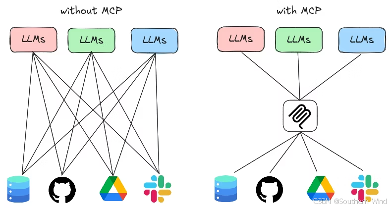
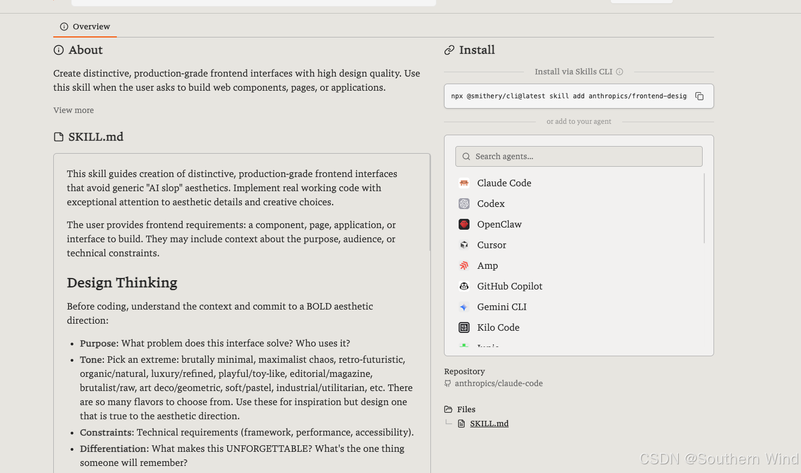
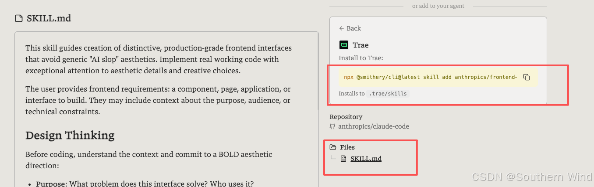
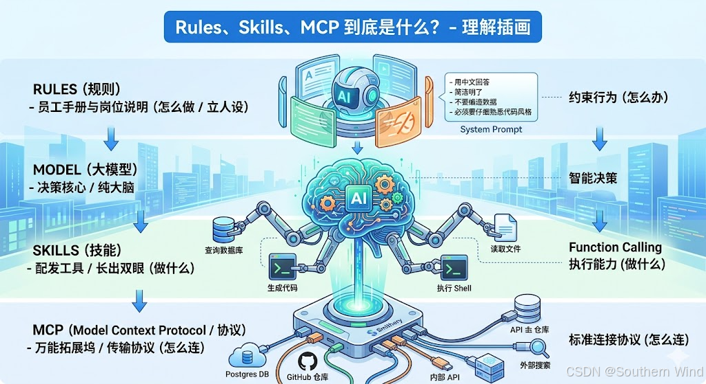

# Rules、Skills、MCP 到底是什么？

我们常在 AI IDE（比如 Cursor、Windsurf、Cline 等）里看到过很多自带的 Rules 功能，还有之前的 MCP 工具，以及新出的 Skills 技能树。但这三者到底有什么关联，意义分别是什么呢？

仔细看了一下，这三个在本质上根本不是一个东西：
- **Rules（规则）**
- **Skills（技能）**
- **MCP（Model Context Protocol）**

很多人会混用，甚至理解成一类东西。实际上，这三者属于完全不同层级的设计。为了方便理解，你可以想象咱们招了一个“超级学霸实习生”（大模型）：

```text
        ┌───────────────┐
        │     Rules     │   ← 员工手册与岗位说明（怎么做 / 立人设）
        └──────┬────────┘
               ↓
        ┌───────────────┐
        │     Model     │   ← 学霸实习生（决策核心 / 纯大脑）
        └──────┬────────┘
               ↓
        ┌───────────────┐
        │    Skills     │   ← 配发的作案工具（做什么 / 长手眼）
        └──────┬────────┘
               ↓
        ┌───────────────┐
        │      MCP      │   ← 万能拓展坞（怎么连 / 标准协议）
        └───────────────┘
```

## Rules（规则）

它的作用是可以输出你自己的风格，为行为划分边界，控制他的安全限制，还可以按照你自己的思维写一个任务偏好。

**本质：**
Rules 的本质其实就是 **System Prompt（系统提示词）**。
它不仅是“护栏”，更是“人设”。在 AI IDE 里，你可以通过写 Rules，把一个通用的 AI 变成**“精通 Vue3 和 Tailwind 的暴躁老哥架构师”**。没有 Rules，AI 每次都会给你生成最平庸、最通用的代码；有了 Rules，它写出来的代码就带上了你的“个人签名”。

**比如：**
```markdown
### Rules
- 用中文回答我的问题
- 回答要简洁明了
- 不要编造数据
- 不要生成测试文件和多余的测试代码
- 必须要仔细熟悉代码风格后开始编写代码
```
当然了，一个比较好的 Rules 不只是这么简单，是需要一套专业术语的，像是“寸止”、“三术”就配置了对应的很不错的 Rules。

**它的特点很明显：** 不能执行逻辑，不能调用外部工具，不能直接产出结果，只是让 AI 具备了提前动脑的操作，给它立规矩。

---

## Skills (技能)

它的作用可以让 AI 具备实际的执行能力，让 AI 用手干活。

**本质：**
Skills 的底层技术原理，其实就是 OpenAI 搞出来的 **Function Calling（函数调用）**。
以前的 AI 只能“动嘴皮子”（聊天），你问它天气，它只能瞎编。有了 Skills，AI 在遇到“需要获取当前用户信息”的问题时，它会输出一段 JSON，告诉外面的系统：“老铁，帮我跑一下这个函数，把结果扔给我”。

**举个例子：**
- 给我调用一下当前用户信息的接口
- 帮我查询一下当前数据库信息
- 帮我直接生成一个能跑的代码
- 执行 shell
- 读一下我 xx 文件夹下的 `hello.js` 文件

按第一条举例，AI 实际输出的结构是这样的：
```json
{
    "name": "getUserInfo",
    "description": "获取用户信息",
    "parameters": {
        "userId": "string"
    }
}
```

**它的特点：** 是可以执行逻辑的，并且可以调用外部的系统以及产出的结果。可以把它理解成大模型的 **“手”**。比如你让 AI 帮你修个 Bug，它得先用 `read_file` 技能看代码，再用 `run_terminal` 技能跑一下 `npm run build` 看报错，这都是在放技能。

---

## MCP (协议)

什么是 MCP？它是如何运作的？Smithery 是如何使用 MCP 的？

本质上是 **Model Context Protocol（模型上下文协议）**。
官方解释：MCP 是一个开放标准，它使 LLM 能够访问定制工具和上下文，只要 LLM 支持 MCP 并且该工具实现了 MCP 协议。

> **本质：MCP 是 AI 调用外部工具的标准接口协议。它就像一个万能的 Type-C 拓展坞。**

**为什么需要 MCP？**
当你希望从外部获取信息或者代表你执行某些操作时，MCP 就很有用。
在没有 MCP 的时候，你想使用不同的工具（比如搜索工具、UI 工具、思维模式工具），每个工具的接入方式不同，AI 本身不知道怎么去调用，而且这些工具没有办法统一进行管理。这就会导致系统内部的结构很混乱，这里拼一个那里拼一个，到后面自己都不知道在哪里该调用什么。

**MCP 是个划时代的玩意儿，因为它做到了“车同轨，书同文”。**
在 MCP 出现之前，Cursor 想连 MySQL 得自己写一套代码；Windsurf 想连又得重新写一套。现在有了统一的 MCP 标准！只要写一个 `MySQL MCP Server`，不管是哪款 IDE，只要支持 MCP，插上这个统一的拓展坞，瞬间全都能连上 MySQL！

#### MCP 的三大法宝（很多人以为它只能调工具，其实格局小了）：
1. **Tools（工具/也就是前面的 Skills）：** 让 AI 能“干活”（比如帮你连上本地机器执行脚本）。
2. **Resources（资源/上下文）：** 让 AI 能“长眼”。你可以直接把本地的 SQLite 数据库、公司的 Github 仓库挂载给 AI。AI 可以自己去里面翻找资料，再也不用你手动 Copy Paste 了。
3. **Prompts（提示词模板）：** 标准化的工作流指令。

#### 服务器、客户端和传输
MCP 与 HTTP 一样，是一种客户端-服务器协议。客户端是 LLM，服务器则向 LLM 提供工具。客户端和服务器通过传输层进行通信（可以是本地 STDIO，也可以是通过互联网的 HTTP）。
- 服务器向客户端公开工具。
- 客户端可以调用服务器上的工具。
- 传输方式是两者之间相互通信的方式。

**MCP 解决了什么问题：**
- 工具的注册方式得到统一
- 参数的描述格式可以列举出来
- 调用的协议统一
- 会返回 AI 需要的数据结构

**如何配置在 IDE 中：**
```json
{
  "tools": [
    {
      "name": "search",
      "description": "搜索信息",
      "input_schema": {...}
    }
  ]
}
```

**配置在项目代码中：**
```javascript
import { Client } from "@modelcontextprotocol/sdk/client/index.js"
import { createConnection } from "@smithery/api/mcp"

const { transport } = await createConnection({
  mcpUrl: "[https://server.smithery.ai/upstash/context7-mcp](https://server.smithery.ai/upstash/context7-mcp)",
})

const mcpClient = new Client(
  { name: "my-app", version: "1.0.0" },
  { capabilities: {} }
)
await mcpClient.connect(transport)

const { tools } = await mcpClient.listTools()
const result = await mcpClient.callTool({
  name: "tool_name",
  arguments: { key: "value" }
})
```

<https://smithery.ai/servers>
Smithery 这个网站可以帮你快速了解 MCP 以及如何上手里面的配置。**你可以把它理解成是 MCP 时代的“App Store（应用商店）”。**
全网大佬写好的各种牛逼的 MCP 插件都在上面。我这边随便点击了一个进去，可以看到 `Skill.md` 文件，这是可以方便前端拿来使用的规范，右侧就是可以使用模型对应的安装命令以及文件位置：




---

### 总结归纳


所以，当你下次在 AI IDE 里折腾的时候，别再把它们混为一谈了：
* **发现 AI 废话太多、代码风格不对？** 去改 **Rules**（调教它的脑子，改人设）。
* **发现 AI 想帮你干活但提示“无权限/找不到命令”？** 说明它缺了 **Skills**（给它配发趁手的工具）。
* **发现你想让 AI 读取你私有的数据库或第三方平台却连不上？** 去找个对应的 **MCP Server** 挂载上（给它插上新设备的拓展坞）。