# 从一段文字到一部动态漫：我们如何打造全流程分镜创作工作台 StoryCanvas AI

> **项目开源地址**：[https://github.com/NanChen042/StoryCanvas-AI](https://github.com/NanChen042/StoryCanvas-AI)
>
> **导读**：
> 现在的 AI 绘图、AI 视频工具层出不穷，但如果你想用 AI 完整做一部哪怕只有 1 分钟的连贯故事短片，就会发现极其痛苦：角色在不同画面里频繁“变脸”、剧情跳跃像在看幻灯片、在四五个不同软件之间反复折腾复制粘贴……
> 
> 为了让普通创作者一个人就能完成编剧、原画设定、分镜设计、配音和视频剪辑，我们开发了 **StoryCanvas AI**。这是一篇面向所有创作者与开发者的实战复盘与技术深度解析文章。本文包含产品诞生的背景痛点、零基础实战流程、核心 AI 导演思考机制、前端双模架构设计、底层 FFmpeg 视听渲染黑魔法以及完整部署指南。

---

## 目录
- [从一段文字到一部动态漫：我们如何打造全流程分镜创作工作台 StoryCanvas AI](#从一段文字到一部动态漫我们如何打造全流程分镜创作工作台-storycanvas-ai)
  - [目录](#目录)
  - [一、 为什么我们要写 StoryCanvas AI？](#一-为什么我们要写-storycanvas-ai)
    - [1.1 一个人做短剧的“地狱难度”](#11-一个人做短剧的地狱难度)
    - [1.2 为什么现有的 AI 工具做不成连贯短剧？](#12-为什么现有的-ai-工具做��成连贯短剧)
      - [痛点一：致命的角色“变脸”](#痛点一致命的角色变脸)
      - [痛点二：缺乏电影视听语言，剧情变成“流水账”](#痛点二缺乏电影视听语言剧情变成流水账)
      - [痛点三：工具链路极度割裂](#痛点三工具链路极度割裂)
      - [痛点四：算力成本与数据隐私](#痛点四算力成本与数据隐私)
    - [1.3 StoryCanvas AI 的定位：从“AI 玩具”到“全流程工作台”](#13-storycanvas-ai-的定位从ai-玩具到全流程工作台)
  - [二、 零基础上手：5 分钟用 AI 拍出第一部动态漫](#二-零基础上手5-分钟用-ai-拍出第一部动态漫)
    - [第一步：灵感与画风选择](#第一步灵感与画风选择)
    - [第二步：智能拆解，生成可视化分镜画布](#第二步智能拆解生成可视化分镜画布)
    - [第三步：双模式自由精修与 AI 助手](#第三步双模式自由精修与-ai-助手)
      - [1. 节点画布模式（Canvas View）](#1-节点画布模式canvas-view)
      - [2. 脚本表格模式（Script Table View）](#2-脚本表格模式script-table-view)
      - [3. 伴随式 AI 助手（AgentPanel）](#3-伴随式-ai-助手agentpanel)
    - [第四步：多媒体生成与给镜头“注入灵魂”](#第四步多媒体生成与给镜头注入灵魂)
    - [第五步：双轨时间轴编排与成片导出](#第五步双轨时间轴编排与成片导出)
  - [三、 揭秘 AI 导演大脑：怎么让大模型学会专业视听语言？](#三-揭秘-ai-导演大脑怎么让大模型学会专业视听语言)
    - [3.1 从“流水账”到“镜头语言”：Prompt 的工程化约束](#31-从流水账到镜头语言prompt-的工程化约束)
    - [3.2 结构化输出（JSON Schema）的精准控制](#32-结构化输出json-schema的精准控制)
    - [3.3 角色一致性 Prompt 链式注入](#33-角色一致性-prompt-链式注入)
    - [3.4 统一多模型网关：支持主流大模型自由切换](#34-统一多模型网关支持主流大模型自由切换)
  - [四、 前端技术架构：怎么做出丝滑的双模编辑器？](#四-前端技术架构怎么做出丝滑的双模编辑器)
    - [4.1 核心状态流转：Pinia 状态管理三重奏](#41-核心状态流转pinia-状态管理三重奏)
    - [4.2 毫秒级无感响应：防抖乐观更新（Optimistic UI）](#42-毫秒级无感响应防抖乐观更新optimistic-ui)
    - [4.3 VueFlow 画布深度定制与业务数据解耦](#43-vueflow-画布深度定制与业务数据解耦)
    - [4.4 零后端算力消耗：前端“伪 3D”实时合成监视器](#44-零后端算力消耗前端伪-3d实时合成��视器)
    - [4.5 双轨时间轴的高精度交互：滚轮横向映射与拖拽重排](#45-双轨时间轴的高精度交互滚轮横向映射与拖拽重排)
  - [五、 后端与本地渲染管线：FFmpeg 视听合成黑魔法](#五-后端与本地渲染管线ffmpeg-视听合成黑魔法)
    - [5.1 本地优先（Local-First）与 SQLite 级联数据模型设计](#51-本地优先local-first与-sqlite-级联数据模型设计)
    - [5.2 媒体文件二进制魔数（Magic Number）安全校验](#52-媒体文件二进制魔数magic-number安全校验)
    - [5.3 Sharp 矢量字幕蒙版动态合成技术](#53-sharp-矢量字幕蒙版动态合成技术)
    - [5.4 FFmpeg ZoomPan 动态运镜矩阵算法推导](#54-ffmpeg-zoompan-动态运镜矩阵算法推导)
    - [5.5 多轨音频混合（Amix）与 Web 流媒体秒开优化（FastStart）](#55-多轨音频混合amix与-web-流媒体秒开优化faststart)
    - [5.6 异步渲染任务状态机与异常防御策略](#56-异步渲染任务状态机与异常防御策略)
  - [六、 部署与配置实战指南](#六-部署与配置实战指南)
    - [6.1 环境要求与依赖安装](#61-环境要求与依赖安装)
    - [6.2 环境变量配置（.env）全解](#62-环境变量配置env全解)
    - [6.3 数据库初始化与离线测试脚本](#63-数据库初始化与离线测试脚本)
  - [七、 核心代码结构与全景速查](#七-核心代码结构与全景速查)
    - [7.1 前端核心组件一览](#71-前端核心组件一览)
    - [7.2 后端 API 路由一览](#72-后端-api-路由一览)
  - [八、 总结与未来演进](#八-总结与未来演进)
    - [未来演进路线：](#未来演进路线)

---

## 一、 为什么我们要写 StoryCanvas AI？

在短剧、动漫短视频爆发的今天，内容创作最大的门槛从来不是“缺乏想象力”，而是**工业化制作的极高门槛与协作成本**。

### 1.1 一个人做短剧的“地狱难度”
如果一个独立创作者想把脑海中的好故事做成视频，传统的流程是这样的：
1. **写剧本**：在 Word 或记事本里打磨台词和剧情大纲；
2. **拆分镜**：把一段文字拆解成一个个具体的镜头画面（远景、特写、动作交代）；
3. **角色设定**：画出主角的三视图、服装细节，确保后续画面不崩；
4. **画分镜草图/成图**：逐张绘制画面，既要考虑构图，又要维持画风统一；
5. **配音与动效**：找配音演员录音或使用 TTS 工具，处理音画同步；
6. **剪辑与后期**：把所有素材拖进剪辑软件（如 Premiere、剪映），手动对齐字幕、调整镜头运动（推拉摇移）、混入背景音乐并最终渲染导��。

这一套流程走下来，即便是一个专业团队，制作一条 1 分钟的高质量分镜样片也往往需要数天时间；对普通人而言，几乎是不可能完成的任务。

---

### 1.2 为什么现有的 AI 工具做不成连贯短剧？
很多人会问：“现在不是有 Midjourney、ChatGPT 和各种 AI 视频生成器了吗？难道不能直接做吗？”

答案是：**能做散点图，但做不成连续剧。** 创作者在实际使用中会遇到四大核心痛点：

#### 痛点一：致命的角色“变脸”
在第一张图里，主角是一个穿黑色连帽衫的银发少年；到了第二张图，发型变成了黑色短发；到了第三张图，衣服又变成了西装。AI 每次生图都是一次独立的随机事件，缺乏对上下文角色的记忆和强绑定能力。

#### 痛点二：缺乏电影视听语言，剧情变成“流水账”
如果你把一段故事扔给普通的 ChatGPT：“请帮我生成分镜”，大模型通常会输出类似这样的话：
> “镜头1：小明在家里吃早餐。镜头2：小明走在路上遇到了怪物。镜头3：小明打赢了怪物。”

这种描述根本不是分镜，而是大纲摘要。它缺乏电影级别的景别交替（远景交代环境 -> 中景展现动作 -> 特写刻画情绪），生成的画面僵硬突兀，毫无节奏感。

#### 痛点三：工具链路极度割裂
写故事在网页 A，生成图片在网页 B，抠图在软件 C，生成语音在软件 D，最后还得打包丢进剪辑软件 E。素材管理极其混乱，只要剧本中间改动了一个字，所有环节都要推倒重来。

#### 痛点四：算力成本与数据隐私
完全依赖云端昂贵的服务不仅成本高昂，而且素材全部上传到第三方，很多创作者希望核心工程和媒体文件能够沉淀在本地。

---

### 1.3 StoryCanvas AI 的定位：从“AI 玩具”到“全流程工作台”
StoryCanvas AI 的初衷不是做一个简单的 Prompt 包装页，而是打造一个**开箱即用、以视听逻辑为核心的可视化工作台**。

它的核心设计理念可以概括为三句话：
- **剧本即节点**：把文字故事一键解构为结构化的角色实体与镜头流；
- **双模自由编辑**：既有像思维导图/节点图一样的宏观视觉画布，又有像专业剧本软件一样的微观表格；
- **端到端一站闭环**：从灵感构思、角色锁定、分镜绘图、AI 配音、图生视频，到底层 FFmpeg 本地合成导出，全部在一个界面内完成。

---
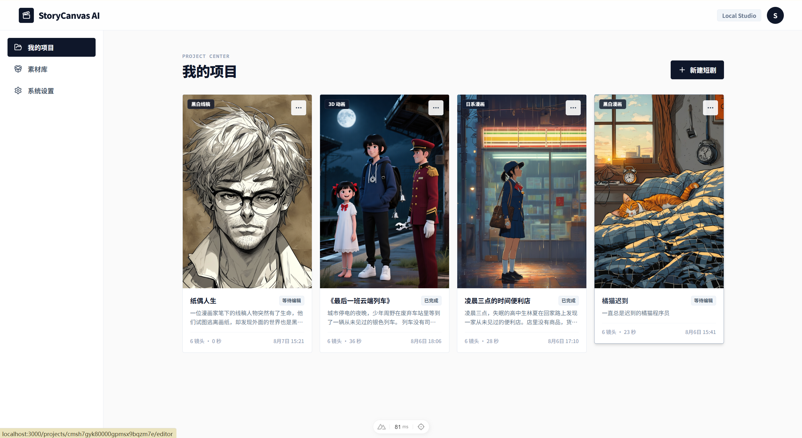
---

## 二、 零基础上手：5 分钟用 AI 拍出第一部动态漫

为了让任何人都能直观感受到这个工具的体验，我们通过一个实际案例，走一遍完整的创作流程。

### 第一步：灵感与画风选择
进入新建项目界面，你不需要从空白文档开始硬憋故事：
1. **选择画风**：系统内置了 4 大类别、20 多种风格标签，包括日系漫画、赛博朋克、吉卜力手绘、电影写实、美式复古、3D 粘土定格等；
2. **选择画面比例**：支持 9:16（抖音/快手/小红书竖屏短视频）、16:9（B站/YouTube横屏影视）以及 1:1（方形绘本）；
3. **AI 灵感推荐**：如果你暂时没有好的点子，点击“推荐剧本”，AI 会根据你选定的画风，实时生成 3 个具备强烈戏剧冲突和画面感的故事大纲，一键填入；
4. **自定义角色设定（可选）**：你也可以上传一张自己已有的角色形象图，作为项目的全局形象参考底模。

---
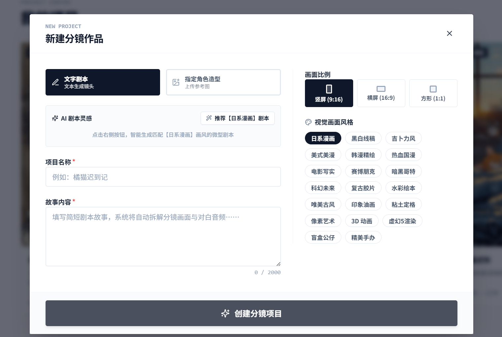
---

### 第二步：智能拆解，生成可视化分镜画布
点击“智能拆解”按钮后，后台 AI 导演引擎开始工作。几秒钟内，原本平铺直叙的文本被解析为一张清晰的**可视化流程网格**：
- **左侧：角色资产节点（Character Node）**  
  AI 自动从故事中提炼出角色姓名、性格特征和精细的外观描述（发色、瞳色、服装、配饰）。如果没有上传参考图，系统会自动用 AI 绘制一张 1:1 的高质感角色头像卡。
- **中间：按剧情顺序排列的镜头节点（Shot Node）**  
  故事被拆解为 6 到 12 个连贯镜头。每个镜头卡片上清晰标注了：镜头序号（#01, #02...）、建议时长（如 4s）、景别类型（远景/中景/特写）、预设运镜（推镜头/拉镜头/向左摇镜）以及对应的对白与台词。
- **右侧：最终成片节点（Final Output Node）**  
  各个镜头通过动态流动的连接线，最终汇聚至合成节点，形成完整的叙事闭环。

---

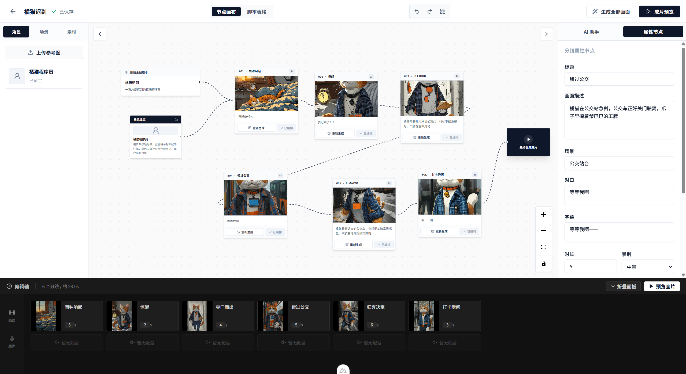

---

### 第三步：双模式自由精修与 AI 助手
现实创作中，创作者通常需要在“宏观把控”和“微观改字”之间来回切换。StoryCanvas AI 提供了业内少见的一键双模切换能力：

#### 1. 节点画布模式（Canvas View）
适合直观把控剧情结构。你可以自由拖拽卡片、增删镜头、重新连线，甚至右键直接唤出快捷菜单，在任意坐标新建镜头或执行智能矩阵对齐。

#### 2. 脚本表格模式（Script Table View）
适合批量修改。点击顶部切换至表格视图，所有镜头将以类似 Excel / 专业编剧软件的形式呈现。你可以直接在表格内快速微调台词、修改 Prompt、修改时长、切换景别和运镜方向，效率翻倍。

#### 3. 伴随式 AI 助手（AgentPanel）
如果你觉得某个镜头写得不够好，选中该镜头，打开右侧的 AI 助手面板。输入一句大白话：“把这个镜头改成暴风雨夜的特写，突出主角绝望的表情”，AI 就会仅针对当前镜头进行剧本和画面的局部重写，并保持角色和上下文逻辑不变。

---

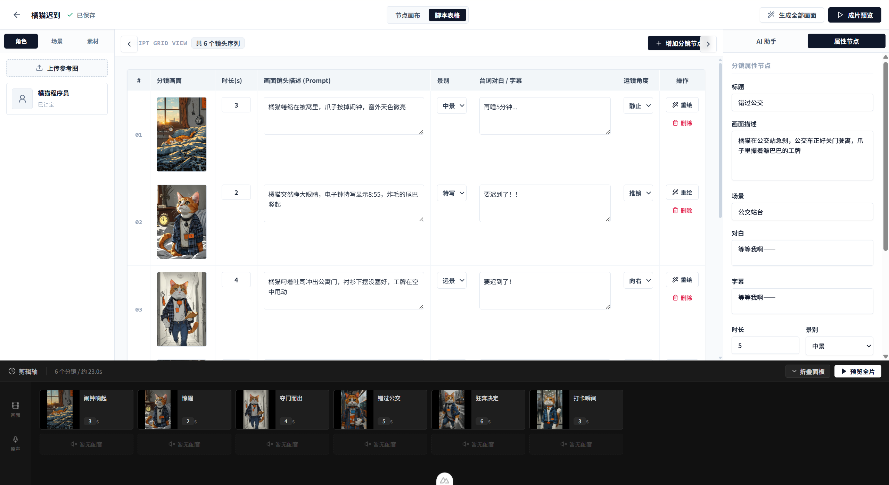
---

### 第四步：多媒体生成与给镜头“注入灵魂”
分镜脚本确定后，接下来就是多模态内容的生成：
1. **一键批量生图**：点击顶部的“绘制全部画面”，AI 会自动按照锁定的角色外观和艺术风格，为每个镜头渲染专属的高清画面。
2. **AI 配音生成（TTS）**：点击镜头属性里的“生成配音”，系统会根据填写的台词，自动合成带有语调起伏的情感音频。
3. **AI 图生视频（Image-to-Video）**：对于需要强烈动态表现的镜头，点击“生成视频”，系统会自动将静态分镜图提交给视频大模型（如智谱 CogVideoX），生成一段 4-5 秒的动态视频片段。

---

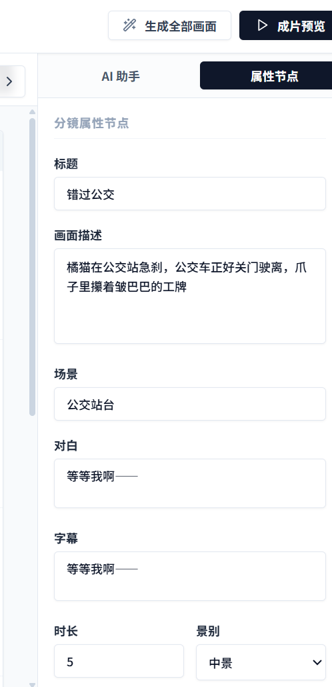
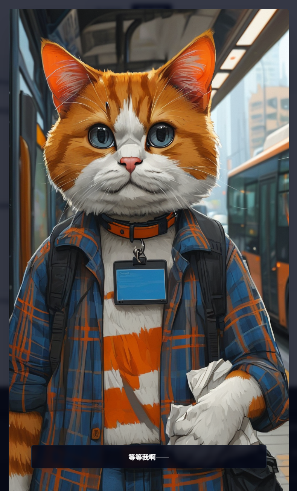
---

### 第五步：双轨时间轴编排与成片导出
在编辑器的底部，内置了一个专业的非线性编辑（NLE）时间轴：
- **视频轨（V1）**：按序展示所有分镜缩略图。���持直接拖拽手柄调换前后顺序，直接在轨上调整镜头播放秒数；
- **音频轨（A1）**：直观展示每个镜头对应的配音波形或静音状态；
- **实时合成监视器**：无需等待漫长渲染，点击播放，前端监视器会通过 CSS 动效实时模拟推拉摇移运镜，并同步叠加字幕与配音，让你即时预览成片效果；
- **本地一键导出**：上传背景音乐，勾选字幕与配音开关，点击“导出”。系统后台直接调用本地 FFmpeg 完成高保真混音、动态运镜编码与字幕烧录，几分钟内即可下载标准 MP4 视频。

---
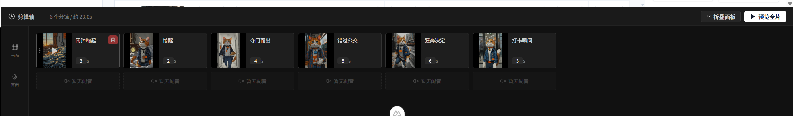
---

## 三、 揭秘 AI 导演大脑：怎么让大模型学会专业视听语言？

很多开发者在做 AI 视频或分镜项目时，往往直接使用简单的 Prompt，结果输出的内容质量极不稳定。在 StoryCanvas AI 中，我们花了很多精力打磨 AI 导演思考机制。

### 3.1 从“流水账”到“镜头语言”：Prompt 的工程化约束
在 `server/prompts/generate-story.ts` 中，我们没有采用泛泛而谈的提问方式，而是为大模型植入了一套好莱坞视听语言准则：

```typescript
export function buildStoryboardPrompt(input: { story: string; style: string; aspectRatio: string }) {
  return `你是一位顶级好莱坞分镜导演与视听语言专家。请将以下短剧故事拆解为富有电影感、动作流畅、景别递进的连续分镜画面（建议 6 到 12 个镜头）。

故事原文：${input.story}
画风设定：${input.style}
画面比例：${input.aspectRatio}

【核心拆解原则 - 解决剧情跨度过大与断层僵硬感】：
1. 拒绝“流水账大纲摘要”：严禁在一个镜头里概括大段剧情！请聚焦故事的“核心微观场景”，采用真实的电影视听语言展开细腻镜头组（如：环境远景铺垫 -> 中景主体动作 -> 手部/道具特写制造悬念 -> 脸部近景情绪爆发）。
2. 镜头动作连贯（Shot-to-Shot Continuity）：相邻镜头之间必须有视觉与物理动作上的顺畅递进（如前一镜头伸手拿物体，后一镜头特写抓握物体），严禁瞬间跨越时空的剧情跳跃。
3. 景别节奏交替（Shot Types）：合理交替 wide（远景/建立镜头）、medium（中景/动作交互）、close-up（近景与特写/面部表情与道具），打造大片级别的视觉起伏。
4. 画面描述极具视听细节：明确写出画面主体姿态、相机视角（仰拍/俯拍/特写）、光影氛围与场景细节，杜绝抽象概括词。
5. 角色外观格式稳定：准确输出具体的发型/毛色、服装款式与色彩、标志性配饰，确保生成画面一致性。
6. 严���简体中文输出：所有角色的 name、description、appearance，以及所有分镜镜头的 title、description、dialogue、subtitle、scene 必须全部统一使用【简体中文】表达！绝对不允许输出英文标题或英文说明！`
}
```

这套 Prompt 的核心在于杜绝跨时空跳跃，强制大模型按照“远景交代环境 -> 中景交代动作 -> 特写交代冲突”的物理节奏切分镜头。

---

### 3.2 结构化输出（JSON Schema）的精准控制
为了让大模型输出的数据能够直接转化为前端的数据库记录和画布卡片，我们使用了严格的 JSON Schema 校验：

```typescript
export const storyboardJsonSchema = {
  type: 'object',
  additionalProperties: false,
  required: ['characters', 'shots'],
  properties: {
    characters: {
      type: 'array', minItems: 1, maxItems: 3,
      items: {
        type: 'object',
        additionalProperties: false,
        required: ['name', 'description', 'appearance'],
        properties: {
          name: { type: 'string' },
          description: { type: 'string' },
          appearance: { type: 'string' }
        }
      }
    },
    shots: {
      type: 'array', minItems: 4, maxItems: 12,
      items: {
        type: 'object',
        additionalProperties: false,
        required: ['title', 'description', 'dialogue', 'subtitle', 'scene', 'shotType', 'duration', 'motion'],
        properties: {
          title: { type: 'string' },
          description: { type: 'string' },
          dialogue: { type: 'string' },
          subtitle: { type: 'string' },
          scene: { type: 'string' },
          shotType: { type: 'string', enum: ['wide', 'medium', 'close-up'] },
          duration: { type: 'integer', minimum: 2, maximum: 8 },
          motion: { type: 'string', enum: ['none', 'zoom-in', 'zoom-out', 'pan-left', 'pan-right'] }
        }
      }
    }
  }
}
```

通过这种强约束：
1. 前端无需做复杂的文本正则解析，模型返回的数据百分之百符合数据结构；
2. 镜头属性被严格限定：景别只能在 `wide / medium / close-up` 中选，运镜只能在 `zoom-in / zoom-out / pan-left / pan-right / none` 中选，时长被限定在 2-8 秒。

---

### 3.3 角色一致性 Prompt 链式注入
在生成单张分镜画面时（`server/prompts/generate-shot.ts`），我们采用了链式拼接策略：

```typescript
export function buildShotImagePrompt(input: {
  style: string;
  aspectRatio: string;
  characterGuide: string;
  referenceImageCount: number;
  title: string;
  description: string;
  scene?: string | null;
  shotType: string
}) {
  return `Create one polished comic storyboard panel.
Art direction: ${input.style}. Aspect ratio composition: ${input.aspectRatio}.
Locked character guide: ${input.characterGuide || 'No visible named character.'}
Character reference assets: ${input.referenceImageCount ? `${input.referenceImageCount} uploaded reference image(s) are attached to this project. Preserve their visible identity when rendering.` : 'No uploaded reference image.'}
Shot title: ${input.title}
Scene: ${input.scene || 'Follow the story context'}
Composition: ${input.shotType}
Action and emotion: ${input.description}
Keep character species, age, hair or fur color, clothing colors, and accessories exactly consistent with the locked guide. No speech bubbles, captions, letters, watermark, border, collage, or split panel.`
}
```

通过把第一步锁定的“角色特征指南（Character Guide）”作为前置约束，强制注入到每一个镜头的绘图 Prompt 中，再结合生图模型的负向排除词（禁止文字气泡、禁止拼贴、禁止水印），从而在根本上大幅降低了角色变脸的概率。

---

### 3.4 统一多模型网关：支持主流大模型自由切换
在后台架构中（`server/services/ai.ts`），我们设计了统一的多模型适配网关：
- **LLM 文本大模型**：支持 OpenAI 官方（GPT-4o / GPT-5 等）和 硅基流动 SiliconFlow（内置 DeepSeek-V3 / DeepSeek-R1）；
- **文生图大模型**：支持 Kwai-Kolors（快手可图）以及 DALL-E / 兼��� SD 系列模型；
- **语音大模型（TTS）**：支持 Fish-Speech-1.5 以及 OpenAI TTS，兼顾自然语调与多音色；
- **图生视频大模型（I2V）**：支持智谱 CogVideoX 异步任务管线。

用户只需要在 `.env` 或系统偏好设置中填入对应的 API Key，即可在不同模型供应商之间平滑切换，完全不侵入核心业务逻辑。

---


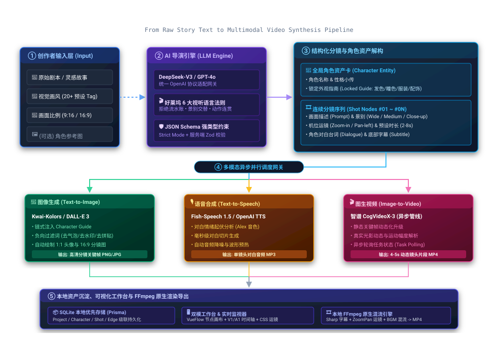

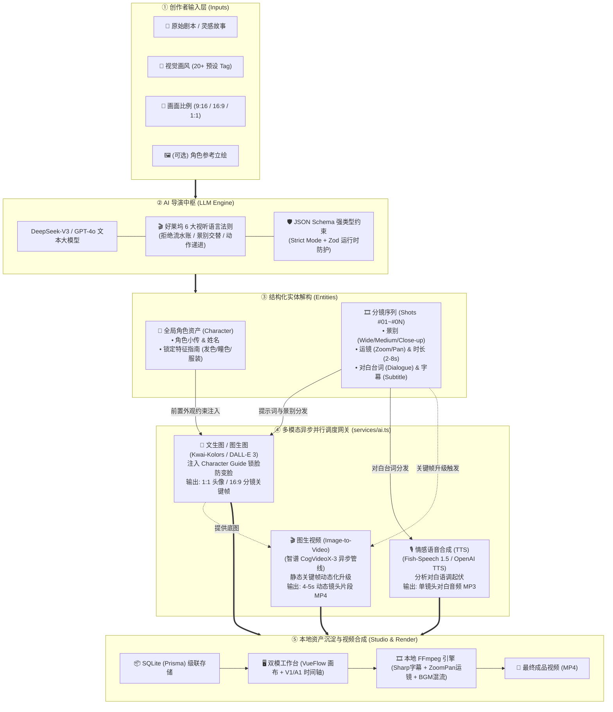

---

## 四、 前端技术架构：怎么做出丝滑的双模编辑器？

很多开发者在做基于画布（Canvas）的 Web 应用时，经常会遇到卡顿、状态难以同步、连线错位等棘手问题。StoryCanvas AI 基于 **Nuxt 3 + Vue 3 (Composition API) + Pinia + VueFlow + Tailwind CSS + Nuxt UI**，在前端工程化上做了大量深度调优。

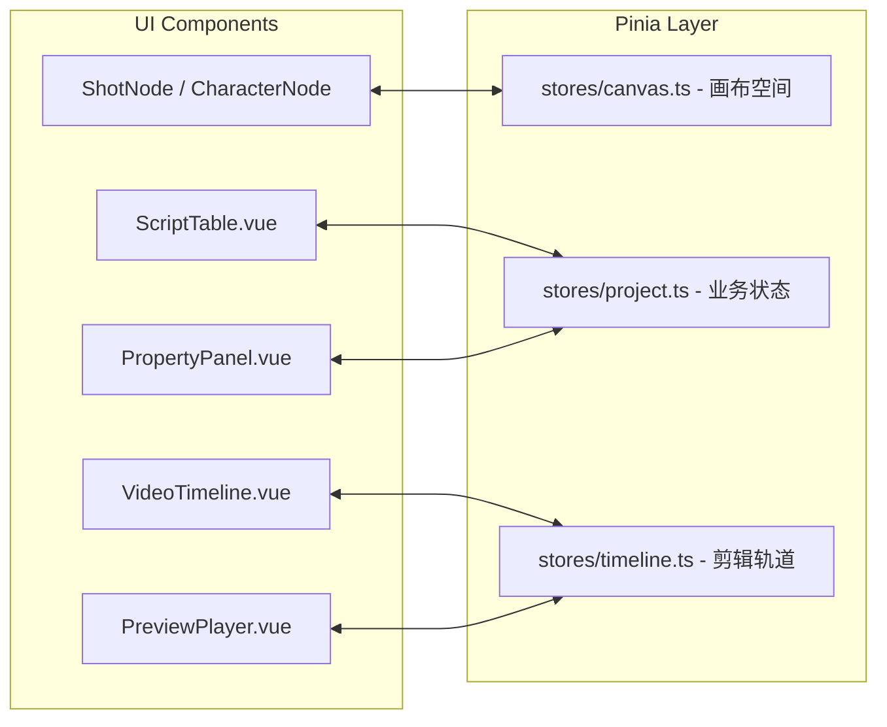

### 4.1 核心状态流转：Pinia 状态管理三重奏
为了避免单个 Store 臃肿并保证单向数据流的高性能，我们将状态严密解耦为三个职责单一的 Store：
1. **`stores/project.ts`（业务核心中枢）**：
   - 负责管理项目元数据、故事文本、角色数组 (`characters`)、分镜列表 (`shots`)；
   - 驱动生图、TTS 配音生成、对话重写以及自动保存状态。
2. **`stores/canvas.ts`（视差图元空间站）**��
   - 专门负责 VueFlow 画布上的节点（`nodes`）与边（`edges`）坐标和连线渲染；
   - 封装智能矩阵排版算法（`autoLayout`）：将所有分镜按 3 列矩阵自动计算位置（`x: 120 + (i%3)*300, y: 110 + floor(i/3)*275`）；
   - 节点拖拽结束后自动触发轻量级的批量坐标持久化。
3. **`stores/timeline.ts`（时间时序控制器）**：
   - 维护时间轴序列 (`items`)，处理增删、排序、时长微调与播放时间游标。

---

### 4.2 毫秒级无感响应：防抖乐观更新（Optimistic UI）
在属性面板中编辑台词或修改 Prompt 时，如果每次键盘敲击都向后端发起网络请求，不仅会导致并发请求塞满网络，还会因接口延迟造成光标跳动。

我们在 `stores/project.ts` 中实现了**防抖乐观更新（Optimistic UI）**：

```typescript
function updateShotLocal(shotId: string, patch: Partial<Shot>) {
  // 1. 立即就地更新本地响应式状态，保证 UI 毫无延迟
  const shot = currentProject.value.shots.find(s => s.id === shotId)
  if (shot) Object.assign(shot, patch)
  saveState.value = 'unsaved'

  // 2. 清理旧定时器，开启 1000ms 防抖
  if (saveTimer.value) clearTimeout(saveTimer.value)
  saveTimer.value = setTimeout(async () => {
    try {
      saveState.value = 'saving'
      await $fetch(`/api/projects/${currentProject.value.id}/shots/${shotId}`, {
        method: 'PATCH',
        body: patch,
      })
      saveState.value = 'saved'
    } catch {
      saveState.value = 'failed'
    }
  }, 1000)
}
```

创作者打字修改分镜时，UI 渲染完全是瞬时的，底层自动将 1 秒内的连续修改合并为一次精准的 HTTP PATCH 请求。

---

### 4.3 VueFlow 画布深度定制与业务数据解耦
在数据结构设计上，我们将**画布图元数据（`CanvasNode`）**与**业务实体数据（`Shot` / `Character`）**进行了彻底解耦：
- `CanvasNode` 仅保存 `entityId`、`entityType`、`x`、`y`；
- 前端通过 `hydrate()` 方法将实体属性注入到自定义的 `ShotNode.vue` 中；
- **动态流动连接线**：在 `assets/css/main.css` 中定制了 `@keyframes dash-flow` 虚线动画，视觉上体现了剧本到镜头、镜头到成片的数据流动感。

---

### 4.4 零后端算力消耗：前端“伪 3D”实时合成监视器
在导出视频前，如果每做一次调整都要调用后端 FFmpeg 渲染几分钟，创作者的灵感就会被打断。

在 `components/timeline/PreviewPlayer.vue` 中，我们纯利用前端 CSS Keyframes 和精确定时器，实现了免渲染的实时监视器：

```css
/* 模拟推镜头 zoom-in */
@keyframes motion-zoom-in {
  0% { transform: scale(1); }
  100% { transform: scale(1.12); }
}

/* 模拟向左平移 pan-left */
@keyframes motion-pan-left {
  0% { transform: scale(1.12) translateX(0); }
  100% { transform: scale(1.12) translateX(-4%); }
}
```

配合 `100ms` 的精确定时器轮询当前播放时间，镜头播完无缝切入下一段，同步播放 TTS 语音音频与背景音乐，让创作者在前端就能获得成片 90% 以上的视听节奏反馈。

---

### 4.5 双轨时间轴的高精度交互：滚轮横向映射与拖拽重排
在 `components/timeline/VideoTimeline.vue` 中：
- **滚轮横向映射**：监听容器的 `@wheel.prevent` 事件，将鼠标纵向滚动的 `event.deltaY` 直接转化为 `timelineContainer.scrollLeft`，实现极度自然的横向长轨道漫游；
- **拖拽重排序**：利用原生 HTML5 Drag & Drop API，拖动卡片手柄时计算落点索引，派发 `reorder` 事件，自动重新计算所有 items 的 `order` 序号并持久化。

---

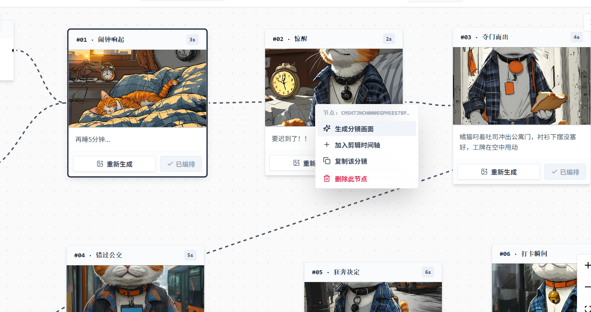
---

## 五、 后端与本地渲染管线：FFmpeg 视听合成黑魔法

后端基于 Nuxt 3 的服务端引擎 **Nitro** 构建，搭配 **Prisma ORM** 与 **SQLite**，并在本地封装了系统级的 FFmpeg 多媒体渲染引擎。

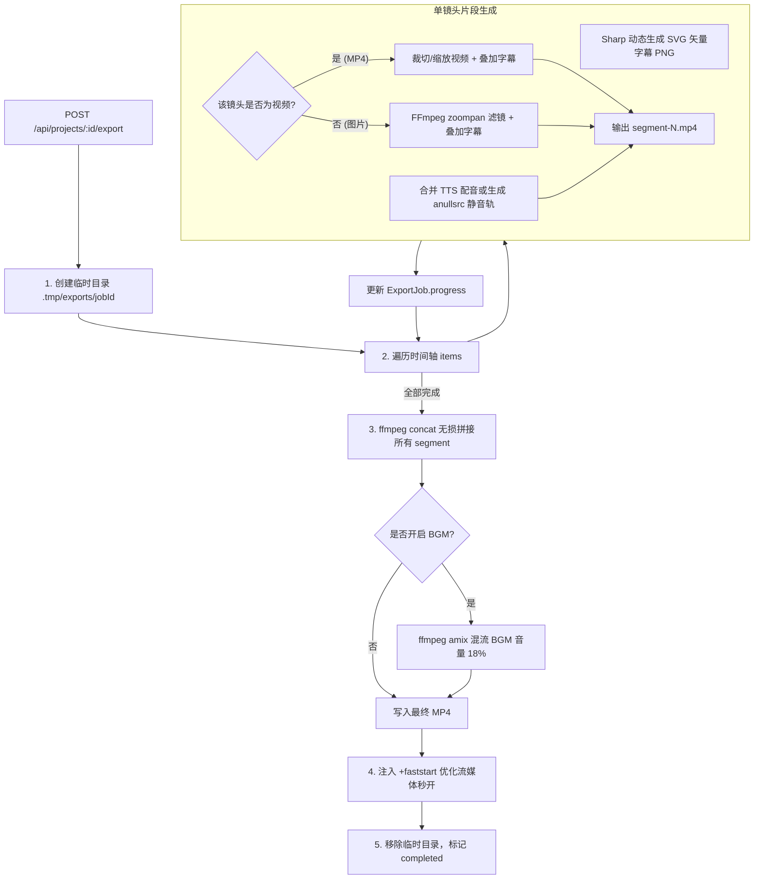

### 5.1 本地优先（Local-First）与 SQLite 级联数据模型设计
在 `prisma/schema.prisma` 中：
- `Project` 包含所有全局信息，且对 `Character`、`Shot`、`CanvasNode`、`CanvasEdge`、`TimelineItem`、`ExportJob` 均配置了 `onDelete: Cascade` 级联删除；
- 结合 Prisma 唯一索引（如 `shotId @unique`），只要删除或复制一个项目，所有底层关联资产在事务中统一处理，彻底杜绝孤立脏数据。

---

### 5.2 媒体文件二进制魔数（Magic Number）安全校验
在 `server/services/storage.ts` 中，我们摒弃了不可靠的文件后缀名判断，采用底层的二进制魔数（Magic Bytes）校验：

```typescript
export function detectImageType(data: Buffer): 'jpg' | 'png' | 'webp' | null {
  if (data.length >= 3 && data[0] === 0xFF && data[1] === 0xD8 && data[2] === 0xFF) return 'jpg'
  if (data.length >= 8 && data[0] === 0x89 && data[1] === 0x50 && data[2] === 0x4E && data[3] === 0x47) return 'png'
  if (data.length >= 12 && data.toString('ascii', 0, 4) === 'RIFF' && data.toString('ascii', 8, 12) === 'WEBP') return 'webp'
  return null
}

export function detectAudioType(data: Buffer): 'mp3' | 'wav' | 'ogg' | null {
  if (data.length >= 3 && data.toString('ascii', 0, 3) === 'ID3') return 'mp3'
  if (data.length >= 2 && data[0] === 0xFF && (data[1] & 0xE0) === 0xE0) return 'mp3'
  if (data.length >= 12 && data.toString('ascii', 0, 4) === 'RIFF' && data.toString('ascii', 8, 12) === 'WAVE') return 'wav'
  if (data.length >= 4 && data.toString('ascii', 0, 4) === 'OggS') return 'ogg'
  return null
}
```

---

### 5.3 Sharp 矢量字幕蒙版动态合成技术
在合成带有字幕的视频时，直接用 FFmpeg 的 `drawtext` 滤镜容易受宿主机系统字体缺失或跨平台字符集乱码影响。我们采用 **Node.js `sharp` 库先将 SVG 矢量栅格化为透明 PNG** 的策略：

```typescript
// server/services/video.ts
let subtitlePngPath = null
if (options.subtitles && (shot.subtitle || shot.dialogue)) {
  const text = escapeXml(shot.subtitle || shot.dialogue || '')
  const svg = Buffer.from(
    `<svg width="${width}" height="${height}">
       <rect x="${width * 0.08}" y="${height - 155}" width="${width * 0.84}" height="95" rx="8" fill="rgba(0,0,0,.68)"/>
       <text x="${width / 2}" y="${height - 96}" text-anchor="middle" font-family="Microsoft YaHei, sans-serif" font-size="32" font-weight="700" fill="white">
         ${text.slice(0, 28)}
       </text>
     </svg>`
  )
  subtitlePngPath = join(work, `sub-${index}.png`)
  await sharp({
    create: { width, height, channels: 4, background: { r: 0, g: 0, b: 0, alpha: 0 } }
  }).composite([{ input: svg }]).png().toFile(subtitlePngPath)
}
```

---

### 5.4 FFmpeg ZoomPan 动态运镜矩阵算法推导
在 `server/services/video.ts` 的 `filter()` 函数中，我们通过严密的数学公式动态生成视频滤镜：

```typescript
function filter(motion: string, width: number, height: number, duration: number) {
  const base = `scale=${width}:${height}:force_original_aspect_ratio=increase,crop=${width}:${height}`
  const frames = duration * 30 // 30fps

  // 1. 推镜头：缩放因子 z 从 1.0 线性递增至 1.12，中心点始终锚定画面几何中心
  if (motion === 'zoom-in') {
    return `${base},zoompan=z='min(zoom+0.0015,1.12)':d=${frames}:x='iw/2-(iw/zoom/2)':y='ih/2-(ih/zoom/2)':s=${width}x${height}:fps=30,format=yuv420p`
  }

  // 2. 拉镜头：缩放因子 z 从 1.12 线性衰减至 1.0
  if (motion === 'zoom-out') {
    return `${base},zoompan=z='if(eq(on,1),1.12,max(1,zoom-0.0015))':d=${frames}:x='iw/2-(iw/zoom/2)':y='ih/2-(ih/zoom/2)':s=${width}x${height}:fps=30,format=yuv420p`
  }

  // 3. 向左平移：固定 1.12 放大，X 轴随着当前帧序号 on 从左往右移动
  if (motion === 'pan-left') {
    return `${base},zoompan=z=1.12:d=${frames}:x='(iw-iw/zoom)*on/${Math.max(frames - 1, 1)}':y='ih/2-(ih/zoom/2)':s=${width}x${height}:fps=30,format=yuv420p`
  }

  // 4. 向右平移：固定 1.12 放大，X 轴从右往左移动
  if (motion === 'pan-right') {
    return `${base},zoompan=z=1.12:d=${frames}:x='(iw-iw/zoom)*(1-on/${Math.max(frames - 1, 1)})':y='ih/2-(ih/zoom/2)':s=${width}x${height}:fps=30,format=yuv420p`
  }

  return `${base},fps=30,format=yuv420p`
}
```

---

### 5.5 多轨音频混合（Amix）与 Web 流媒体秒开优化（FastStart）
当各个片段拼接完成后，最终的背景音乐混流指令如下���

```typescript
// 若用户上传了背景音乐，按 18% 音量衰减混入主音轨
if (musicPath) {
  await execFileAsync(ffmpegPath!, [
    '-y',
    '-i', combined,
    '-stream_loop', '-1',
    '-i', musicPath,
    '-filter_complex', '[1:a]volume=0.18[m];[0:a][m]amix=inputs=2:duration=first:dropout_transition=2[a]',
    '-map', '0:v',
    '-map', '[a]',
    '-c:v', 'copy',
    '-c:a', 'aac',
    '-shortest',
    '-movflags', '+faststart',
    output,
  ])
}
```

- **`amix=inputs=2:duration=first`**：以第一条视频轨的时长为基准，视频结束时自动截断 BGM，防止视频黑屏；
- **`-movflags +faststart`**：将 MP4 的 `moov` atom 元数据置于文件头部，保证浏览器在网络传输时可以边缓冲边播放，秒开视频。

---

### 5.6 异步渲染任务状态机与异常防御策略
由于视频渲染属于密集型 I/O 与 CPU 操作，后端采用异步非阻塞模式：
1. `POST /api/projects/:id/export` 校验前置条件，创建 `ExportJob` 记录后立即返回 `200` 与 `jobId`；
2. 服务端在后台异步执行 `renderVideo(jobId)`；
3. 前端以 1000ms 为间隔轮询 `GET /api/exports/:jobId`；
4. 发生异常时，`catch` 块捕获错误将 `ExportJob` 置为 `failed` 并安全删除临时目录。

---
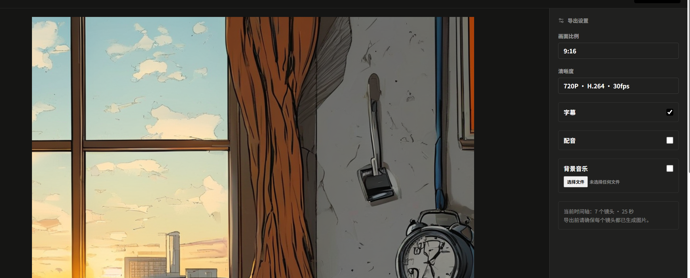
---

## 六、 部署与配置实战指南

### 6.1 环���要求与依赖安装
- **Node.js**：v18.18.0 或更高版本（推荐 v20+ LTS）；
- **包管理器**：`npm` / `pnpm` / `yarn`；
- **操作系统**：Windows 10/11、macOS 或 Linux（系统自带 `ffmpeg-static`，无需手动配置环境变量）。

```bash
# 1. 克隆代码仓库
git clone <your-repo-url>
cd "StoryCanvas AI"

# 2. 安装项目依赖
npm install
```

---

### 6.2 环境变量配置（.env）全解
在项目根目录创建 `.env` 文件：

```ini
# 数据库配置（默认 SQLite 本地文件）
DATABASE_URL="file:./dev.db"

# AI 服务商选择：'siliconflow' (硅基流动推荐) 或 'openai'
AI_PROVIDER="siliconflow"

# 基础 API 密钥与端点
AI_API_KEY="sk-xxxxxxxxxxxxxxxxxxxxxxxx"
AI_BASE_URL="https://api.siliconflow.cn/v1"

# 文本大模型 (用于故事拆解、灵感推荐、指令重写)
AI_TEXT_MODEL="deepseek-ai/DeepSeek-V3"

# 生图模型 (用于角色肖像绘制、分镜画面生成)
AI_IMAGE_MODEL="Kwai-Kolors/Kolors"

# 语音合成模型与音色 (TTS)
AI_TTS_MODEL="fishaudio/fish-speech-1.5"
AI_TTS_VOICE="alex"

# 智谱 AI 视频大模型配置 (可选，用于 CogVideoX 图生视频)
ZHIPU_API_KEY="xxxxxxxxxxxxxxxx.xxxxxxxx"
ZHIPU_VIDEO_MODEL="cogvideox-3"
```

---

### 6.3 数据库初始化与离线测试脚本

```bash
# 1. 生成 Prisma Client 客户端
npm run db:generate

# 2. 推送 SQLite 数据库结构
npx prisma db push

# 3. (可选) 免 AI 离线测试视频导出管线
# 运行内置脚本为指定项目生成 6 帧彩色彩条占位图
node scripts/seed-export-test.mjs <your-project-id>

# 4. 启动本地开发服务器
npm run dev
```
访问 `http://localhost:3000` 即可进入 StoryCanvas AI 工作台。

---

## 七、 核心代码结构与全景速查

### 7.1 前端核心组件一览
- **`components/canvas/nodes/ShotNode.vue`**：镜头核心卡片（16:9取景框、景别/运镜徽章、右键菜单、生成遮罩）；
- **`components/canvas/nodes/CharacterNode.vue`**：角色资产卡片（锁定状态、1:1头像、外观设定）；
- **`components/editor/PropertyPanel.vue`**：分镜右侧属性检查面板（景别、运镜、台词、配音、视频生成）；
- **`components/editor/AgentPanel.vue`**：AI 伴随式改写助手（预设指令 Chip、自然语言对话改写）；
- **`components/editor/ScriptTable.vue`**：8 列响应式密集分镜表格；
- **`components/timeline/VideoTimeline.vue`**：底部双轨非编时间轴（滚轮横向映射、HTML5 拖拽重排）；
- **`components/timeline/PreviewPlayer.vue`**：纯前端实时视听合成播放器；
- **`components/project/CreateProjectDialog.vue`**：新建项目弹窗（20+ 画风云、AI 灵感推荐）。

### 7.2 后端 API 路由一览
- `GET /api/projects/idea`：AI 针对画风智能推荐 3 条故事灵感；
- `POST /api/projects/:id/generate`：故事大纲智能拆解为角色与镜头流；
- `POST /api/projects/:id/shots/:shotId/generate`：单镜头 AI 生图；
- `POST /api/projects/:id/shots/:shotId/rewrite`：根据用户指令局部改写单镜头；
- `POST /api/projects/:id/shots/:shotId/voice`：生成镜头 TTS 对白配音；
- `POST /api/projects/:id/shots/:shotId/video`：调用智谱 CogVideoX 图生视频；
- `POST /api/projects/:id/export`：触发本地后台 FFmpeg 视频合成任务；
- `GET /api/exports/:jobId`：轮询视频合成进度与状态。

---

## 八、 总结与未来演进

**StoryCanvas AI** 的实践表明：当生成式 AI 从孤立的“单点生成”走向**结构化、以专业视听工作流为中心的图形工作台**时，个人创作的生产力边界将被极大拓宽。

我们通过**结构化 Prompt 工程**解决了剧情流水账的问题，通过**全局资产锁定**缓解了角色变脸问题，通过**双模可视化编辑器与本地渲染管线**打通了从文本到成片的最后一公里。

### 未来演进路线：
1. **多智能体（Multi-Agent）导演组博弈**：引入“编剧 Agent”、“分镜师 Agent”、“剪辑 Agent”进行多轮自我评审与细节打磨；
2. **端云协同与团队多人协作**：将 SQLite 底座扩展至 PostgreSQL + CRDT 协议（如 Yjs），支持团队跨地域多人实时在同一个画布上协同创作分镜；
3. **3D 空间轨迹与原生视频模型对接**：对接更先进的视频与 3D 摄影机轨迹控制算法，让创作者能够自定义镜头在虚拟三维空间中的运镜航线。

---

