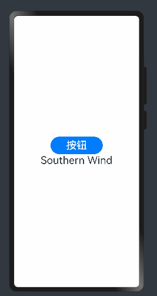
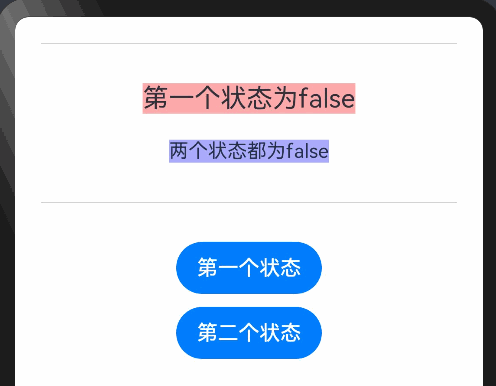
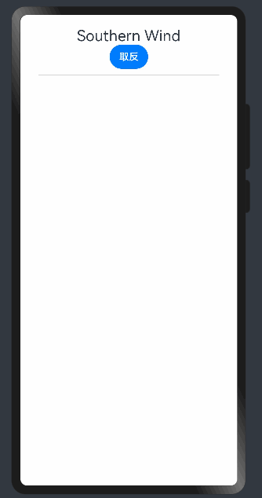

# HarmonyOS4.0 系列——06、渲染之条件渲染、循环渲染以及懒加载渲染

## if/else：条件渲染

ArkTS 提供了渲染控制的能力。条件渲染可根据应用的不同状态，使用 if、else 和 else if 渲染对应状态下的 UI 内容。

写法和 TS 的一样，简单看一下即可

```ts
@Entry
@Component
struct IfForEach {
  @State status: boolean = true

  build() {
    Row() {
      Column() {
        Button('按钮')
          .fontSize(30)
          .width(150)
          .height(50)
          .onClick(() => {
            this.status = !this.status;
          })
        if (this.status) {
          if_son({ content: 'Southern Wind' })
        } else {
          if_son({ content: '隐藏' })
        }

      }
      .width('100%')
    }
    .height('100%')
  }
}

@Component
struct if_son {
  content: string
  build() {
    Text(this.content)
      .fontSize(30)
  }
}

```

效果：


另外，@State 定义的变量归父组件所有。因此，当`子组件`实例被删除时，该变量不会被销毁。`子组件`通过`@Link装饰器`引用状态。状态必须从子级移动到其父级（或父级的父级），以避免在条件内容或重复内容被销毁时丢失状态。

### 条件语句的嵌套对父组件的相关规则也没有影响。

例：

```ts
@Entry
@Component
struct CompA {
  @State toggle: boolean = false;
  @State toggleColor: boolean = false;

  build() {
    Column() {
      Divider().margin(20)
      if (this.toggle) {
        Text('第一个状态为true').margin(10)
          .backgroundColor('#aaffaa').fontSize(20)
        // 内部if语句
        if (this.toggleColor) {
          Text('两个状态都为true').margin(10)
            .backgroundColor('#00aaaa').fontSize(15)
        } else {
          Text('第一个状态为true第二个状态为false').margin(10)
            .backgroundColor('#aaaaff').fontSize(15)
        }
      } else {
        Text('第一个状态为false').fontSize(20).margin(10)
          .backgroundColor('#ffaaaa')
        if (this.toggleColor) {
          Text('第一个状态为false，第二个状态为true').margin(10)
            .backgroundColor('#00aaaa').fontSize(15)
        } else {
          Text('两个状态都为false').margin(10)
            .backgroundColor('#aaaaff').fontSize(15)
        }
      }
      Divider().margin(20)

      Button('第一个状态').margin(10)
        .onClick(() => {
          this.toggle = !this.toggle;
        })
      Button('第二个状态')
        .onClick(() => {
          this.toggleColor = !this.toggleColor;
        })
    }
    .width('100%')
  }
}
```

因为他默认两个状态都为 false 触发`第一个状态为false'`和`两个状态都为false`文本，
一共是四种效果：

- true true
- ture false
- false false
- false true

效果：


## ForEach

接口描述：

```ts
ForEach(
  arr: any[],
  itemGenerator: (item: any, index?: number) => void,
  keyGenerator?: (item: any, index?: number) => string
)
```

第一个参数为数组，允许设置为空数组，空数组场景下将不会创建子组件。
第二个参数其实就是生成遍历出来的元素和索引值，和 js 中 forEach 用法一致，只是写法略微改动。
第三个参数为匿名函数。用于给数组中的每一个数据项生成唯一且固定的键值。键值生成器的功能是可选的，但是，为了使开发框架能够更好地识别数组更改，提高性能，建议提供。如将数组反向时，如果没有提供键值生成器，则 ForEach 中的所有节点都将重建。**其实也就是 vue 中 for 循环的唯一键值 key，等同于`:key="item.id"`或者`:key="index"`**

- ForEach 必须在容器组件内使用。

### 使用场景

```ts
@Entry
@Component
struct ForEachPage {
  @State message: string = 'Hello World'
  @State flag: boolean |string = false
  @State arr: Array<object> = [
    {
      id: 1,
      name: 'ArkTS',
    },
    {
      id: 2,
      name: 'HTML'
    },
    {
      id: 3,
      name: 'CSS',
    },
    {
      id: 4,
      name: 'Javascript'
    },
    {
      id: 5,
      name: 'PHP'
    }
    ,
    {
      id: 6,
      name: 'WebGL'
    },
    {
      id: 7,
      name: 'Node'
    },
    {
      id: 8,
      name: 'Go'
    }, {
    id: 9,
    name: 'Vue'
  },
    {
      id: 10,
      name: 'react'
    }, {
    id: 11,
    name: 'IOS'
  }, {
    id: 12,
    name: 'Southern Wind'
  },

  ]

  build() {
    Row() {
      Column() {
        Text(this.message).fontSize(50)
        Button('取反').onClick(()=>{
          this.flag=!this.flag;
          console.log(`${this.flag}`)
        })
        Divider().margin(10)
        List({ space: 30 }) {
          if (this.flag){
            ForEach(this.arr, (item, key) => {
              ListItem() {
                Text(`name:${item.name} --id:${item.id} -- key:${key}`)
                  .fontSize(30)
                  .textAlign(TextAlign.Center)
                  .width('100%')
                  .lineHeight(45)
                  .backgroundColor('#bbb')
              }
            }, item => item)
          }
        }.width('100%').height('80%')

      }.padding(20)
      .width('100%')
    }

  }
}
```

效果：

**如果渲染长列表的话需要使用`List`组件，不然数组数据多的情况下滚动会出现问题**。

## LazyForEach：数据懒加载

LazyForEach 就是滚动到视口的位置是才会加载，比如加载长列表图片，刚开始只渲染视口的数据，当往下拖动时才继续加载列表数据。

### 接口描述

```ts
LazyForEach(
    dataSource: IDataSource,             // 需要进行数据迭代的数据源
    itemGenerator: (item: any) => void,  // 子组件生成函数
    keyGenerator?: (item: any) => string // (可选) .键值生成函数
): void
```
官方的表格大家可以看一下具体参数名和描述


<table class="layoutFixed idpTab"><thead><tr><th align="left" class="cellrowborder" id="mcps1.3.3.1.5.1.1" valign="top" width="22.567743225677432%"><p>参数名</p> </th> <th align="left" class="cellrowborder" id="mcps1.3.3.1.5.1.2" valign="top" width="25.497450254974503%"><p>参数类型</p> </th> <th align="left" class="cellrowborder" id="mcps1.3.3.1.5.1.3" valign="top" width="8.129187081291871%"><p>必填</p> </th> <th align="left" class="cellrowborder" id="mcps1.3.3.1.5.1.4" valign="top" width="43.80561943805619%"><p>参数描述</p> </th> </tr> </thead> <tbody><tr><td class="cellrowborder" valign="top" width="22.567743225677432%"><p>dataSource</p> </td> <td class="cellrowborder" valign="top" width="25.497450254974503%"><p><a href="/consumer/cn/doc/harmonyos-guides-V2/arkts-rendering-control-lazyforeach-0000001524417213-V2#section4825812108">IDataSource</a></p> </td> <td class="cellrowborder" valign="top" width="8.129187081291871%"><p>是</p> </td> <td class="cellrowborder" valign="top" width="43.80561943805619%"><p>LazyForEach数据源，需要开发者实现相关接口。</p> </td> </tr> <tr><td class="cellrowborder" valign="top" width="22.567743225677432%"><p>itemGenerator</p> </td> <td class="cellrowborder" valign="top" width="25.497450254974503%"><p>(item: any) =&gt; void</p> </td> <td class="cellrowborder" valign="top" width="8.129187081291871%"><p>是</p> </td> <td class="cellrowborder" valign="top" width="43.80561943805619%"><p>子组件生成函数，为数组中的每一个数据项创建一个子组件。</p> <div><div class="hw-editor-tip">
                <div class="icon-panel">
                    <div class="icon-img icon-img-info"></div>
                </div>
                <div class="content-panel">
                    <div class="title">说明</div>
                    <div class="content"><p>itemGenerator的函数体必须使用大括号{...}。itemGenerator每次迭代只能并且必须生成一个子组件。itemGenerator中可以使用if语句，但是必须保证if语句每个分支都会创建一个相同类型的子组件。itemGenerator中不允许使用ForEach和LazyForEach语句。</p> </div>
                </div>
                <div class="link"></div>
            </div></div> </td> </tr> <tr><td class="cellrowborder" valign="top" width="22.567743225677432%"><p>keyGenerator</p> </td> <td class="cellrowborder" valign="top" width="25.497450254974503%"><p>(item: any) =&gt; string</p> </td> <td class="cellrowborder" valign="top" width="8.129187081291871%"><p>否</p> </td> <td class="cellrowborder" valign="top" width="43.80561943805619%"><p>键值生成函数，用于给数据源中的每一个数据项生成唯一且固定的键值。当数据项在数组中的位置更改时，其键值不得更改，当数组中的数据项被新项替换时，被替换项的键值和新项的键值必须不同。键值生成器的功能是可选的，但是，为了使开发框架能够更好地识别数组更改，提高性能，建议提供。如将数组反向时，如果没有提供键值生成器，则LazyForEach中的所有节点都将重建。</p> <div><div class="hw-editor-tip">
                <div class="icon-panel">
                    <div class="icon-img icon-img-info"></div>
                </div>
                <div class="content-panel">
                    <div class="title">说明</div>
                    <div class="content"><p>数据源中的每一个数据项生成的键值不能重复。</p> </div>
                </div>
                <div class="link"></div>
            </div></div> </td> </tr>  </tbody></table>


关于第一个参数`IDataSource`也有详细的说明
```ts
interface IDataSource {
    totalCount(): number; // 获得数据总数
    getData(index: number): any; // 获取索引值对应的数据
    registerDataChangeListener(listener: DataChangeListener): void; // 注册数据改变的监听器
    unregisterDataChangeListener(listener: DataChangeListener): void; // 注销数据改变的监听器
}
```
关于事件`DataChangeListener`
```ts
interface DataChangeListener {
    onDataReloaded(): void; // 重新加载数据时调用
    onDataAdded(index: number): void; // 添加数据时调用
    onDataMoved(from: number, to: number): void; // 数据移动起始位置与数据移动目标位置交换时调用
    onDataDeleted(index: number): void; // 删除数据时调用
    onDataChanged(index: number): void; // 改变数据时调用
    onDataAdd(index: number): void; // 添加数据时调用
    onDataMove(from: number, to: number): void; // 数据移动起始位置与数据移动目标位置交换时调用
    onDataDelete(index: number): void; // 删除数据时调用
    onDataChange(index: number): void; // 改变数据时调用
}
```

### 使用限制
- LazyForEach必须在容器组件内使用，仅有List、Grid以及Swiper组件支持数据懒加载（可配置cachedCount属性，即只加载可视部分以及其前后少量数据用于缓冲），其他组件仍然是一次性加载所有的数据
- LazyForEach在每次迭代中，必须创建且只允许创建一个子组件。
-允许LazyForEach包含在if/else条件渲染语句中，也允许LazyForEach中出现if/else条件渲染语句。

具体代码可以参考[HarmonyOS——LazyForEach](https://developer.huawei.com/consumer/cn/doc/harmonyos-guides-V2/arkts-rendering-control-lazyforeach-0000001524417213-V2)
