# HarmonyOS4.0系列——01、下载、安装、配置环境、搭建页面以及运行示例代码.md
## HarmonyOS4.0应用开发
### 安装编辑器

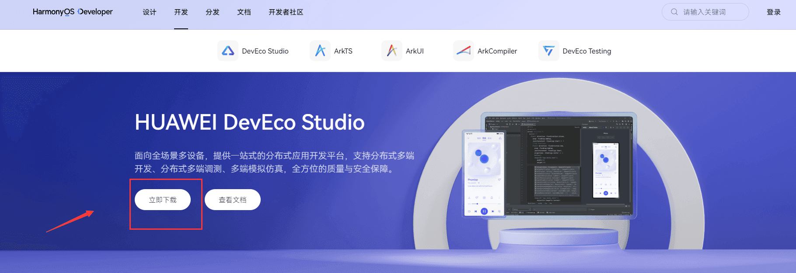
这里安装windows版本为例
### 安装依赖
打开`DevEco Studio`
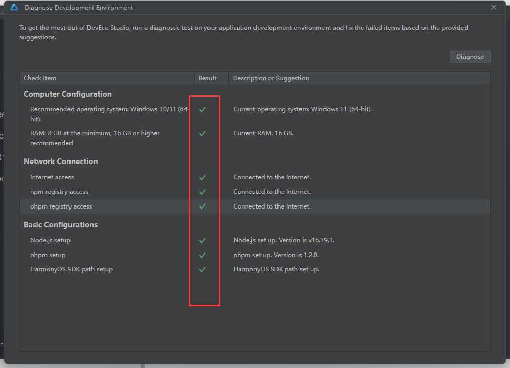
这八项全部打钩即可开始编写代码，如果存在x，需要安装正确的库即可
### 开发
点击`Create Project`
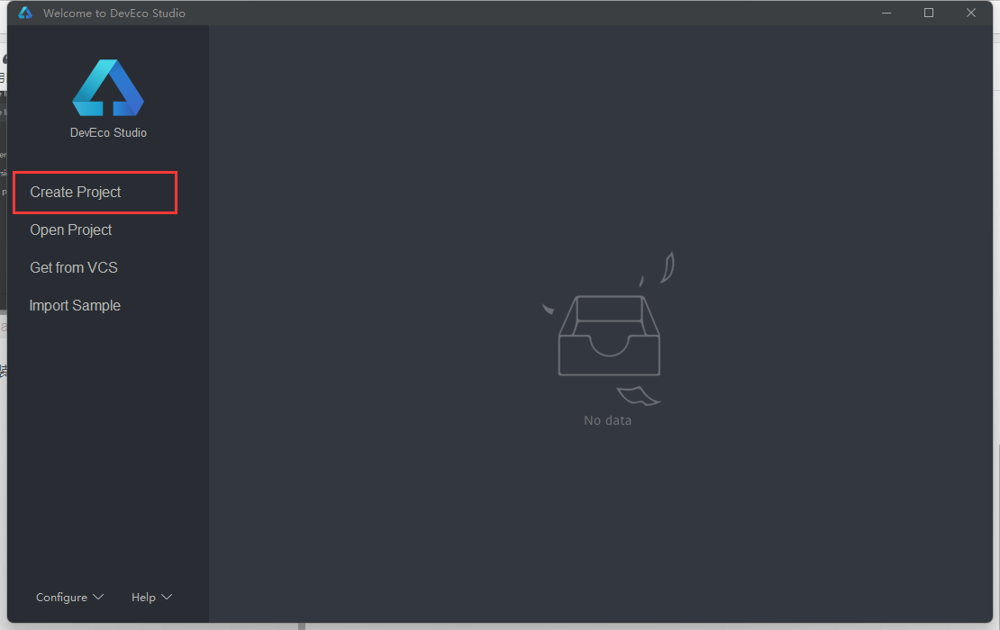
选择默认模板——next
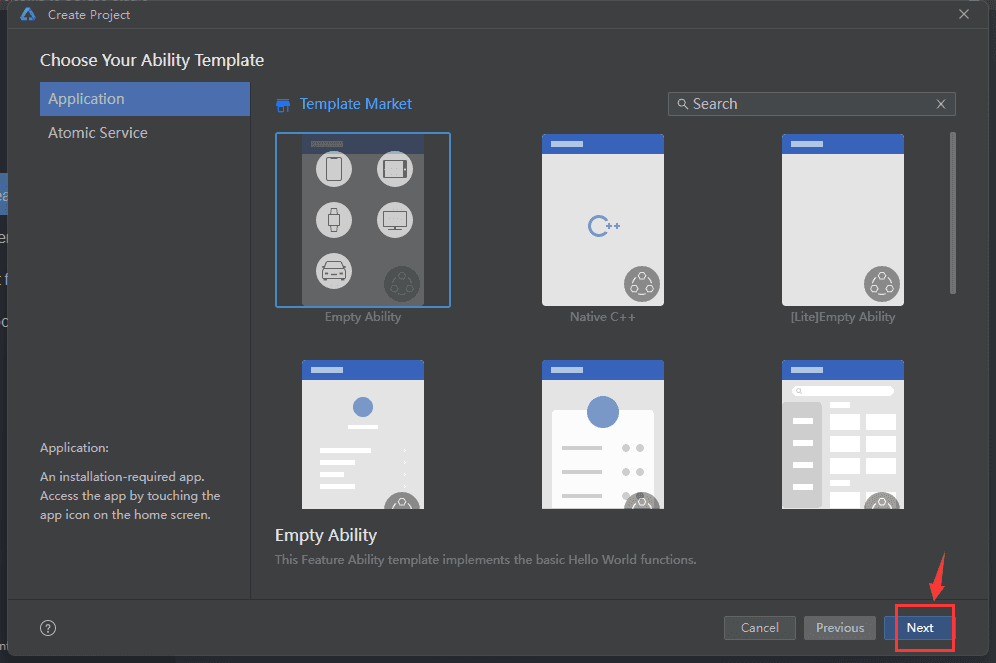
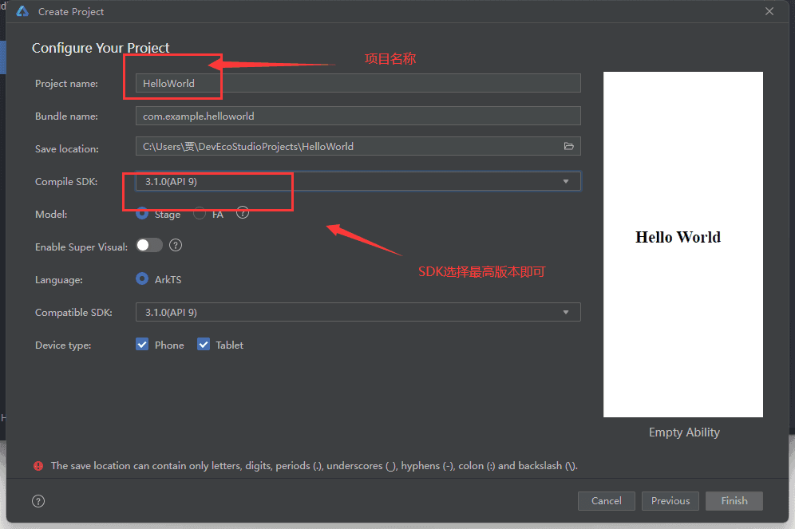
Model部分分为`Stage`和`FA`两个应用模型，`FA`是支持7版本以内的模型支持JS和TS，而`Stage`支持最新版切只支持TS
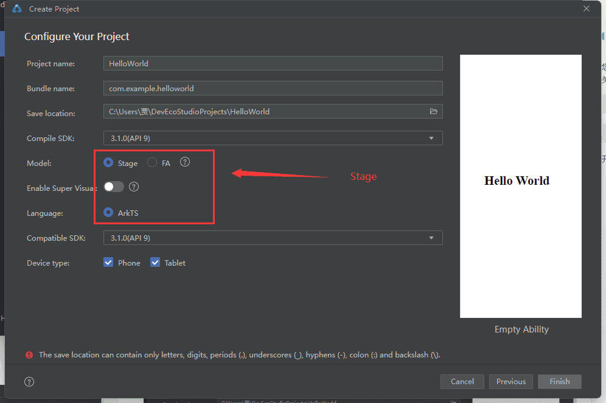

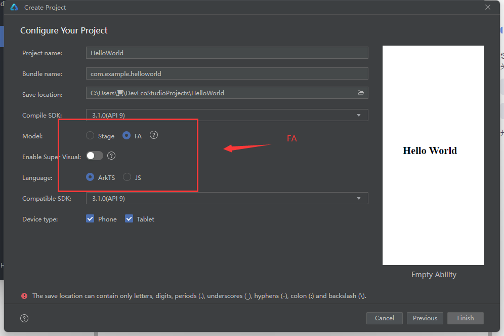
建议大家使用`Stage`模型
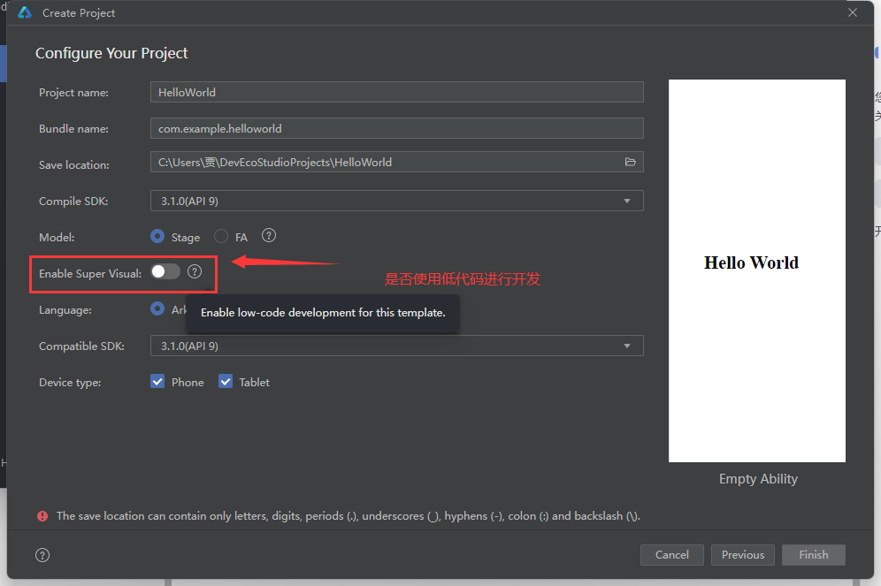
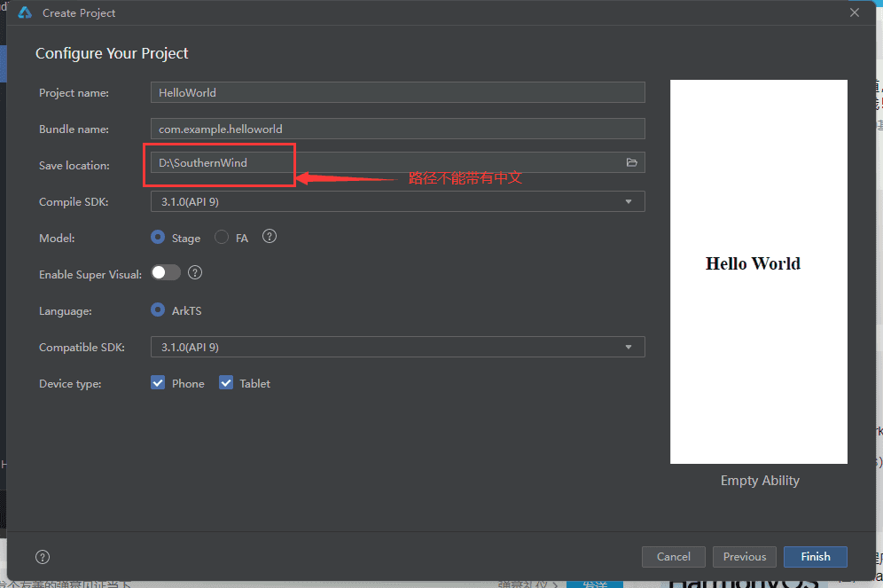
编辑好之后点击`Finish`
进去后等加载完毕在右上角点击预览查看效果
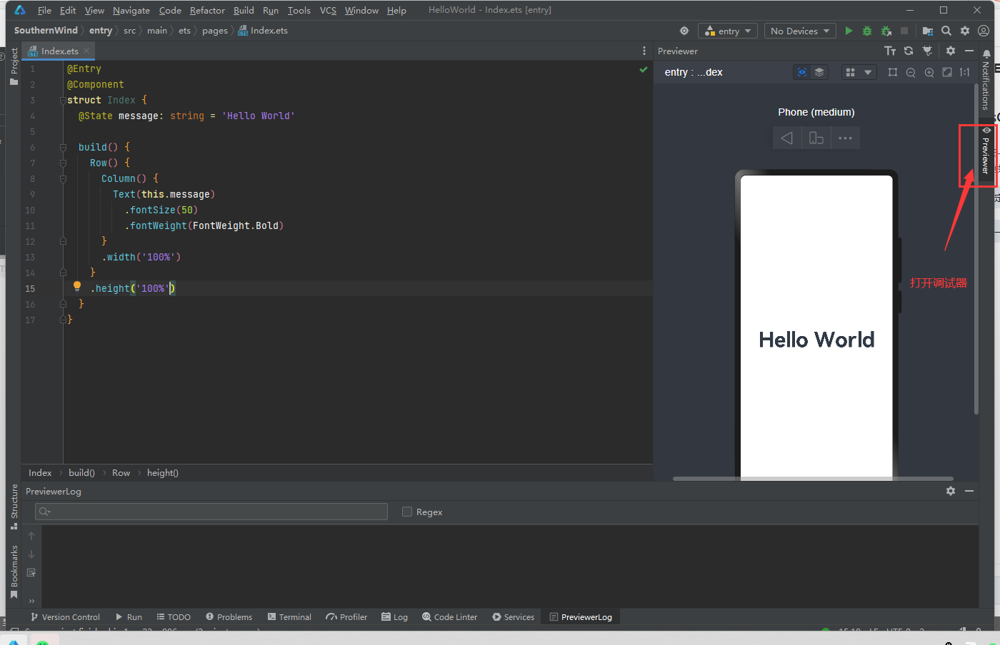
```ts
@Entry
// 程序入口
@Component
// 组件

// 结构体，语法格式 struct {}
struct Index {
  @State message: string = 'Hello World'

  build() {
    // 界面内容放在build中
    Row() {
      // 行有多高
      Column() {
        // 列有多长
        Text(this.message) 
          .fontSize(50)
          .fontWeight(FontWeight.Bold)
      }
      .width('100%')
    }
    .height('100%')
  }
}
```

此段代码就是让界面撑满整个屏幕并对`Hello World`设置字体大小以及粗体


DevEco Studio提供自动更新代码和实时渲染的效果


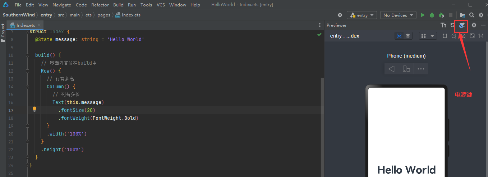
电源键：打开状态下会进行实时更新，如果是关闭状态就不会进行更新，建议打开

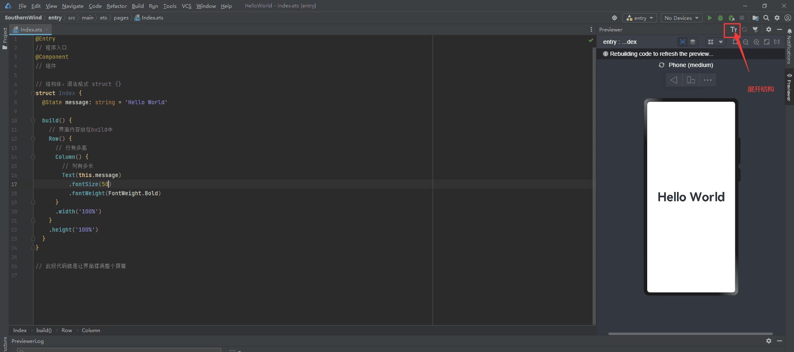
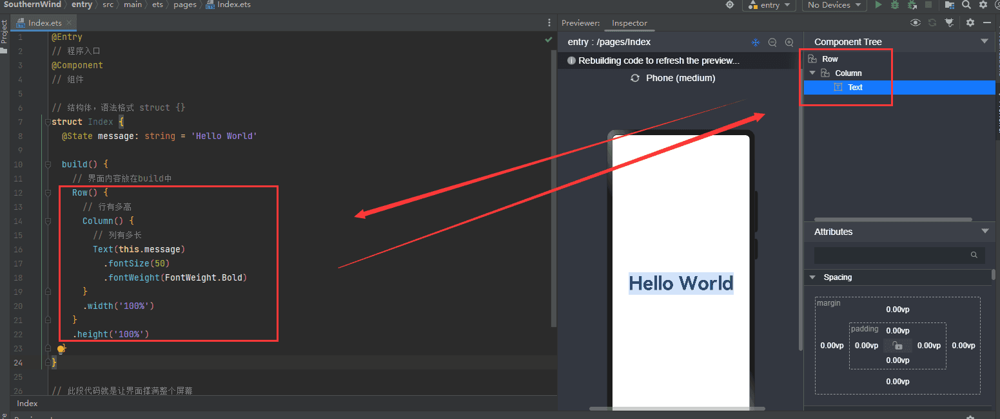
鸿蒙系统可以在一端代码兼容多端应用，那么如何看到pad端、桌面端等其他的调试效果呢？
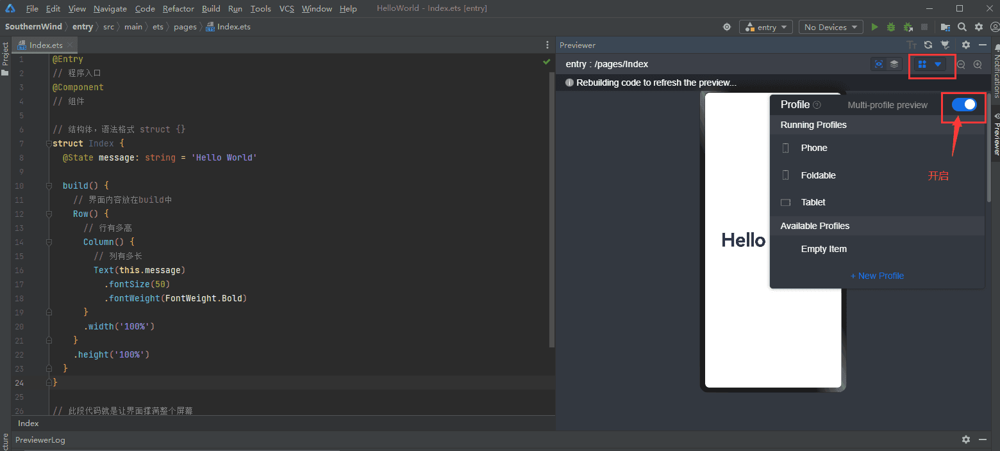


如果开启了多端查询那么热更新是无法进行实时更新的，需要关闭一下


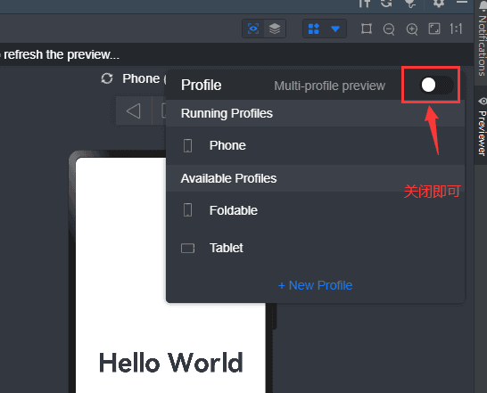
### 真机调试
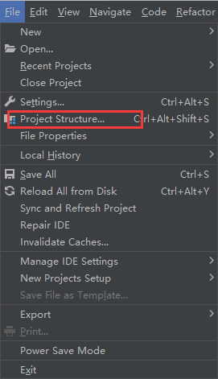
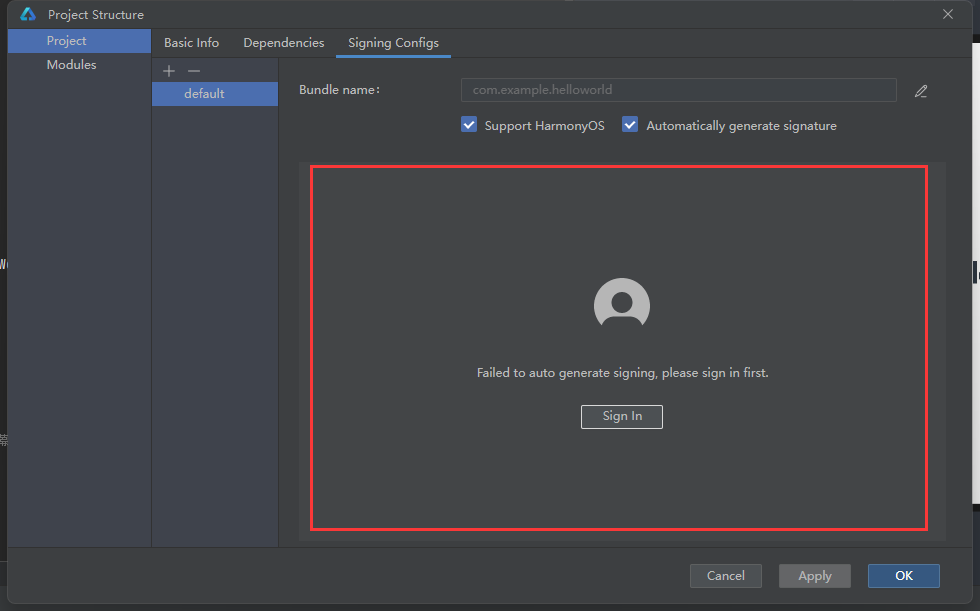
这里要有绑定的华为设备就可以了，这里就不演示了