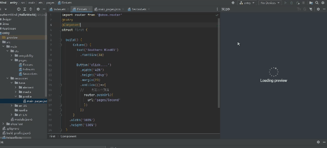
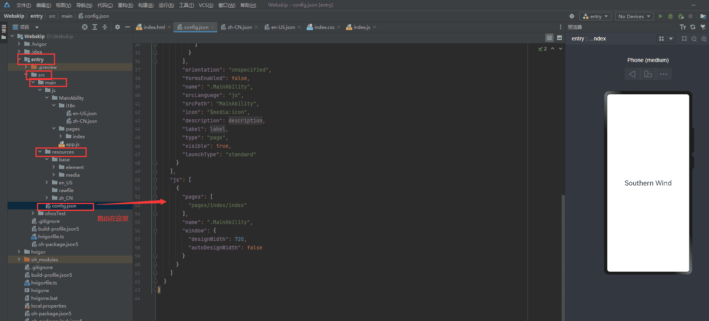
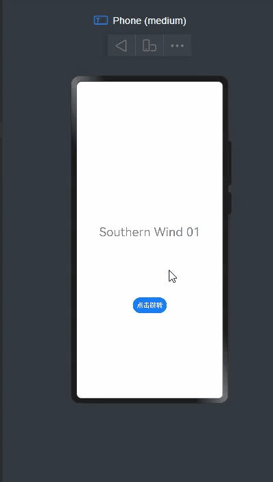

# HarmonyOS4.0系列——02、汉化插件、声明式开发范式ArkTS和类web开发范式
## 编辑器调整
我们在每次退出编辑器后再次打开会直接进入项目文件中，这样在新建项目用起来很是不方便，所以这里跟着设置一下就好


这样下次进入就不会直接跳转到当时的文件项目中！！


## 关于汉化
`settings` → `plugins `→ `installed `→ 输入 `chinese `→ 点击 `ebable `→ 点击 `apply `→重启DevEco-Studio完成汉化


## ArkTS路由

ArkTS的路由在`main_pages.json`中

### 点击事件
点击事件的写法为
```js
标签('标签名称')
	.onClick(()=>{
		router.pushUrl({
			url:'路径'
		})
	})
```
从First.ets跳转到Second.ets页面代码示例：
#### First.ets
```ts
import router from '@ohos.router'
@Entry
@Component
struct First {

  build() {
      Column() {
        Text('Southern Wind01')
          .fontSize(30)
        Button('click....')
          .width('40%')
          .height('40vp')
          .margin(20)
          .onClick(()=>{
          //    去第二个页面
            router.pushUrl({
              url:'pages/Second'
            })
          })
      }
    .width('100%')
    .height('100%')
  }
}

```

### Second.ets
```js
import router from '@ohos.router'
@Entry
@Component
struct second {

  build() {

      Column() {
        Text('Southern Wind02')
          .fontSize(30)
        Button('back')
          .padding(20)
          .margin(20)
          .backgroundColor('#e0e0e0')
          .fontColor('#000')
          .onClick(()=>{
            router.back()
          })
      }
      .width('100%')

    .height('100%')
  }
}

```
实际效果：


### 类web开发范式
也就是所谓的前端开发方式。创建时使用`FA`模型，语言选择`JS`


#### 类web路由配置
路由页面在`config.json`中

写法和Vue类似
这里看一下
`first.html`
```html
<div class="container">
  <text class="title">
    Southern Wind 01
  </text>

  <button @click="goSecond">点击跳转</button>
</div>

```
`first.js`
```js
import router from '@ohos.router'
export default {
  data: {
    title: ""
  },
  onInit() {
    this.title = "Southern Wind";

  },
  //   跳转事件
  goSecond(){
    // router.pushUrl({
    //   url:'pages/second/second'
    // })
    router.push({
      url:'pages/second/second'
    })
  }
}

```
**注意：这里官方是说9版本以后使用`pushUrl`，但在js写法中起不了作用，应该是还没兼容导致的，这里还是用老版的`router.push`即可**

`second.html`
```html
<div class="container">
  <text class="title">
    Southern Wind 02
  </text>
  <button @click="back">back</button>
</div>

```
`second.js`
```js
import router from '@ohos.router'
export default {
  data: {
    title: ""
  },
  onInit() {
  },
  back(){
    router.back();
  }
}

```
效果：
