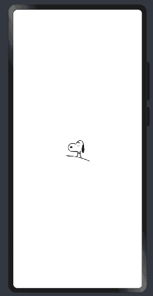

# HarmonyOS4.0系列——03、声明式UI、链式编程、事件方法、以及自定义组件简单案例

## 声明式 UI

> ArkTS以声明方式组合和扩展组件来描述应用程序的UI，同时还提供了基本的属性、事件和子组件配置方法，帮助开发者实现应用交互逻辑。

> 如果组件的接口定义没有包含必选构造参数，则组件后面的“()”不需要配置任何内容。例如，Divider组件不包含构造参数（**下划线组件**）
> 
> $r`形式引入应用资源，可应用于多语言场景
> 
> struct 内部无需用 let 声明，外部需要用 let 声明

使用 Stage 模型的应用，需要在` module.json5 `配置文件中声明权限。
例如加载网络图片，语法：

```typescript
Image(src: string | Resource | media.PixelMap)
```

加载本地资源

```typescript
Image("images/view.jpg").width(200);
```

加载网络图片需要申请权限


```typescript
Image(
  "https://profile-avatar.csdnimg.cn/63cdb1329d9e45b49ccbc25c10e23baf_nanchen_j.jpg!1"
); // 实际使用时请替换为真实地址
```

```typescript
@Entry
@Component
struct DeclarativeUi {
  @State message: string = 'Hello World'

  build() {
    Row() {
      Column() {
        Text('声明式UI')
        Divider()
        Image('https://profile-avatar.csdnimg.cn/63cdb1329d9e45b49ccbc25c10e23baf_nanchen_j.jpg!1')
          .width(100)
          .height(100)

      }
      .width('100%')
    }
    .height('100%')
  }
}
```

实际效果：


Resource 资源
使用资源格式可以跨包/跨模块引入图片，resources 文件夹下的图片都可以通过$r 资源接口读取到并转换到 Resource 格式。

```typescript
Image($r("app.media.icon"));
```

也可以将图片放在`rawfile`文件夹下
**其中：`$r`代表的是资源类型，`app.media`为应用程序下的媒体资源**

## 链式编程

一条一条编写，类似于JQuery

```typescript
Text("声明式UI").fontSize(40).fontColor(Color.Green);
```

## 事件方法

动态监听值的变化，例：

```typescript
@Entry
@Component
struct DeclarativeUi {
  @State num:number = 3
  build() {
    Row() {
      Column() {
        Text('声明式UI'+this.num)
          .fontSize(40)
          .fontColor(Color.Green)
        Divider()

        Button('click++').onClick(()=>{
          this.num++
        })
      }
      .width('100%')
    }
    .height('100%')
  }
}

```

```typescript
@Entry
@Component
struct DeclarativeUi {
  num:number = 3 // 不会具有响应式
}
```

**注意：在`struct`中声明变量动态绑定需要用到`@Struct`，否则不会是响应式**

## private

定义私有变量，写法：

```typescript
private content:string = 'Southern Wind'
```

## 自定义组件

当我们需要写多个文本不同但样式相同的效果，需要使用自定义组件来实现，下面是需要注意的几点

1. @Component：`@Component`装饰器仅能装饰struct关键字声明的数据结构。struct被`@Component`装饰后具备组件化的能力，需要实现build方法描述UI，一个struct只能被一个`@Component`装饰。
2. `@Entry `放在哪个组件前面，哪个就在页面上显示
3. 在`Entry`组件中，`build()`中必须有且只有一个更组件
4. 自定义组件必须定义`build()`函数

定义一个`itemComponent`的组件

```typescript
@Component
struct itemComponent{
  //  private私有变量
  private content:string = 'Southern Wind'
  build(){
    // @ts-ignore
    Row(){
      Image($r('app.media.gray'))
        .width(30)
        .height(30)
        .margin(15)
      Text(this.content)
        .fontSize(30)
        .fontColor(Color.White)

    }
    .backgroundColor(Color.Gray)
    .borderRadius(20)
    .padding({
      right:20
    })
    .margin({
      top:15
    })
  }
}
```

在主组件中渲染

```typescript

@Entry
@Component
struct Index {
  build() {
    Row() {
      Column() {
        Divider()
        itemComponent()
        itemComponent({
          content:'我是第二个文本'
        })
        itemComponent()
        itemComponent()
      }
      .width('100%')
    }
    .height('100%')
  }
}

```

效果：


这里可以看到，自定义组件定义的变量在渲染第二次的时候可以被赋值替换

**自定义组件具有以下特点**

==可组合==：允许开发者使用系统组件、及其属性和方法

==可复用==：自定义组件可以被其他组件复用，并作为不同的实例在不同的父组件或容器中使用。

==数据驱动UI更新==：通过状态变量的改变，来驱动UI的刷新。

```typescript
@Component
struct itemComponent{
  //  private私有变量
  private content:string = 'Southern Wind'

  @State isStatus:boolean = false

  build(){
    // @ts-ignore
    Row(){
      Image(this.isStatus ?$r('app.media.gray'):$r('app.media.gou'))
        .width(30)
        .height(30)
        .margin(15)
      Text(this.content)
        .fontSize(30)
        .fontColor(Color.White)

    }
    .backgroundColor(Color.Gray)
    .borderRadius(20)
    .padding({
      right:20
    })
    .margin({
      top:15
    })
    .onClick(()=>{
      this.isStatus = !this.isStatus
    })
  }
}

```

图片交互时渲染可以采用三元表达式的写法进行书写

效果：


添加下滑线：`TextDecorationType`文本枚举类型

```typescript
  .decoration({
    type:TextDecorationType.None
  })
```


完整代码及效果：

```typescript

@Entry
@Component
struct Index {
  build() {
    Row() {
      Column() {
        Divider()
        itemComponent()
        itemComponent({
          content:'我是第二个文本'
        })
        itemComponent()
        itemComponent()
      }
      .width('100%')
    }
    .height('100%')
  }
}


@Component
struct itemComponent{
  //  private私有变量
  private content:string = 'Southern Wind'

  @State isStatus:boolean = true

  build(){
    // @ts-ignore
    Row(){
      Image(this.isStatus ?$r('app.media.gray'):$r('app.media.gou'))
        .width(30)
        .height(30)
        .margin(15)
      Text(this.content)
        .fontSize(30)
        .fontColor(Color.White)
        .decoration({
          type:this.isStatus ?TextDecorationType.LineThrough :TextDecorationType.None,
          color:Color.Black
        })

    }
    .backgroundColor(Color.Gray)
    .borderRadius(20)
    .padding({
      right:20
    })
    .margin({
      top:15
    })
    .onClick(()=>{
      this.isStatus = !this.isStatus
    })
  }
}

```


