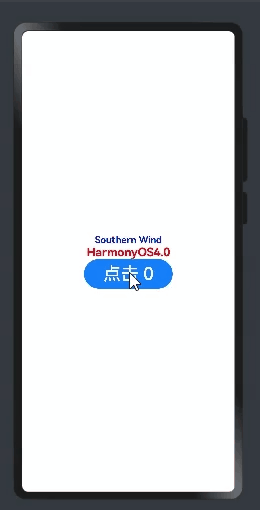
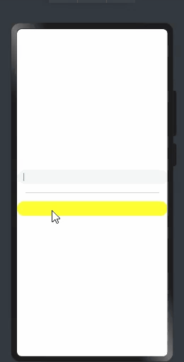

# HarmonyOS4.0系列——04、@Styles、@Extend、@Extend事件以及多态样式stateStyles
## @Styles、@Extend、@Extend事件以及多态样式stateStyles
## @Styles
通用样式
类似于css中的`class`
语法一：**内部样式** 放在struct内
```js
  @Styles commonStyle(){
    .backgroundColor(Color.Pink)
    .padding('20px')
  }
```

语法二：**外部样式**
```js
@Styles function commonStyle() {
  .backgroundColor(Color.Pink)
  .padding('40px')
}
```
调用`.commonStyle()` 

总结：@Styles 内部样式和外部样式，内部样式优先级高于外部样式，内部不要需要用函数function定义，外部需要function;
缺点：只能用于通用样式，@Styles不能进行传参

那么如何进行传参呢？
## @Extend()
在@Styles的基础上，可以使用@Extend，用于扩展原生组件样式。
```js
@Extend(Text) function textStyle(fs:number){
  .fontSize(fs).fontColor(Color.Pink)
}
```

使用规范：和`@Styles`不同，`@Extend`仅支持定义在全局，不支持在组件内部定义。


```js
@Extend(Text) function fancy () {
  .fontColor(Color.Red)
}

// superFancyText可以调用预定义的fancy
@Extend(Text) function superFancyText(size:number) {
    .fontSize(size)
    .fancy()
}
```

例：
```js
@Entry
@Component
struct ExtendFun {
  @State message: string = '@Extend'

  build() {
    Row() {
      Column() {
        // Text(this.message).fontSize(40)
        Text('Southern Wind').superFancyText(40)
      }
      .width('100%')
    }
    .height('100%')
  }

}


// @Extend(Text) function textStyle(fs:number){
//   .fontSize(fs).fontColor(Color.Pink)
// }

@Extend(Text) function fancy () {
  .fontColor(Color.Red)
}

// superFancyText可以调用预定义的fancy
@Extend(Text) function superFancyText(size:number) {
  .fontSize(size)
  .fancy()
}

```
效果：


当然函数与函数直接也是可以传参的
```js
@Entry
@Component
struct ExtendFun {
  @State message: string = '@Extend'

  build() {
    Row() {
      Column() {
        // Text(this.message).fontSize(40)
        Text('Southern Wind').fancy('blue',FontWeight.Bold)
        Text('HarmonyOS4.0').superFancyText(20)
      }
      .width('100%')
    }
    .height('100%')
  }

}

@Extend(Text) function fancy (color:Color|string,fw:FontWeight) {
  .fontColor(color)
  .fontWeight(fw)
}

// superFancyText可以调用预定义的fancy
@Extend(Text) function superFancyText(size:number) {
  .fontSize(size)
  .fancy(Color.Red,FontWeight.Bold)
}


```


**@Extend(Text)**如果里面是Text就代表对Text标签生效，如果为Button则代表对Button标签生效

## @Extend函数事件
声明点击事件
```js
@Extend(Button) function btnFun(click:()=>void) {
  .fontSize(30)
  .width(150)
  .height(50)
  .onClick(()=>{
    click()
  })
}
```
标签调用：
```js
@Entry
@Component
struct ExtendFun {
  @State count: number = 0
  build() {
    Row() {
      Column() {
        Button('点击 ' + this.count).btnFun(()=>{
          this.count ++
        })
      }
      .width('100%')
    }
    .height('100%')
  }

}
```
效果：



## stateStyles:多态样式
stateStyles可以依据组件的内部状态的不同，快速设置不同样式。其实可以把它理解为一种属性方法，类似于css伪类，但是语法不同

+ focused：获焦态。
+ normal：正常态。
+ pressed：按压态。
+ disabled：不可用态。
  
演示
```js
@Entry
@Component
struct Index {
  @State message: string = 'Southern Wind'

  build() {
    Row() {
      Column() {
        TextInput()
        Divider()
          .margin(20)
        TextInput()
          .fontSize(30)
          .fontWeight(FontWeight.Bold)
          .stateStyles({
            normal:{
              .backgroundColor(Color.Yellow)
            },
            focused:{
              .backgroundColor(Color.Pink)
            },
            pressed:{
              .backgroundColor(Color.Blue)
            }
          })
      }
      .width('100%')
    }
    .height('100%')
  }
}

```


